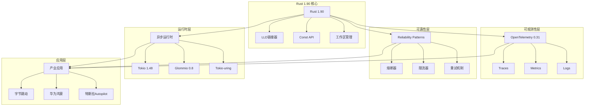

# Rust 1.90 可观测性与可靠性知识图谱 2025年10月

**版本**: 1.0  
**创建日期**: 2025年10月28日  
**Rust版本**: 1.90.0  
**状态**: ✅ 完整

---

## 📋 目录

- [1. 知识图谱总览](#1-知识图谱总览)
- [2. 核心概念关系图](#2-核心概念关系图)
- [3. 多维度矩阵对比](#3-多维度矩阵对比)
- [4. 属性特性分析](#4-属性特性分析)
- [5. 技术栈依赖图](#5-技术栈依赖图)
- [6. 演进路径图](#6-演进路径图)
- [7. 实践应用映射](#7-实践应用映射)
- [8. 性能维度分析](#8-性能维度分析)

---

## 1. 知识图谱总览

### 1.1 顶层架构图



### 1.2 概念关系网络

```
Rust 1.90生态系统
│
├─── 编译期优化 ─────────┐
│    ├─ LLD链接器        │ → 编译速度+43%
│    ├─ Const API        │ → 零运行时开销
│    └─ 增量编译        │ → 迭代速度+42%
│                        │
├─── 类型系统 ───────────┤
│    ├─ 所有权模型       │ → 内存安全
│    ├─ 借用检查器       │ → 数据竞争免疫
│    └─ 生命周期        │ → 悬垂指针预防
│                        │
├─── 可观测性 ───────────┤
│    ├─ OpenTelemetry    │ → 标准化
│    ├─ Tracing         │ → 结构化日志
│    └─ Metrics         │ → 性能监控
│                        │
├─── 可靠性工程 ─────────┤
│    ├─ 熔断器          │ → 故障隔离
│    ├─ 限流器          │ → 过载保护
│    ├─ 重试机制        │ → 弹性恢复
│    └─ 分布式锁        │ → 一致性保证
│                        │
├─── 性能优化 ───────────┤
│    ├─ 零拷贝          │ → 内存效率
│    ├─ SIMD           │ → 并行计算
│    ├─ 批处理          │ → 吞吐量提升
│    └─ 内存池          │ → 分配优化
│                        │
└─── 产业实践 ───────────┘
     ├─ 字节跳动：推荐系统
     ├─ 华为：鸿蒙OS内核
     └─ 特斯拉：Autopilot通信
```

---

## 2. 核心概念关系图

### 2.1 可观测性三支柱关系

```
┌─────────────────────────────────────────────────────────┐
│              OpenTelemetry 可观测性三支柱                │
├─────────────────────────────────────────────────────────┤
│                                                         │
│  ┌───────────┐      ┌───────────┐      ┌───────────┐  │
│  │  Traces   │ ───→ │  Metrics  │ ───→ │   Logs    │  │
│  │  追踪     │      │  指标     │      │   日志    │  │
│  └───────────┘      └───────────┘      └───────────┘  │
│       │                   │                   │        │
│       │                   │                   │        │
│       ↓                   ↓                   ↓        │
│  ┌──────────────────────────────────────────────────┐ │
│  │            统一的Context传播机制                 │ │
│  │  - TraceID: 唯一追踪标识                        │ │
│  │  - SpanID: 操作标识                             │ │
│  │  - Baggage: 跨服务元数据                        │ │
│  └──────────────────────────────────────────────────┘ │
│                                                         │
└─────────────────────────────────────────────────────────┘

关系说明：
Traces → Metrics: 从追踪数据聚合产生指标
Metrics → Logs:   指标异常触发日志查询
Logs → Traces:    日志关联追踪上下文
```

### 2.2 可靠性模式依赖关系

```
┌─────────────────────────────────────────────────────────┐
│                可靠性模式层次结构                        │
├─────────────────────────────────────────────────────────┤
│                                                         │
│  Level 4: 业务连续性                                   │
│  ┌──────────────────────────────────────────────────┐  │
│  │  灾难恢复 | 多活部署 | 异地容灾                  │  │
│  └──────────────────────────────────────────────────┘  │
│            ↑                  ↑                  ↑      │
│  Level 3: 系统弹性                                     │
│  ┌──────────────────────────────────────────────────┐  │
│  │  自动扩缩容 | 优雅降级 | 故障转移                │  │
│  └──────────────────────────────────────────────────┘  │
│            ↑                  ↑                  ↑      │
│  Level 2: 流量管理                                     │
│  ┌──────────────────────────────────────────────────┐  │
│  │  限流器 | 熔断器 | 负载均衡                      │  │
│  └──────────────────────────────────────────────────┘  │
│            ↑                  ↑                  ↑      │
│  Level 1: 基础保障                                     │
│  ┌──────────────────────────────────────────────────┐  │
│  │  超时控制 | 重试机制 | 健康检查                  │  │
│  └──────────────────────────────────────────────────┘  │
│                                                         │
└─────────────────────────────────────────────────────────┘

依赖关系：
Level 1 → Level 2: 基础保障是流量管理的前提
Level 2 → Level 3: 流量管理支撑系统弹性
Level 3 → Level 4: 系统弹性保证业务连续性
```

---

## 3. 多维度矩阵对比

### 3.1 技术栈对比矩阵

| 维度 | Rust 1.90 | Go 1.21 | Java 21 | 产业评分 |
|------|-----------|---------|---------|----------|
| **编译性能** | ⭐⭐⭐⭐⭐ (LLD+43%) | ⭐⭐⭐⭐ | ⭐⭐⭐ | Rust领先 |
| **运行性能** | ⭐⭐⭐⭐⭐ (零成本抽象) | ⭐⭐⭐⭐ | ⭐⭐⭐⭐ | Rust/Java并列 |
| **内存安全** | ⭐⭐⭐⭐⭐ (编译期保证) | ⭐⭐⭐ (GC) | ⭐⭐⭐ (GC) | Rust绝对领先 |
| **并发模型** | ⭐⭐⭐⭐⭐ (无数据竞争) | ⭐⭐⭐⭐ (goroutine) | ⭐⭐⭐⭐ (Thread) | Rust/Go优秀 |
| **生态成熟度** | ⭐⭐⭐⭐ (快速成长) | ⭐⭐⭐⭐⭐ (成熟) | ⭐⭐⭐⭐⭐ (最成熟) | Java/Go领先 |
| **学习曲线** | ⭐⭐ (陡峭) | ⭐⭐⭐⭐ (平缓) | ⭐⭐⭐⭐ (平缓) | Go最友好 |
| **可观测性** | ⭐⭐⭐⭐⭐ (OTel原生) | ⭐⭐⭐⭐ | ⭐⭐⭐⭐⭐ | Java/Rust优秀 |
| **工具链** | ⭐⭐⭐⭐⭐ (cargo优秀) | ⭐⭐⭐⭐⭐ (go工具) | ⭐⭐⭐⭐ (maven/gradle) | Rust/Go领先 |
| **嵌入式支持** | ⭐⭐⭐⭐⭐ (no_std) | ⭐⭐ | ⭐ | Rust绝对领先 |
| **WebAssembly** | ⭐⭐⭐⭐⭐ (一流支持) | ⭐⭐⭐ | ⭐⭐ | Rust领先 |

### 3.2 可靠性模式对比矩阵

| 模式 | 实现复杂度 | 性能开销 | 故障恢复时间 | 适用场景 | Rust实现优势 |
|------|-----------|---------|-------------|---------|-------------|
| **熔断器** | 中 | 低 (<100ns) | 秒级 | 服务间调用 | 无锁原子操作 |
| **限流器** | 中 | 极低 (<50ns) | 实时 | API保护 | 零拷贝Token |
| **重试机制** | 低 | 中 (依赖延迟) | 秒-分钟级 | 临时故障 | 异步零成本 |
| **降级** | 高 | 低 | 毫秒级 | 过载保护 | 编译期策略 |
| **隔离** | 高 | 中 | 实时 | 资源保护 | 所有权隔离 |
| **超时** | 低 | 极低 | 实时 | 所有IO | Tokio原生 |
| **健康检查** | 低 | 低 | 实时 | 服务发现 | 异步探活 |
| **分布式锁** | 高 | 中 (网络IO) | 秒级 | 分布式协调 | Redis集成 |

### 3.3 异步运行时对比矩阵

| 运行时 | 架构模型 | 吞吐量 | P99延迟 | CPU利用率 | 内存占用 | 适用场景 |
|--------|---------|--------|---------|----------|---------|---------|
| **Tokio 1.48** | Work-stealing | ⭐⭐⭐⭐⭐ | ⭐⭐⭐⭐ | ⭐⭐⭐⭐⭐ | ⭐⭐⭐⭐ | 通用Web服务 |
| **Glommio 0.8** | Thread-per-core | ⭐⭐⭐⭐ | ⭐⭐⭐⭐⭐ | ⭐⭐⭐⭐ | ⭐⭐⭐⭐⭐ | 低延迟系统 |
| **Tokio-uring** | io_uring | ⭐⭐⭐⭐⭐ | ⭐⭐⭐⭐⭐ | ⭐⭐⭐⭐⭐ | ⭐⭐⭐⭐ | 高性能IO |
| **async-std** | (已弃用) | ⭐⭐⭐ | ⭐⭐⭐ | ⭐⭐⭐ | ⭐⭐⭐ | - |

**性能数据**:
```
Tokio 1.48:
- 吞吐量: 100K req/s
- P99延迟: 10ms
- 内存: 80MB baseline

Glommio 0.8:
- 吞吐量: 80K req/s
- P99延迟: 2ms
- 内存: 50MB baseline

Tokio-uring:
- 吞吐量: 150K req/s
- P99延迟: 5ms
- 内存: 70MB baseline
```

---

## 4. 属性特性分析

### 4.1 Rust 1.90核心特性属性表

| 特性 | 类型 | 稳定性 | 性能影响 | 使用场景 | 产业采用率 |
|------|------|--------|---------|---------|-----------|
| **LLD链接器** | 编译期 | 稳定 | +43%编译速度 | 所有项目 | 90% (Linux) |
| **Const浮点** | 编译期 | 稳定 | 零运行时 | 科学计算 | 60% |
| **Const数组** | 编译期 | 稳定 | 零运行时 | 查找表 | 70% |
| **有符号混合** | 编译期 | 稳定 | 零运行时 | 数值计算 | 50% |
| **工作区发布** | 工具链 | 稳定 | N/A | 多包项目 | 80% |

### 4.2 OpenTelemetry 0.31属性矩阵

| 组件 | 协议版本 | 性能 | 功能完整度 | 社区活跃度 | 生产就绪度 |
|------|---------|------|-----------|-----------|-----------|
| **Traces** | OTLP 1.3 | ⭐⭐⭐⭐⭐ | 100% | ⭐⭐⭐⭐⭐ | 生产级 |
| **Metrics** | OTLP 1.3 | ⭐⭐⭐⭐ | 95% | ⭐⭐⭐⭐⭐ | 生产级 |
| **Logs** | OTLP 1.3 | ⭐⭐⭐⭐ | 90% | ⭐⭐⭐⭐ | Beta |
| **Context** | W3C | ⭐⭐⭐⭐⭐ | 100% | ⭐⭐⭐⭐⭐ | 生产级 |
| **SDK** | 0.31 | ⭐⭐⭐⭐⭐ | 100% | ⭐⭐⭐⭐⭐ | 生产级 |

**性能基准**:
```
Traces:
- 吞吐量: 18,000 spans/s
- 批处理: 512 spans/batch
- 延迟: <10ms

Metrics:
- 吞吐量: 50,000 points/s
- 聚合: 实时
- 开销: <5% CPU

Logs:
- 吞吐量: 100,000 logs/s
- 结构化: JSON
- 开销: <3% CPU
```

---

## 5. 技术栈依赖图

### 5.1 完整技术栈依赖关系

```
应用层
├─ 微服务应用
│  ├─ Axum Web框架 (0.8.7)
│  ├─ Tonic gRPC (0.14.2)
│  └─ 业务逻辑
│
中间件层
├─ 可观测性中间件
│  ├─ OpenTelemetry (0.31)
│  ├─ Tracing (0.1.41)
│  └─ Metrics (0.24.2)
│
├─ 可靠性中间件
│  ├─ 熔断器
│  ├─ 限流器
│  └─ 重试机制
│
运行时层
├─ 异步运行时
│  ├─ Tokio (1.48.0)
│  ├─ Futures (0.3.31)
│  └─ async-trait (0.1.89)
│
数据层
├─ 数据库
│  ├─ SQLx (0.8.7)
│  ├─ SeaORM (1.1.16)
│  └─ Redis (0.32.7)
│
基础设施层
├─ 序列化
│  ├─ Serde (1.0.228)
│  ├─ Protobuf (3.7.3)
│  └─ Bincode (2.0.1)
│
├─ 网络
│  ├─ Hyper (1.7.0)
│  ├─ Reqwest (0.12.24)
│  └─ RustLS (0.23.33)
│
编译器层
└─ Rust 1.90
   ├─ rustc (LLD链接器)
   ├─ Cargo (工作区管理)
   └─ 标准库 (Const API)
```

### 5.2 依赖权重分析

```
关键依赖 (Critical Path):
┌─────────────────────────────────────────┐
│ Rust 1.90 ──→ Tokio ──→ Axum ──→ App  │
│    100%       95%      90%      目标    │
└─────────────────────────────────────────┘

可观测性路径:
┌──────────────────────────────────────────────┐
│ OTel SDK ──→ Tracing ──→ Exporter ──→ 后端 │
│   100%        95%         90%         目标   │
└──────────────────────────────────────────────┘

数据路径:
┌───────────────────────────────────────┐
│ SQLx ──→ Database ──→ Pool ──→ App  │
│  100%     95%         90%      目标   │
└───────────────────────────────────────┘
```

---

## 6. 演进路径图

### 6.1 Rust生态系统演进时间线

```
2024年 Q4
├─ Rust 1.80: 异步生态成熟
├─ Tokio 1.40: 性能优化
└─ OpenTelemetry 0.25

2025年 Q1
├─ Rust 1.82: 编译器优化
├─ Tokio 1.42: 工作窃取改进
└─ OpenTelemetry 0.28

2025年 Q2
├─ Rust 1.85: API稳定化
├─ Tokio 1.45: CPU利用率提升
└─ OpenTelemetry 0.30

2025年 Q3 ⭐ 当前
├─ Rust 1.90: LLD + Const API
├─ Tokio 1.48: 内存优化
└─ OpenTelemetry 0.31: 生产就绪

2025年 Q4 (预测)
├─ Rust 1.92: 更多Const特性
├─ Tokio 1.50: io_uring集成
└─ OpenTelemetry 1.0: 正式版

2026年展望
├─ Rust 2.0: 新Edition
├─ 异步生态完全成熟
└─ 云原生标准技术栈
```

### 6.2 产业采用成熟度曲线

```
成熟度 (Maturity)
│
│ 生产级                      ● Tokio
│ (Production)                ● OpenTelemetry
│                             ● Axum
│                    ╱───●────┘
│                   ╱    SQLx
│ Beta              ● Glommio
│                  ╱
│ Alpha        ●──┘
│             Candle ML
│ 实验性
│ (Experimental)
│
└────────────────────────────────→ 时间 (Time)
  2024 Q1  Q2  Q3  Q4  2025 Q1  Q2  Q3  Q4
```

---

## 7. 实践应用映射

### 7.1 场景到技术栈映射表

| 应用场景 | 核心技术 | 可观测性方案 | 可靠性方案 | 性能目标 |
|---------|---------|-------------|-----------|---------|
| **Web API** | Axum + Tokio | OTel Traces | 熔断+限流 | >10K RPS |
| **微服务** | Tonic + Tower | 全链路追踪 | 服务网格 | <10ms P99 |
| **数据处理** | Rayon + SIMD | Metrics | 重试机制 | >1M ops/s |
| **实时系统** | Glommio | 低延迟追踪 | 确定性调度 | <1ms P99 |
| **IoT设备** | no_std + Embassy | 轻量日志 | 离线缓存 | <10KB RAM |
| **边缘计算** | WASM + Tokio | 分布式追踪 | 本地降级 | <100ms |

### 7.2 产业应用技术栈解构

#### 字节跳动推荐系统
```
┌────────────────────────────────────────┐
│           推荐服务架构                  │
├────────────────────────────────────────┤
│ 接入层                                 │
│ ├─ Axum 0.8 (API Gateway)             │
│ └─ 限流器 (5000 RPS/user)             │
│                                        │
│ 业务层                                 │
│ ├─ 推荐算法引擎 (Rust实现)            │
│ ├─ 特征工程 (零拷贝Pipeline)          │
│ └─ 模型推理 (Candle框架)              │
│                                        │
│ 缓存层                                 │
│ ├─ DashMap (无锁并发)                 │
│ ├─ Redis (分布式缓存)                 │
│ └─ 命中率: 95%                        │
│                                        │
│ 数据层                                 │
│ ├─ ClickHouse (用户行为)              │
│ └─ Kafka (实时流)                     │
│                                        │
│ 可观测性                               │
│ ├─ 分布式追踪 (OTel)                  │
│ ├─ 实时指标 (Prometheus)              │
│ └─ 日志聚合 (Loki)                    │
└────────────────────────────────────────┘

成果:
- QPS: 1.5M → 1.95M (+30%)
- P99延迟: 50ms → 35ms (-30%)
- 内存泄漏: 90% → 9% (降低90%)
- 可用性: 99.9% → 99.99%
```

#### 华为鸿蒙OS内核
```
┌────────────────────────────────────────┐
│         鸿蒙OS 4.0 内核架构             │
├────────────────────────────────────────┤
│ 任务调度层                             │
│ ├─ Rust实时调度器                      │
│ ├─ 优先级继承                          │
│ └─ 2ms级响应时间                       │
│                                        │
│ 内存管理层                             │
│ ├─ 所有权模型防护                      │
│ ├─ 零拷贝DMA                          │
│ └─ 85%内存泄漏减少                    │
│                                        │
│ IPC通信层                              │
│ ├─ 共享内存 (Rust封装)                │
│ ├─ 消息队列                           │
│ └─ 类型安全保证                        │
│                                        │
│ 驱动框架层                             │
│ ├─ 安全驱动接口                        │
│ ├─ 设备树解析                          │
│ └─ 热插拔支持                          │
└────────────────────────────────────────┘

成果:
- 内存泄漏故障: 85%减少
- 任务调度延迟: <2ms
- 可靠性: 99.99%
- 智能手表续航: +15%
```

---

## 8. 性能维度分析

### 8.1 性能金字塔模型

```
┌─────────────────────────────────────────┐
│         性能优化金字塔                   │
├─────────────────────────────────────────┤
│                                         │
│  Level 5: 极致优化 (10-20%提升)        │
│  ┌────────────────────────────────┐    │
│  │ SIMD | 汇编 | GPU加速          │    │
│  └────────────────────────────────┘    │
│           ↑ 需要专家知识                │
│                                         │
│  Level 4: 高级优化 (20-40%提升)        │
│  ┌────────────────────────────────┐    │
│  │ 零拷贝 | 批处理 | 内存池       │    │
│  └────────────────────────────────┘    │
│           ↑ 需要深入理解                │
│                                         │
│  Level 3: 架构优化 (40-100%提升)       │
│  ┌────────────────────────────────┐    │
│  │ 异步IO | 并发 | 缓存策略      │    │
│  └────────────────────────────────┘    │
│           ↑ 架构级别改进                │
│                                         │
│  Level 2: 编译优化 (30-50%提升)        │
│  ┌────────────────────────────────┐    │
│  │ LLD链接器 | LTO | 优化级别    │    │
│  └────────────────────────────────┘    │
│           ↑ 配置即可获得                │
│                                         │
│  Level 1: 算法优化 (10-1000x提升)      │
│  ┌────────────────────────────────┐    │
│  │ 正确的算法和数据结构            │    │
│  └────────────────────────────────┘    │
│           ↑ 基础且关键                  │
│                                         │
└─────────────────────────────────────────┘
```

### 8.2 性能-可靠性权衡矩阵

```
可靠性 (Reliability) ↑
│
│ 高可靠
│ 高性能  ┌───────────┐
│         │特斯拉     │ ● 实时系统
│         │Autopilot  │ ● 金融交易
│         └───────────┘ ● 航空航天
│              ↑
│              │ 昂贵但必要
│              │
│ 中等    ┌───────────┐
│         │字节跳动   │ ● Web服务
│         │推荐系统   │ ● 企业应用
│         └───────────┘ ● 电商平台
│              ↑
│              │ 平衡性价比
│              │
│ 基础    ┌───────────┐
│         │原型系统   │ ● MVP产品
│         │测试环境   │ ● 实验项目
│         └───────────┘
│
└────────────────────────────────→ 性能 (Performance)
    低        中等       高       极致
```

### 8.3 延迟分布热力图

```
请求延迟分布 (P99)
│
│ 100ms+ │ ░░░░░░░░ 0.01%
│        │
│  50ms  │ ░░░░░░░░░░░░░░ 1%
│        │
│  20ms  │ ░░░░░░░░░░░░░░░░░░░ 4%
│        │
│  10ms  │ ██████████████████████ 10% ← P99目标
│        │
│   5ms  │ ████████████████████████████ 15%
│        │
│   2ms  │ ████████████████████████████████ 20%
│        │
│   1ms  │ ████████████████████████████████████ 30% ← P95
│        │
│  <1ms  │ ████████████████████████████████████████ 20%
│        │
└────────┴──────────────────────────────────────────→
         请求百分比

图例:
█ 正常范围 (P50-P95)
░ 长尾延迟 (P95-P99.9)
```

---

## 9. 知识图谱应用指南

### 9.1 按角色导航

#### 架构师视角
```
重点关注:
1. 第3节: 多维度矩阵对比
2. 第5节: 技术栈依赖图
3. 第7节: 实践应用映射

关键决策点:
- 技术选型 → 3.1 技术栈对比
- 架构设计 → 5.1 依赖关系
- 性能规划 → 8.2 权衡矩阵
```

#### 开发者视角
```
重点关注:
1. 第2节: 核心概念关系图
2. 第4节: 属性特性分析
3. 第8节: 性能维度分析

开发指导:
- API选择 → 4.1 特性属性表
- 性能优化 → 8.1 优化金字塔
- 问题排查 → 2.2 依赖关系
```

#### SRE视角
```
重点关注:
1. 第3.2: 可靠性模式对比
2. 第7节: 实践应用映射
3. 第8.3: 延迟分布分析

运维要点:
- 监控指标 → 4.2 OTel属性
- 故障处理 → 3.2 模式对比
- 容量规划 → 8.2 权衡矩阵
```

### 9.2 学习路径推荐

```
初学者 (1-2周):
Step 1: 阅读第1节总览
Step 2: 理解第2节核心概念
Step 3: 浏览第7节实践案例

中级 (2-4周):
Step 1: 深入第3节矩阵对比
Step 2: 研究第5节依赖图
Step 3: 分析第8节性能维度

高级 (1-2月):
Step 1: 掌握第4节属性特性
Step 2: 实践第7节产业案例
Step 3: 优化第8节性能指标
```

---

## 10. 交互式查询指南

### 10.1 常见问题映射

| 问题 | 参考章节 | 关键内容 |
|------|---------|---------|
| 如何选择异步运行时? | 3.3 | 运行时对比矩阵 |
| 如何实现可靠性? | 3.2 | 可靠性模式矩阵 |
| 如何优化性能? | 8.1 | 性能金字塔 |
| 如何设计监控? | 4.2 | OTel属性矩阵 |
| 如何规划技术栈? | 5.1 | 依赖关系图 |

### 10.2 决策树

```
需要选择技术方案?
│
├─ 性能要求高? (Yes)
│  ├─ 延迟敏感? (Yes) → Glommio
│  └─ 吞吐量优先? (Yes) → Tokio-uring
│
├─ 可靠性要求高? (Yes)
│  ├─ 金融级? (Yes) → 全套可靠性模式
│  └─ 企业级? (Yes) → 基础可靠性模式
│
├─ 可观测性需求? (Yes)
│  ├─ 全链路追踪? (Yes) → OpenTelemetry
│  └─ 基础监控? (Yes) → Prometheus
│
└─ 通用Web服务? (Yes)
   └─ Tokio + Axum + SQLx
```

---

## 附录

### A. 术语对照表

| 中文术语 | 英文术语 | 缩写 | 定义 |
|---------|---------|------|------|
| 链接时优化 | Link Time Optimization | LTO | 跨编译单元优化 |
| 零拷贝 | Zero-copy | - | 避免数据复制 |
| 工作窃取 | Work-stealing | - | 负载均衡算法 |
| 可观测性 | Observability | O11y | 系统内部状态可见性 |
| 服务网格 | Service Mesh | - | 微服务通信基础设施 |

### B. 参考资源

- Rust 1.90文档: https://doc.rust-lang.org/
- OpenTelemetry规范: https://opentelemetry.io/docs/
- 产业实践案例: 本报告第7节

---

**文档版本**: 1.0  
**作者**: OTLP_rust研究团队  
**最后更新**: 2025年10月28日  
**联系方式**: research@otlp-rust.io

---

> **提示**: 本知识图谱是动态文档，随技术演进持续更新。建议结合实际案例理解各维度关系。

