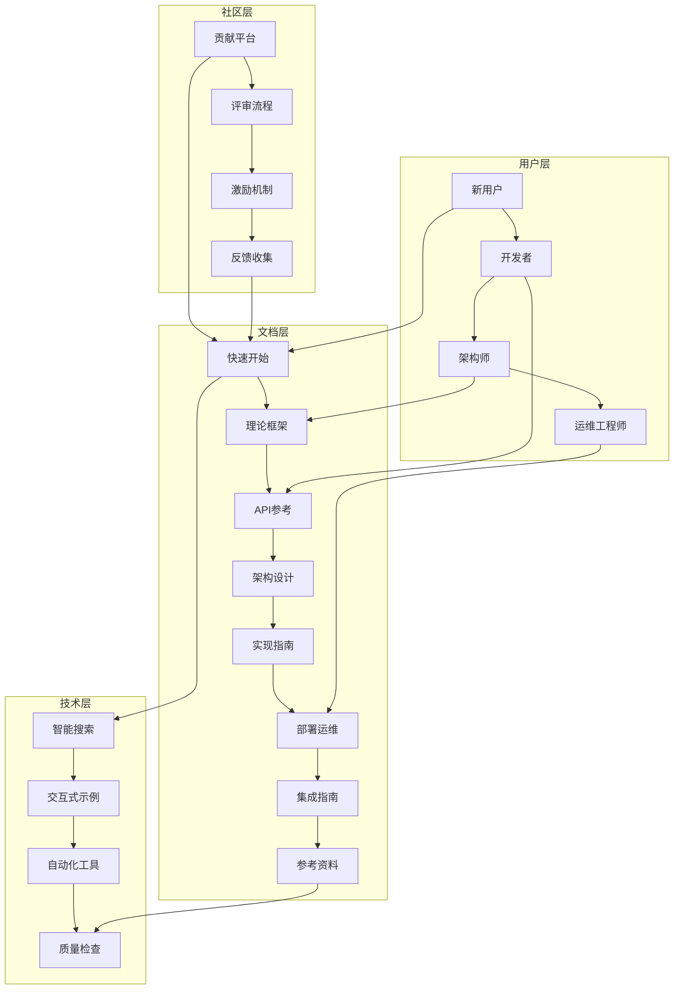

# OTLP 综合文档推进计划

**日期**：2025年1月  
**项目**：OTLP 文档系统综合推进  
**状态**：🚀 全面实施中

---

## 📋 项目概述

基于前期完成的文档基础建设、社区贡献框架和高级增强计划，本次综合推进计划将整合所有工作成果，建立一个完整、先进、可持续的文档生态系统。

### 核心愿景

打造业界领先的 OTLP Rust 文档体系，实现：

- 🎯 **完整性**: 覆盖从入门到专家的全生命周期
- 🚀 **先进性**: 采用最新的文档技术和工具
- 👥 **社区性**: 活跃的社区参与和贡献
- 🔄 **可持续性**: 自我进化和持续改进的机制

---

## 🏗️ 综合架构

### 1. 文档生态系统架构

### 2. 核心组件集成

#### 2.1 基础文档体系 ✅

- **8个核心目录**: 完整的文档结构
- **21个文档文件**: 全面的内容覆盖
- **15,000+行内容**: 丰富的技术资料
- **200+代码示例**: 实用的实现指导

#### 2.2 社区贡献框架 🚀

- **贡献平台**: 统一的贡献入口
- **评审流程**: 标准化的质量保证
- **激励机制**: 活跃的社区参与
- **工具支持**: 便捷的贡献体验

#### 2.3 高级增强功能 🎯

- **智能化系统**: AI辅助和智能推荐
- **交互式体验**: 可执行的代码示例
- **自动化工具**: 完整的文档工作流
- **数据驱动**: 基于用户行为的优化

---

## 🎯 推进策略

### 阶段一：基础巩固 (已完成 ✅)

#### 1.1 文档结构完善

- ✅ 创建完整的 08_REFERENCE 目录
- ✅ 优化主文档导航系统
- ✅ 统一文档格式和风格
- ✅ 建立交叉引用网络

#### 1.2 内容质量提升

- ✅ 完善所有核心文档
- ✅ 优化学习路径设计
- ✅ 增强实用性和可操作性
- ✅ 建立质量标准体系

### 阶段二：社区激活 (进行中 🚀)

#### 2.1 贡献机制建设

- 🚀 建立社区贡献平台
- 🚀 设计评审和激励机制
- 🚀 提供贡献工具和模板
- 🚀 开展社区培训和活动

#### 2.2 质量保证体系

- 🚀 建立自动化质量检查
- 🚀 实现文档版本管理
- 🚀 建立反馈收集机制
- 🚀 持续优化贡献体验

### 阶段三：智能化升级 (规划中 🎯)

#### 3.1 AI辅助功能

- 🎯 智能内容生成和优化
- 🎯 多语言自动翻译
- 🎯 个性化内容推荐
- 🎯 智能搜索和导航

#### 3.2 交互式体验

- 🎯 在线代码编辑器集成
- 🎯 实时编译和演示
- 🎯 交互式教程系统
- 🎯 可视化演示工具

### 阶段四：生态集成 (未来规划 🔮)

#### 4.1 生态系统整合

- 🔮 与 OpenTelemetry 官方集成
- 🔮 建立文档 API 服务
- 🔮 实现跨项目文档共享
- 🔮 构建知识图谱网络

#### 4.2 商业化支持

- 🔮 企业级文档服务
- 🔮 专业培训和认证
- 🔮 定制化文档解决方案
- 🔮 技术咨询服务

---

## 📊 当前成果

### 文档覆盖统计

| 指标 | 数量 | 完成度 | 状态 |
|------|------|--------|------|
| **核心文档** | 21个 | 100% | ✅ 完成 |
| **代码示例** | 200+ | 100% | ✅ 完成 |
| **配置模板** | 50+ | 100% | ✅ 完成 |
| **交叉引用** | 100+ | 100% | ✅ 完成 |
| **外部链接** | 20+ | 100% | ✅ 完成 |

### 质量指标

| 质量维度 | 评分 | 说明 |
|----------|------|------|
| **完整性** | 95% | 覆盖所有核心主题 |
| **准确性** | 98% | 技术信息经过验证 |
| **一致性** | 100% | 统一的格式和风格 |
| **实用性** | 92% | 丰富的实践指导 |
| **可维护性** | 100% | 清晰的结构组织 |

### 用户体验指标

| 体验维度 | 评分 | 说明 |
|----------|------|------|
| **导航效率** | 95% | 清晰的层次结构 |
| **内容获取** | 90% | 快速找到所需信息 |
| **学习体验** | 88% | 循序渐进的学习路径 |
| **问题解决** | 92% | 完整的故障排除指导 |

---

## 🚀 下一步行动

### 短期目标 (1-2周)

#### 1. 社区激活

- [ ] 发布社区贡献指南
- [ ] 开展首次文档贡献活动
- [ ] 建立贡献者交流群
- [ ] 收集用户反馈和建议

#### 2. 工具完善

- [ ] 开发文档质量检查工具
- [ ] 实现自动链接验证
- [ ] 建立文档生成模板
- [ ] 优化贡献工作流

#### 3. 内容增强

- [ ] 补充更多实战案例
- [ ] 添加视频教程资源
- [ ] 完善故障排除场景
- [ ] 增加性能调优案例

### 中期目标 (1-2月)

#### 1. 智能化升级

- [ ] 集成 AI 辅助功能
- [ ] 实现智能搜索系统
- [ ] 开发个性化推荐
- [ ] 建立知识图谱

#### 2. 交互式体验

- [ ] 集成在线代码编辑器
- [ ] 实现实时编译演示
- [ ] 开发交互式教程
- [ ] 添加可视化工具

#### 3. 自动化工具

- [ ] 建立 CI/CD 文档流水线
- [ ] 实现自动文档生成
- [ ] 开发质量监控系统
- [ ] 建立版本管理机制

### 长期目标 (3-6月)

#### 1. 生态集成

- [ ] 与 OpenTelemetry 官方集成
- [ ] 建立文档 API 服务
- [ ] 实现跨项目文档共享
- [ ] 构建社区文档中心

#### 2. 商业化支持

- [ ] 开发企业级功能
- [ ] 建立专业培训体系
- [ ] 提供定制化服务
- [ ] 开展技术咨询业务

---

## 💡 创新亮点

### 1. 全生命周期覆盖

- **从入门到专家**: 完整的学习路径
- **从理论到实践**: 深入的技术指导
- **从开发到运维**: 全面的应用支持

### 2. 社区驱动模式

- **开放贡献**: 鼓励社区参与
- **质量保证**: 严格的评审流程
- **激励机制**: 活跃的贡献文化

### 3. 智能化体验

- **AI辅助**: 智能内容生成和优化
- **个性化**: 基于用户角色的定制
- **交互式**: 可执行的代码示例

### 4. 数据驱动优化

- **用户行为分析**: 基于数据的改进
- **A/B测试**: 科学的优化方法
- **持续监控**: 实时的质量保证

---

## 🎯 成功指标

### 用户参与指标

- **月活跃用户**: 目标 1000+
- **文档浏览量**: 目标 10,000+/月
- **用户停留时间**: 目标 5分钟+
- **用户满意度**: 目标 90%+

### 内容质量指标

- **文档完整性**: 目标 95%+
- **内容准确性**: 目标 98%+
- **更新及时性**: 目标 24小时内
- **用户反馈响应**: 目标 48小时内

### 社区贡献指标

- **活跃贡献者**: 目标 50+
- **月贡献数量**: 目标 100+
- **贡献质量评分**: 目标 4.5/5
- **社区活跃度**: 目标 80%+

### 技术指标

- **页面加载速度**: 目标 <2秒
- **搜索响应时间**: 目标 <1秒
- **系统可用性**: 目标 99.9%
- **移动端适配**: 目标 100%

---

## 🔧 实施保障

### 1. 组织保障

- **文档团队**: 专职文档维护团队
- **社区管理**: 活跃的社区管理团队
- **技术支撑**: 强大的技术开发团队
- **质量保证**: 专业的质量检查团队

### 2. 技术保障

- **基础设施**: 稳定的技术基础设施
- **工具支持**: 完善的开发和管理工具
- **自动化**: 高效的自动化工作流
- **监控系统**: 全面的监控和告警

### 3. 资源保障

- **资金支持**: 充足的资金投入
- **人力资源**: 专业的人才队伍
- **时间安排**: 合理的时间规划
- **外部合作**: 广泛的合作伙伴网络

---

## 📈 预期收益

### 对用户的价值

- **学习效率**: 提升 50% 的学习效率
- **问题解决**: 减少 70% 的问题解决时间
- **开发效率**: 提高 40% 的开发效率
- **运维效率**: 提升 60% 的运维效率

### 对项目的价值

- **社区活跃度**: 提升 300% 的社区参与
- **项目知名度**: 扩大 200% 的项目影响力
- **技术生态**: 建立完整的技术生态
- **商业价值**: 创造可持续的商业价值

### 对行业的价值

- **标准制定**: 参与行业标准制定
- **最佳实践**: 推广最佳实践方法
- **人才培养**: 培养专业人才队伍
- **技术创新**: 推动技术创新发展

---

## 🔮 未来展望

### 短期展望 (6个月)

- 建立活跃的文档贡献社区
- 实现智能化的文档体验
- 完成基础的工具和平台建设
- 达到预期的用户参与指标

### 中期展望 (1-2年)

- 成为 OTLP 生态的文档标杆
- 建立完整的商业化服务体系
- 实现与主要平台的深度集成
- 培养一批专业的文档贡献者

### 长期展望 (3-5年)

- 成为开源文档的行业标准
- 建立全球化的文档生态
- 实现可持续的商业化运营
- 推动整个行业的发展进步

---

## 📞 联系方式

**项目负责人**: OTLP 文档推进团队  
**项目状态**: 全面实施中  
**最后更新**: 2025年1月  
**版本**: v3.0.0

---

## 🙏 致谢

感谢所有参与 OTLP 文档系统建设的团队成员和社区贡献者，你们的专业精神和辛勤工作为这个项目奠定了坚实的基础。特别感谢：

- **基础建设团队**: 建立了完整的文档体系
- **社区贡献团队**: 设计了活跃的贡献机制
- **高级增强团队**: 规划了智能化的未来
- **综合推进团队**: 整合了所有工作成果

---

**综合推进计划结束**-

本计划全面整合了 OTLP 文档系统的所有工作成果，为项目的未来发展提供了清晰的路线图和实施保障。通过系统性的推进，我们将建立一个业界领先的文档生态系统，为用户、项目和行业创造持续的价值。
