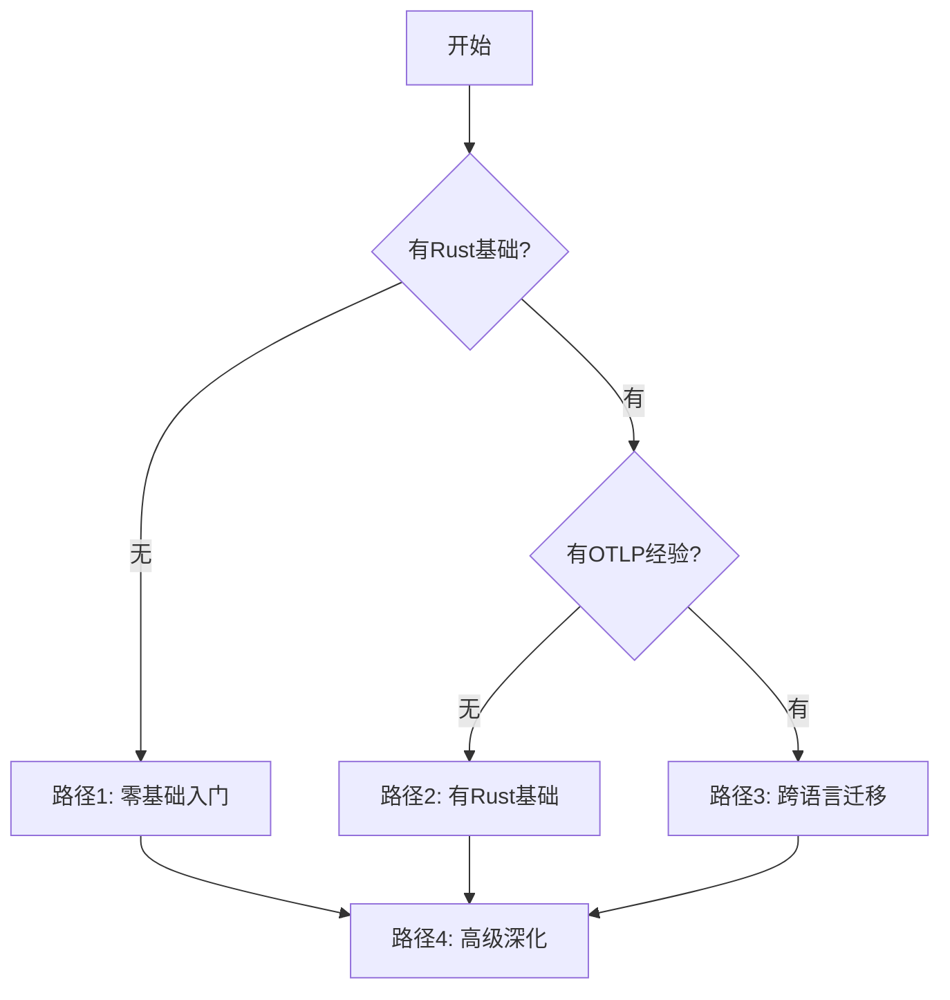

# 🎓 Rust OTLP 学习路径完整指南

> **目标**: 为不同层次的开发者提供清晰的学习路线图  
> **Rust 版本**: 1.90+  
> **预计完成时间**: 4-12周（根据基础和投入时间）  
> **最后更新**: 2025年10月10日

---

## 📋 目录

- [🎓 Rust OTLP 学习路径完整指南](#-rust-otlp-学习路径完整指南)
  - [📋 目录](#-目录)
  - [学习路径选择](#学习路径选择)
    - [快速自测](#快速自测)
  - [路径 1: 零基础入门 (4-6周)](#路径-1-零基础入门-4-6周)
    - [第1周: Rust 语言基础](#第1周-rust-语言基础)
      - [学习目标](#学习目标)
      - [学习内容](#学习内容)
      - [实践项目](#实践项目)
    - [第2周: Rust 异步编程](#第2周-rust-异步编程)
      - [学习目标1](#学习目标1)
      - [学习内容1](#学习内容1)
      - [实践项目1](#实践项目1)
    - [第3周: OpenTelemetry 核心概念](#第3周-opentelemetry-核心概念)
      - [学习目标2](#学习目标2)
      - [学习内容2](#学习内容2)
      - [实践项目2](#实践项目2)
    - [第4周: Semantic Conventions](#第4周-semantic-conventions)
      - [学习目标3](#学习目标3)
      - [学习内容3](#学习内容3)
      - [实践项目3](#实践项目3)
      - [项目检查清单](#项目检查清单)
    - [第5-6周: 进阶实践](#第5-6周-进阶实践)
      - [学习目标4](#学习目标4)
      - [学习内容4](#学习内容4)
      - [毕业项目](#毕业项目)
  - [路径 2: 有 Rust 基础 (2-3周)](#路径-2-有-rust-基础-2-3周)
    - [前提条件](#前提条件)
    - [第1周: OTLP 快速上手](#第1周-otlp-快速上手)
    - [第2周: 深入理解](#第2周-深入理解)
    - [第3周: 生产就绪](#第3周-生产就绪)
  - [路径 3: 有其他语言 OTLP 经验 (1-2周)](#路径-3-有其他语言-otlp-经验-1-2周)
    - [前提条件6](#前提条件6)
    - [第1周: Rust 特有实现](#第1周-rust-特有实现)
    - [第2周: 深入 Rust 生态](#第2周-深入-rust-生态)
  - [路径 4: 高级主题深化 (持续学习)](#路径-4-高级主题深化-持续学习)
    - [性能优化](#性能优化)
    - [分布式系统](#分布式系统)
    - [高级主题](#高级主题)
  - [按角色定制学习路径](#按角色定制学习路径)
    - [后端工程师](#后端工程师)
    - [平台工程师](#平台工程师)
    - [SRE/DevOps](#sredevops)
    - [性能工程师](#性能工程师)
  - [学习资源](#学习资源)
    - [官方文档](#官方文档)
    - [本项目文档](#本项目文档)
    - [在线资源](#在线资源)
    - [社区](#社区)
  - [学习建议](#学习建议)
    - [时间管理](#时间管理)
    - [学习技巧](#学习技巧)
    - [常见陷阱](#常见陷阱)
  - [结业认证](#结业认证)
    - [🏆 初级认证](#-初级认证)
    - [🏆 中级认证](#-中级认证)
    - [🏆 高级认证](#-高级认证)
  - [持续学习](#持续学习)

---

## 学习路径选择

根据你的背景，选择合适的学习路径：



### 快速自测

回答以下问题，确定你的起点：

1. **Rust 基础**
   - [ ] 理解所有权、借用、生命周期
   - [ ] 熟悉 `async/await` 异步编程
   - [ ] 能使用 `Result<T, E>` 进行错误处理

   **全部选中** → 跳过路径1

2. **OpenTelemetry 经验**
   - [ ] 理解 Trace, Span, Context 概念
   - [ ] 使用过其他语言的 OTLP SDK
   - [ ] 了解 Semantic Conventions

   **全部选中** → 从路径3开始

3. **可观测性背景**
   - [ ] 使用过 Jaeger/Zipkin
   - [ ] 了解分布式追踪原理
   - [ ] 有监控告警经验

   **全部选中** → 可以加快学习速度

---

## 路径 1: 零基础入门 (4-6周)

### 第1周: Rust 语言基础

#### 学习目标

- 掌握 Rust 基本语法
- 理解所有权系统
- 能编写简单的 Rust 程序

#### 学习内容

**Day 1-2: 安装和基础**:

- [ ] 安装 Rust 工具链
- [ ] 阅读: [The Rust Book - Ch1-3](https://doc.rust-lang.org/book/)
- [ ] 实践: Hello World, 变量, 数据类型
- [ ] 文档: [Rust开发环境配置](../31_开发工具链/01_Rust开发环境配置.md)

**Day 3-4: 所有权系统**:

- [ ] 阅读: The Rust Book - Ch4
- [ ] 理解: 所有权、借用、引用、生命周期
- [ ] 实践: 编写函数，处理字符串和vector

**Day 5-7: 错误处理和模块**:

- [ ] 阅读: The Rust Book - Ch7, Ch9
- [ ] 学习: `Result<T, E>`, `Option<T>`, `?` 运算符
- [ ] 实践: 创建多模块项目

#### 实践项目

```bash
# 创建一个简单的CLI工具
cargo new simple-logger
cd simple-logger

# 实现: 读取文件并记录日志
# 练习: 错误处理、文件I/O
```

---

### 第2周: Rust 异步编程

#### 学习目标1

- 理解 `async/await` 机制
- 使用 Tokio 运行时
- 编写异步网络应用

#### 学习内容1

**Day 1-3: Async 基础**:

- [ ] 阅读: [Async Book](https://rust-lang.github.io/async-book/)
- [ ] 学习: `Future`, `async fn`, `.await`
- [ ] 实践: 简单的异步函数

```rust
async fn fetch_data() -> Result<String, Box<dyn std::error::Error>> {
    // 你的第一个异步函数
    Ok("data".to_string())
}
```

**Day 4-5: Tokio 运行时**:

- [ ] 阅读: [Tokio Tutorial](https://tokio.rs/tokio/tutorial)
- [ ] 学习: `tokio::spawn`, `tokio::select!`
- [ ] 实践: 并发任务

**Day 6-7: 异步 HTTP**:

- [ ] 使用 `reqwest` 或 `hyper`
- [ ] 实践: HTTP 客户端和服务器

#### 实践项目1

```bash
# 创建异步HTTP服务
cargo new async-server
# 实现: 简单的API服务器
# 练习: Tokio, async/await
```

---

### 第3周: OpenTelemetry 核心概念

#### 学习目标2

- 理解 OTLP 协议
- 掌握 Trace/Span 概念
- 能创建基础追踪

#### 学习内容2

**Day 1-2: OTLP 概述**:

- [ ] 阅读: [OTLP核心协议/01_协议概述](../01_OTLP核心协议/01_协议概述.md)
- [ ] 理解: Traces, Metrics, Logs 三大支柱
- [ ] 学习: OTLP/gRPC vs OTLP/HTTP

**Day 3-4: Traces 数据模型**:

- [ ] 阅读: [Traces数据模型](../03_数据模型/01_Traces数据模型/)
- [ ] 理解: Trace, Span, SpanContext
- [ ] 学习: SpanKind, Span 属性

**Day 5-7: 第一个 OTLP 应用**:

- [ ] 跟随: [30分钟快速入门](../33_教程与示例/01_Rust_OTLP_30分钟快速入门.md)
- [ ] 实践: 创建 Span, 设置属性
- [ ] 启动: Jaeger 查看追踪数据

#### 实践项目2

```bash
# 完成快速入门教程的所有示例
# 1. 基础 Span 创建
# 2. HTTP 服务追踪
# 3. 数据库操作追踪
```

---

### 第4周: Semantic Conventions

#### 学习目标3

- 理解语义约定的重要性
- 掌握常用属性命名
- 规范化追踪数据

#### 学习内容3

**Day 1-2: HTTP 追踪**:

- [ ] 阅读: [HTTP Semantic Conventions](../02_Semantic_Conventions/02_追踪属性/01_HTTP_Rust完整版.md)
- [ ] 实践: 标准化 HTTP 属性

**Day 3-4: 数据库追踪**:

- [ ] 阅读: [SQL数据库属性](../02_Semantic_Conventions/04_数据库属性/01_SQL数据库属性_Rust完整版.md)
- [ ] 实践: 数据库操作追踪

**Day 5-7: 综合应用**:

- [ ] 创建完整的 Web 应用
- [ ] 集成数据库追踪
- [ ] 查看完整调用链

#### 实践项目3

```bash
# 创建一个完整的 Web API
cargo new user-api
# 实现:
# - RESTful API (GET, POST, PUT, DELETE)
# - PostgreSQL 集成
# - 完整的 OTLP 追踪
```

#### 项目检查清单

- [ ] 所有 HTTP 请求都有 Span
- [ ] 使用标准 HTTP 属性
- [ ] 所有数据库操作都有 Span
- [ ] 错误都被正确记录
- [ ] 可以在 Jaeger 中查看完整链路

---

### 第5-6周: 进阶实践

#### 学习目标4

- 掌握 Context 传播
- 实现微服务追踪
- 生产环境最佳实践

#### 学习内容4

**Week 5: Context 传播**:

- [ ] 阅读: [Context传播](../01_OTLP核心协议/04_Context传播_Rust完整版.md)
- [ ] 实践: 跨服务追踪
- [ ] 学习: W3C Trace Context 格式

**Week 6: 最佳实践**:

- [ ] 阅读: [最佳实践Checklist](../17_最佳实践清单/Rust_OTLP_最佳实践Checklist.md)
- [ ] 学习: 采样策略, 性能优化
- [ ] 实践: 生产环境配置

#### 毕业项目

```text
构建一个简单的微服务系统:
┌─────────────┐      ┌─────────────┐      ┌──────────────┐
│  API Gateway│ ───> │ User Service│ ───> │   Database   │
└─────────────┘      └─────────────┘      └──────────────┘
       │                     │
       │                     v
       │             ┌─────────────┐
       └────────────>│Order Service│
                     └─────────────┘

要求:
- 完整的分布式追踪
- Context 正确传播
- 错误追踪
- 性能监控
```

---

## 路径 2: 有 Rust 基础 (2-3周)

### 前提条件

- ✅ 熟悉 Rust 语法
- ✅ 理解所有权和生命周期
- ✅ 会使用 `async/await`
- ✅ 熟悉 Cargo 工具链

### 第1周: OTLP 快速上手

**Day 1: 环境搭建**:

- [ ] 快速入门: [30分钟教程](../33_教程与示例/01_Rust_OTLP_30分钟快速入门.md)
- [ ] 启动 Jaeger
- [ ] 运行示例代码

**Day 2-3: 核心概念**:

- [ ] 阅读: [协议概述](../01_OTLP核心协议/01_协议概述.md)
- [ ] 理解: Trace, Span, Context
- [ ] 实践: 创建复杂的 Span 层次结构

**Day 4-5: Semantic Conventions**:

- [ ] 阅读: [通用Span属性](../02_Semantic_Conventions/02_追踪属性/05_通用Span属性_Rust完整版.md)
- [ ] 浏览: HTTP, gRPC, Database 属性
- [ ] 实践: 规范化你的追踪数据

**Day 6-7: 实战项目**:

- [ ] 为现有项目添加 OTLP
- [ ] 实现完整追踪
- [ ] 优化性能

### 第2周: 深入理解

**数据模型**:

- [ ] SpanContext, SpanKind, Span Links
- [ ] Metrics 数据模型
- [ ] Logs 集成

**高级特性**:

- [ ] Context 传播机制
- [ ] 采样策略
- [ ] Baggage 使用

**最佳实践**:

- [ ] 性能优化
- [ ] 错误处理
- [ ] 安全配置

### 第3周: 生产就绪

**部署**:

- [ ] Kubernetes 集成
- [ ] Collector 配置
- [ ] 监控告警

**优化**:

- [ ] 采样策略调优
- [ ] 性能基准测试
- [ ] 成本控制

---

## 路径 3: 有其他语言 OTLP 经验 (1-2周)

### 前提条件6

- ✅ 熟悉 OpenTelemetry 概念
- ✅ 使用过其他语言的 SDK (Go/Python/Java)
- ✅ 有 Rust 基础

### 第1周: Rust 特有实现

**Day 1-2: 快速对比**:

- [ ] 阅读: 30分钟快速入门
- [ ] 对比: Rust vs 你熟悉的语言
- [ ] 注意: 所有权和生命周期的影响

**关键差异**:

```rust
// Python: 简单但不安全
span = tracer.start_span("operation")
# ... 操作
span.end()

// Rust: 类型安全，RAII自动管理
{
    let _span = tracer.start("operation");
    // ... 操作
} // Span 自动结束
```

**Day 3-4: 异步模型**:

- [ ] 理解: Rust 的 async/await vs 其他语言
- [ ] 学习: Tokio 运行时集成
- [ ] 实践: 异步导出器

**Day 5-7: 迁移现有项目**:

- [ ] 迁移指南: [从其他语言迁移](../31_迁移指南/)
- [ ] 实践: 将现有服务迁移到 Rust + OTLP

### 第2周: 深入 Rust 生态

**性能优化**:

- [ ] SIMD 加速
- [ ] Arrow 列式存储
- [ ] 零拷贝优化

**高级特性**:

- [ ] 自定义导出器
- [ ] 自定义采样器
- [ ] 扩展 SDK

---

## 路径 4: 高级主题深化 (持续学习)

### 性能优化

**基础优化** (1周)

- [ ] [SIMD加速](../35_性能优化深化/01_SIMD加速_Rust_OTLP性能优化.md)
- [ ] 内存池设计
- [ ] 批处理优化

**Arrow 优化** (2周)

- [ ] [Arrow + Rust 1.90](../35_性能优化深化/02_Arrow_Rust_1.90_最新优化实践.md)
- [ ] DataFusion 查询
- [ ] 列式压缩

### 分布式系统

**分布式追踪** (2周)

- [ ] [分布式OTLP控制](../36_分布式OTLP控制/)
- [ ] 采样算法
- [ ] 负载均衡

**Service Mesh** (1周)

- [ ] Istio/Linkerd 集成
- [ ] Envoy 追踪
- [ ] 多集群可观测性

### 高级主题

**形式化验证** (按需)

- [ ] TLA+ 模型检验
- [ ] 协议正确性证明

**eBPF** (按需)

- [ ] 内核级追踪
- [ ] 零侵入可观测性

---

## 按角色定制学习路径

### 后端工程师

**核心技能**:

1. Rust 语言 (2周)
2. OTLP 基础 (1周)
3. 微服务追踪 (1周)
4. 生产部署 (1周)

**推荐文档**:

- HTTP/gRPC 追踪
- 数据库追踪
- 消息队列追踪
- Context 传播

### 平台工程师

**核心技能**:

1. OTLP 协议 (1周)
2. Collector 配置 (1周)
3. Kubernetes 集成 (1周)
4. 监控告警 (1周)

**推荐文档**:

- Collector 完整配置
- Kubernetes 部署
- 采样策略
- 最佳实践

### SRE/DevOps

**核心技能**:

1. OTLP 基础 (1周)
2. 分布式追踪 (1周)
3. 监控告警 (1周)
4. 故障排查 (1周)

**推荐文档**:

- 故障排查
- 性能优化
- 成本控制
- SLO/SLA 监控

### 性能工程师

**核心技能**:

1. Rust 高级特性 (2周)
2. OTLP 性能优化 (2周)
3. Arrow 优化 (2周)
4. 基准测试 (1周)

**推荐文档**:

- SIMD 加速
- Arrow 优化
- 性能基准测试
- 零拷贝优化

---

## 学习资源

### 官方文档

- [OpenTelemetry 规范](https://opentelemetry.io/docs/specs/otel/)
- [Rust OpenTelemetry](https://github.com/open-telemetry/opentelemetry-rust)
- [The Rust Book](https://doc.rust-lang.org/book/)
- [Async Book](https://rust-lang.github.io/async-book/)

### 本项目文档

- [README 导航](../README.md)
- [30分钟快速入门](../33_教程与示例/01_Rust_OTLP_30分钟快速入门.md)
- [最佳实践Checklist](../17_最佳实践清单/Rust_OTLP_最佳实践Checklist.md)
- [开发环境配置](../31_开发工具链/01_Rust开发环境配置.md)

### 在线资源

- [Rust Playground](https://play.rust-lang.org/)
- [Tokio Tutorial](https://tokio.rs/tokio/tutorial)
- [Axum Examples](https://github.com/tokio-rs/axum/tree/main/examples)

### 社区

- [Rust Discord](https://discord.gg/rust-lang)
- [OpenTelemetry Slack](https://cloud-native.slack.com/)
- [Rust 论坛](https://users.rust-lang.org/)

---

## 学习建议

### 时间管理

| 背景 | 每天学习时间 | 总周数 | 预计达到水平 |
|------|-------------|--------|-------------|
| 零基础 | 2-3小时 | 6-8周 | 能独立开发带 OTLP 的应用 |
| 有Rust基础 | 1-2小时 | 3-4周 | 能使用高级特性 |
| 跨语言迁移 | 1小时 | 2-3周 | 能迁移现有项目 |

### 学习技巧

1. **动手实践** 🛠️
   - 每天至少写代码 30 分钟
   - 完成所有实践项目
   - 修改示例代码，尝试不同实现

2. **循序渐进** 📚
   - 不要跳过基础章节
   - 理解概念后再编码
   - 遇到困难回顾前置知识

3. **查阅文档** 📖
   - 养成阅读官方文档的习惯
   - 使用 `cargo doc` 查看本地文档
   - 参考标准库实现

4. **社区互动** 👥
   - 在论坛提问
   - 参与开源项目
   - 分享学习笔记

### 常见陷阱

❌ **避免以下错误**:

1. **跳过 Rust 基础**
   - 所有权系统必须理解
   - 不理解会导致编译错误

2. **忽视 Semantic Conventions**
   - 不使用标准属性名
   - 导致数据不可比较

3. **过度追踪**
   - 为每个函数创建 Span
   - 性能开销大

4. **忽视错误处理**
   - 不处理 Span 创建失败
   - 影响业务逻辑

---

## 结业认证

完成学习后，尝试以下挑战，验证你的能力：

### 🏆 初级认证

- [ ] 能创建基本的 Trace 和 Span
- [ ] 理解 SpanKind 和 Span 属性
- [ ] 能为 HTTP 服务添加追踪
- [ ] 能查看和分析 Jaeger 数据

### 🏆 中级认证

- [ ] 能实现跨服务追踪
- [ ] 理解 Context 传播机制
- [ ] 能配置采样策略
- [ ] 能优化追踪性能

### 🏆 高级认证

- [ ] 能实现自定义导出器
- [ ] 理解 Arrow 优化原理
- [ ] 能设计分布式追踪架构
- [ ] 能排查生产环境问题

---

## 持续学习

OpenTelemetry 和 Rust 都在快速发展，建议：

- 📅 每季度查看 OpenTelemetry 新特性
- 🔄 每月更新依赖库版本
- 📰 关注 Rust Blog 和 OTLP 更新
- 🎯 参与社区讨论和贡献

---

**指南版本**: v1.0  
**创建日期**: 2025年10月10日  
**预计更新**: 每季度

---

[🏠 返回主目录](../README.md) | [🚀 开始学习](../33_教程与示例/01_Rust_OTLP_30分钟快速入门.md)
