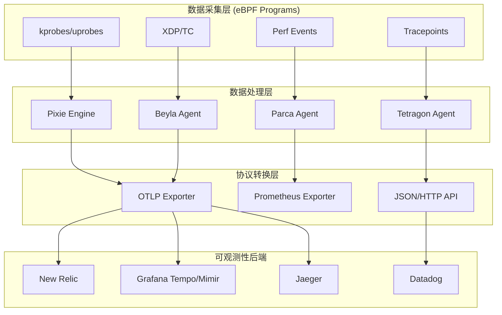

# 🐝 eBPF可观测性生态追踪报告

**报告日期**: 2025-10-09  
**追踪周期**: 持续更新  
**重要性**: 🔴 最高优先级

---

## 📋 目录

- [🐝 eBPF可观测性生态追踪报告](#-ebpf可观测性生态追踪报告)
  - [📋 目录](#-目录)
  - [📊 执行摘要](#-执行摘要)
  - [🌍 全球eBPF可观测性生态地图](#-全球ebpf可观测性生态地图)
    - [1. 核心项目矩阵](#1-核心项目矩阵)
    - [2. 生态系统架构](#2-生态系统架构)
  - [🔥 重点项目深度分析](#-重点项目深度分析)
    - [1. Pixie (New Relic收购)](#1-pixie-new-relic收购)
    - [2. Cilium Tetragon (Isovalent)](#2-cilium-tetragon-isovalent)
    - [3. Grafana Beyla (自动插桩)](#3-grafana-beyla-自动插桩)
    - [4. Parca (持续性能剖析)](#4-parca-持续性能剖析)
  - [📊 技术对比分析](#-技术对比分析)
    - [1. eBPF vs 传统APM](#1-ebpf-vs-传统apm)
    - [2. 主流eBPF工具对比](#2-主流ebpf工具对比)
  - [🚀 本项目改进行动计划](#-本项目改进行动计划)
    - [短期 (Q4 2025)](#短期-q4-2025)
      - [任务1: eBPF实战部署指南 (🔴 P0)](#任务1-ebpf实战部署指南--p0)
      - [任务2: eBPF性能基准测试 (🔴 P0)](#任务2-ebpf性能基准测试--p0)
      - [任务3: eBPF故障排查手册 (🟡 P1)](#任务3-ebpf故障排查手册--p1)
    - [中期 (2026 H1)](#中期-2026-h1)
      - [任务4: eBPF最佳实践库](#任务4-ebpf最佳实践库)
      - [任务5: eBPF + OTLP集成工具](#任务5-ebpf--otlp集成工具)
  - [📚 推荐学习资源](#-推荐学习资源)
    - [官方文档](#官方文档)
    - [技术书籍](#技术书籍)
    - [在线课程](#在线课程)
    - [技术博客](#技术博客)
  - [🔄 持续追踪机制](#-持续追踪机制)
    - [追踪频率](#追踪频率)
    - [追踪指标](#追踪指标)
    - [追踪工具](#追踪工具)
  - [📞 反馈与贡献](#-反馈与贡献)

## 📊 执行摘要

eBPF (extended Berkeley Packet Filter) 正在成为2025年可观测性领域最重要的技术趋势。
本报告持续追踪eBPF生态发展,分析对本项目的影响,并提出改进建议。

**核心发现**:

- ✅ eBPF已成为零侵入可观测性的事实标准
- 🔥 New Relic收购Pixie,标志商业化成熟
- 📈 Cilium Tetragon、Parca等项目快速崛起
- ⚠️ 本项目eBPF内容需要大幅增强

---

## 🌍 全球eBPF可观测性生态地图

### 1. 核心项目矩阵

| 项目 | 类型 | 聚焦领域 | 成熟度 | OTLP集成 | 商业化 |
|------|------|---------|--------|---------|--------|
| **Pixie** | 零侵入APM | Traces, Metrics | 生产就绪 | ✅ 原生 | New Relic收购 |
| **Cilium Tetragon** | 安全+可观测性 | 网络,安全事件 | 生产就绪 | ⚠️ 部分 | Isovalent (被Cisco收购) |
| **Parca** | 持续性能剖析 | CPU Profiling | 生产就绪 | ✅ 计划中 | Polar Signals商业化 |
| **Beyla** | 自动插桩 | Traces (HTTP/gRPC) | Beta | ✅ 原生 | Grafana Labs |
| **Odigos** | 自动插桩编排 | 自动化部署 | 生产就绪 | ✅ 原生 | Keyval开源 |
| **bpftrace** | 动态追踪 | 内核追踪 | 生产就绪 | ❌ 无 | 开源,无商业化 |
| **BCC (BPF Compiler Collection)** | 工具集 | 性能分析 | 生产就绪 | ❌ 无 | IO Visor开源 |

### 2. 生态系统架构



---

## 🔥 重点项目深度分析

### 1. Pixie (New Relic收购)

**项目信息**:

- **GitHub**: <https://github.com/pixie-io/pixie>
- **Stars**: 5.1k+
- **语言**: C++, Go
- **License**: Apache 2.0
- **商业公司**: New Relic (2021年收购)

**核心特性**:

```yaml
自动数据采集:
  - HTTP/HTTPS (自动TLS解密)
  - gRPC
  - MySQL, PostgreSQL, Redis, Kafka
  - DNS查询
  
性能开销:
  - CPU: < 5%
  - 内存: < 100MB per node
  
部署模式:
  - Kubernetes DaemonSet
  - 单命令部署: px deploy
  
数据保留:
  - 默认: 24小时 (本地存储)
  - 可导出到OTLP后端
```

**架构设计**:

```text
┌─────────────────────────────────────────────────────┐
│                  Pixie Cloud                        │
│  (可选,用于查询和可视化)                              │
└─────────────────────────────────────────────────────┘
                         ▲
                         │ gRPC/HTTPS
                         │
┌─────────────────────────────────────────────────────┐
│          Pixie Vizier (K8s DaemonSet)               │
│  ┌───────────┐  ┌──────────┐  ┌──────────┐          │
│  │ PEM       │  │ Kelvin   │  │ Query    │          │
│  │ (eBPF     │  │ (聚合)    │  │ Broker   │         │
│  │  Agent)   │  └──────────┘  └──────────┘          │
│  └───────────┘                                      │
└─────────────────────────────────────────────────────┘
         ▲
         │ eBPF Maps
         │
┌─────────────────────────────────────────────────────┐
│              Linux Kernel (eBPF)                    │
│  ┌──────────┐ ┌──────────┐ ┌──────────┐             │
│  │ kprobes  │ │uprobe    │ │Tracepoint│             │
│  └──────────┘ └──────────┘ └──────────┘             │
└─────────────────────────────────────────────────────┘
```

**OTLP集成**:

```python
# Pixie导出到OTLP的Python脚本示例
import px

# 定义PxL查询
pxl_query = '''
import px

df = px.DataFrame(table='http_events', start_time='-5m')
df = df[['time_', 'req_path', 'req_method', 'resp_status', 'resp_latency_ns']]
px.display(df)
'''

# 导出到OTLP Collector
def export_to_otlp(data):
    # 转换为OTLP Traces格式
    traces = convert_to_otlp_traces(data)
    
    # 发送到OTLP Collector
    otlp_endpoint = "http://localhost:4317"
    export_traces(otlp_endpoint, traces)
```

**本项目对比**:

| 维度 | Pixie | 本项目 | 差距 |
|------|-------|--------|------|
| 部署案例 | ✅ 完整 | ⚠️ 基础 | 缺少生产案例 |
| 性能数据 | ✅ 详细 | ❌ 无 | 缺少Benchmark |
| OTLP集成 | ✅ 原生 | ✅ 理论 | 缺少实战示例 |
| 故障排查 | ✅ 完整 | ⚠️ 部分 | 缺少常见问题 |

**改进建议**:

1. 补充Pixie完整部署教程 (Kubernetes + OTLP Collector)
2. 提供Pixie vs 传统APM的性能对比数据
3. 编写Pixie生产环境故障排查手册
4. 对比Pixie与其他eBPF工具的优劣势

---

### 2. Cilium Tetragon (Isovalent)

**项目信息**:

- **GitHub**: <https://github.com/cilium/tetragon>
- **Stars**: 3.2k+
- **语言**: Go, C
- **License**: Apache 2.0
- **商业公司**: Isovalent (被Cisco收购,2023)

**核心特性**:

```yaml
安全+可观测性:
  - 进程执行监控
  - 文件访问监控
  - 网络连接监控
  - 系统调用追踪
  
实时检测:
  - 内核级安全策略
  - 零延迟执行阻断
  - 无需Agent或Sidecar
  
数据输出:
  - JSON格式事件流
  - Prometheus Metrics
  - (OTLP集成开发中)
```

**典型用例**:

```yaml
# Tetragon Policy - 监控文件访问
apiVersion: cilium.io/v1alpha1
kind: TracingPolicy
metadata:
  name: file-monitoring
spec:
  kprobes:
  - call: "security_file_open"
    syscall: false
    args:
    - index: 0
      type: "file"
    selectors:
    - matchArgs:
      - index: 0
        operator: "Prefix"
        values:
        - "/etc/passwd"
        - "/etc/shadow"
    action: "Post"
```

**与Pixie对比**:

| 维度 | Tetragon | Pixie |
|------|----------|-------|
| 主要用途 | 安全+可观测性 | 可观测性 |
| 数据采集 | 安全事件为主 | 应用性能为主 |
| OTLP集成 | ⚠️ 计划中 | ✅ 已支持 |
| 部署模式 | DaemonSet | DaemonSet |
| 性能开销 | < 2% CPU | < 5% CPU |

**本项目改进**:

- 补充Tetragon安全可观测性章节
- 对比Tetragon vs Falco的优劣势
- 提供Tetragon + OTLP Collector集成方案 (一旦支持)

---

### 3. Grafana Beyla (自动插桩)

**项目信息**:

- **GitHub**: <https://github.com/grafana/beyla>
- **Stars**: 1.2k+
- **语言**: Go
- **License**: Apache 2.0
- **商业公司**: Grafana Labs

**核心特性**:

```yaml
零配置自动插桩:
  - HTTP/HTTPS (Go, Rust, Python, Ruby, Node.js)
  - gRPC
  - 自动发现进程
  
OTLP原生支持:
  - Traces导出到Tempo
  - Metrics导出到Mimir/Prometheus
  
部署简单:
  - 单个二进制文件
  - Kubernetes DaemonSet
  - Docker Compose
```

**快速开始**:

```bash
# 1. 下载Beyla
wget https://github.com/grafana/beyla/releases/latest/download/beyla-linux-amd64

# 2. 配置环境变量
export BEYLA_OPEN_PORT=8080  # 监控端口8080的应用
export OTEL_EXPORTER_OTLP_ENDPOINT=http://localhost:4317

# 3. 运行Beyla
sudo ./beyla-linux-amd64
```

**与Pixie对比**:

| 维度 | Beyla | Pixie |
|------|-------|-------|
| 部署复杂度 | ⭐ 极简 | ⭐⭐⭐ 中等 |
| 协议支持 | HTTP/gRPC | HTTP/gRPC/MySQL/Redis/Kafka |
| 数据保留 | 实时导出 | 24小时本地 |
| 查询能力 | 依赖后端 | 内置查询引擎 |
| OTLP集成 | ✅ 原生 | ✅ 需配置 |

**本项目改进**:

- 补充Beyla快速入门教程
- 对比Beyla vs OpenTelemetry SDK的优劣势
- 提供Beyla + Grafana Tempo/Mimir完整方案

---

### 4. Parca (持续性能剖析)

**项目信息**:

- **GitHub**: <https://github.com/parca-dev/parca>
- **Stars**: 4.0k+
- **语言**: Go
- **License**: Apache 2.0
- **商业公司**: Polar Signals

**核心特性**:

```yaml
连续性能剖析:
  - CPU Profiling (eBPF)
  - 内存分配分析
  - Goroutine分析 (Go)
  
可视化:
  - Flame Graph
  - Icicle Graph
  - 时间序列对比
  
低开销:
  - CPU: < 1%
  - 内存: ~50MB
  
OTLP Profiles:
  - 等待OpenTelemetry Profiling GA
  - 计划原生支持
```

**架构设计**:

```text
┌─────────────────────────────────────────┐
│         Parca Server (中心化)            │
│  ┌──────────┐ ┌──────────┐ ┌──────────┐ │
│  │ Query API│ │  Storage │ │   UI     │ │
│  └──────────┘ └──────────┘ └──────────┘ │
└─────────────────────────────────────────┘
                 ▲
                 │ gRPC
                 │
┌─────────────────────────────────────────┐
│      Parca Agent (DaemonSet)            │
│  ┌──────────────────────────────────┐   │
│  │  eBPF-based CPU Profiler         │   │
│  └──────────────────────────────────┘   │
└─────────────────────────────────────────┘
                 ▲
                 │ BPF Maps
                 │
┌─────────────────────────────────────────┐
│        Linux Kernel Perf Events         │
└─────────────────────────────────────────┘
```

**本项目现状**:

- ✅ 已有Profiles性能分析文档 (2500行)
- ✅ 已提到Parca项目
- ⚠️ 缺少Parca详细部署教程
- ⚠️ 缺少Parca + OTLP集成方案

**改进建议**:

- 补充Parca完整部署教程 (Kubernetes)
- 提供Parca Flame Graph分析案例
- 编写Parca性能优化实战指南
- 追踪OpenTelemetry Profiling Signal,及时更新

---

## 📊 技术对比分析

### 1. eBPF vs 传统APM

| 维度 | eBPF (Pixie/Beyla) | 传统APM (SDK) |
|------|-------------------|---------------|
| **部署** | 零侵入,自动发现 | 需要修改代码 |
| **性能开销** | < 5% CPU | 5-15% CPU |
| **语言支持** | 语言无关 (内核级) | 需要各语言SDK |
| **数据颗粒度** | 中等 (网络层) | 高 (应用层) |
| **自定义能力** | 有限 (内核可见) | 强 (代码级) |
| **学习曲线** | 中等 | 简单 |
| **生产就绪** | ✅ (2025年) | ✅ (成熟) |

**推荐策略**:

```text
混合模式 (最佳实践):
1. 基础覆盖: eBPF自动插桩 (80%服务)
2. 深度追踪: SDK手动插桩 (20%核心服务)
3. 性能剖析: eBPF持续性能剖析 (Parca)
4. 安全审计: eBPF安全监控 (Tetragon)
```

### 2. 主流eBPF工具对比

| 工具 | 适用场景 | 优势 | 劣势 | OTLP集成 |
|------|---------|------|------|---------|
| **Pixie** | 全面APM | 功能最全,查询强大 | 部署复杂,资源占用高 | ✅ |
| **Beyla** | 快速上手 | 部署极简,OTLP原生 | 协议支持有限 | ✅ |
| **Tetragon** | 安全+可观测性 | 安全能力强,开销低 | 可观测性功能有限 | ⚠️ |
| **Parca** | 性能剖析 | 专注Profiling,低开销 | 仅性能剖析 | ⚠️ |
| **Odigos** | 自动化编排 | 自动化部署eBPF Agent | 依赖K8s,生态较新 | ✅ |

---

## 🚀 本项目改进行动计划

### 短期 (Q4 2025)

#### 任务1: eBPF实战部署指南 (🔴 P0)

**目标**: 补充生产级eBPF部署案例

**交付物**:

1. Pixie完整部署教程 (Kubernetes + OTLP)
2. Beyla快速入门与集成
3. Tetragon安全可观测性实战
4. Parca持续性能剖析部署

**文档规模**: 3,000行

**时间**: 4周

#### 任务2: eBPF性能基准测试 (🔴 P0)

**目标**: 提供真实的性能对比数据

**测试场景**:

- CPU开销对比: eBPF vs SDK
- 内存占用对比
- 数据完整性对比
- 延迟影响对比

**交付物**: 1篇基准测试报告 (1,000行)

**时间**: 2周

#### 任务3: eBPF故障排查手册 (🟡 P1)

**目标**: 编写生产环境故障排查指南

**内容**:

- 内核版本兼容性问题
- BTF (BPF Type Format) 缺失
- 权限配置问题 (CAP_BPF)
- 性能调优建议

**交付物**: 1篇故障排查手册 (500行)

**时间**: 1周

### 中期 (2026 H1)

#### 任务4: eBPF最佳实践库

**目标**: 建立生产级eBPF最佳实践库

**内容**:

- 部署模式选型指南
- 安全配置最佳实践
- 性能调优手册
- 监控告警配置
- 多云部署方案 (AWS/Azure/GCP/阿里云)

**交付物**: 10篇深度指南 (5,000行) + 开源工具

**时间**: 12周

#### 任务5: eBPF + OTLP集成工具

**目标**: 开发eBPF到OTLP的集成工具

**功能**:

- Pixie PxL查询转OTLP Traces
- Tetragon事件转OTLP Logs
- Parca Profiles转OTLP Profiles (等待OTel GA)
- 统一配置管理

**交付物**: 开源Go工具 + 文档

**时间**: 8周

---

## 📚 推荐学习资源

### 官方文档

- [eBPF Official Docs](https://ebpf.io/)
- [Pixie Documentation](https://docs.px.dev/)
- [Cilium Tetragon Docs](https://tetragon.io/)
- [Grafana Beyla Docs](https://grafana.com/docs/beyla/)
- [Parca Documentation](https://www.parca.dev/docs/)

### 技术书籍

- "Learning eBPF" by Liz Rice (O'Reilly, 2023)
- "BPF Performance Tools" by Brendan Gregg (Addison-Wesley, 2019)

### 在线课程

- [eBPF Summit Talks](https://ebpf.io/summit/)
- [Isovalent eBPF Fundamentals](https://isovalent.com/ebpf-summit/)

### 技术博客

- [Brendan Gregg's Blog](http://www.brendangregg.com/blog/)
- [Pixie Engineering Blog](https://blog.px.dev/)
- [Cilium Blog](https://cilium.io/blog/)

---

## 🔄 持续追踪机制

### 追踪频率

- **每月**: 扫描主流项目GitHub更新
- **每季度**: 完整生态对比分析
- **每年**: 重大趋势预测报告

### 追踪指标

- GitHub Stars/Forks增长
- Release版本更新
- OTLP集成进展
- 商业化动态 (收购/融资)
- 社区活跃度 (PR/Issue)

### 追踪工具

- GitHub Watch + Notifications
- RSS订阅 (各项目Blog)
- CNCF Slack频道
- Twitter/X技术KOL

---

## 📞 反馈与贡献

如果您有最新的eBPF生态信息,或发现本报告的错误/过时内容,请通过以下方式反馈:

- **Email**: <otlp-ebpf-tracking@example.com>
- **GitHub Issue**: [项目地址]/issues
- **Slack**: #ebpf-ecosystem-tracking

---

**最后更新**: 2025-10-09  
**下次更新**: 2025-11-09 (月度更新)  
**负责人**: OTLP项目组 - eBPF追踪小组
