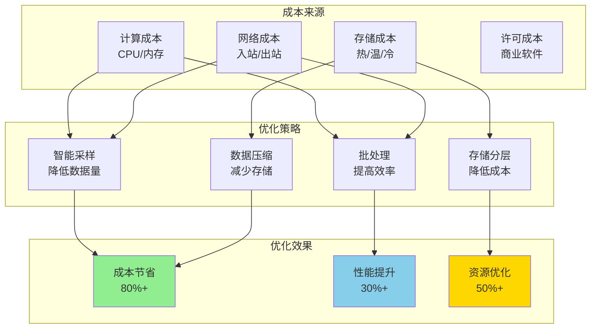
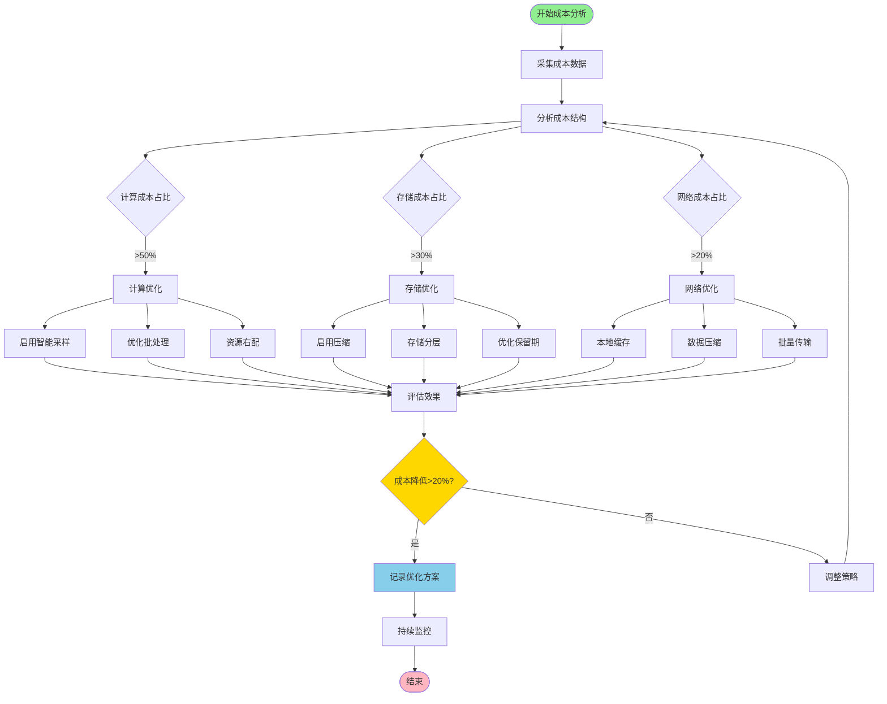
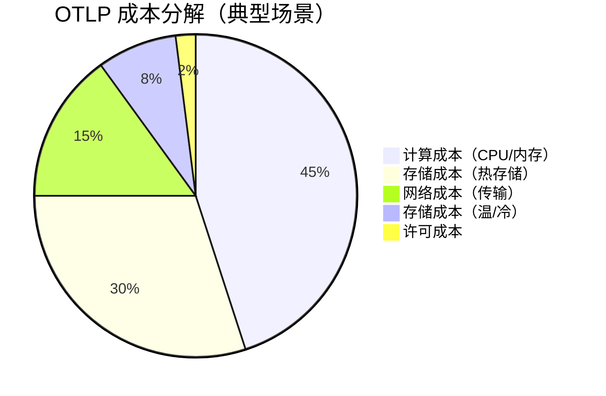

# 成本优化

## 目录

- [成本优化](#成本优化)
  - [目录](#目录)
  - [概述](#概述)
    - [📊 OTLP 成本优化架构图](#-otlp-成本优化架构图)
    - [🔄 成本优化决策流程](#-成本优化决策流程)
    - [💰 成本分解饼图](#-成本分解饼图)
  - [成本分析](#成本分析)
    - [成本构成](#成本构成)
  - [优化策略](#优化策略)
    - [1. 采样率优化](#1-采样率优化)
    - [2. 存储分层](#2-存储分层)
    - [3. 资源右配](#3-资源右配)
  - [成本监控](#成本监控)
    - [Prometheus 成本指标](#prometheus-成本指标)
    - [成本告警](#成本告警)
  - [详细成本分析模型](#详细成本分析模型)
    - [成本计算器](#成本计算器)
  - [优化策略详解](#优化策略详解)
    - [1. 智能采样优化](#1-智能采样优化)
    - [2. 数据压缩优化](#2-数据压缩优化)
    - [3. 批处理优化](#3-批处理优化)
  - [实战案例](#实战案例)
    - [案例1：采样优化节省 80% 成本](#案例1采样优化节省-80-成本)
    - [案例2：存储分层节省 60% 存储成本](#案例2存储分层节省-60-存储成本)
    - [案例3：压缩优化](#案例3压缩优化)
  - [成本优化最佳实践](#成本优化最佳实践)
    - [1. 建立成本意识文化](#1-建立成本意识文化)
    - [2. 成本优化检查清单](#2-成本优化检查清单)
    - [3. 成本优化工具](#3-成本优化工具)

## 概述

成本优化在保证性能和可靠性的前提下，最小化系统运营成本。

### 📊 OTLP 成本优化架构图



### 🔄 成本优化决策流程



### 💰 成本分解饼图



## 成本分析

### 成本构成

```rust
pub struct CostBreakdown {
    pub compute_cost: f64,      // 计算资源成本
    pub storage_cost: f64,      // 存储成本
    pub network_cost: f64,      // 网络传输成本
    pub license_cost: f64,      // 许可证成本
}

impl CostBreakdown {
    pub fn total(&self) -> f64 {
        self.compute_cost + self.storage_cost + self.network_cost + self.license_cost
    }

    pub fn cost_per_span(&self, total_spans: u64) -> f64 {
        if total_spans == 0 {
            return 0.0;
        }
        self.total() / total_spans as f64
    }
}
```

## 优化策略

### 1. 采样率优化

```rust
pub struct CostAwareSampler {
    target_cost_per_day: f64,
    current_span_rate: f64,
    cost_per_span: f64,
}

impl CostAwareSampler {
    pub fn calculate_optimal_sampling_rate(&self) -> f64 {
        let max_spans_per_day = self.target_cost_per_day / self.cost_per_span;
        let current_spans_per_day = self.current_span_rate * 86400.0;

        if current_spans_per_day <= max_spans_per_day {
            return 1.0; // 无需采样
        }

        max_spans_per_day / current_spans_per_day
    }
}
```

### 2. 存储分层

```rust
pub enum StorageTier {
    Hot,    // SSD, 快速访问
    Warm,   // HDD, 中速访问
    Cold,   // 对象存储, 归档
}

pub struct TieredStorage {
    hot_retention_days: usize,
    warm_retention_days: usize,
}

impl TieredStorage {
    pub fn calculate_cost_savings(&self, total_spans_per_day: u64) -> f64 {
        let hot_cost_per_gb = 0.10;
        let warm_cost_per_gb = 0.02;
        let cold_cost_per_gb = 0.004;

        let span_size_gb = 0.001; // 1KB per span
        let daily_data_gb = total_spans_per_day as f64 * span_size_gb;

        let hot_cost = daily_data_gb * self.hot_retention_days as f64 * hot_cost_per_gb;
        let warm_cost = daily_data_gb * self.warm_retention_days as f64 * warm_cost_per_gb;
        let cold_cost = daily_data_gb * 365.0 * cold_cost_per_gb;

        // 与全部使用热存储相比的节省
        let all_hot_cost = daily_data_gb * 365.0 * hot_cost_per_gb;
        all_hot_cost - (hot_cost + warm_cost + cold_cost)
    }
}
```

### 3. 资源右配

```rust
pub struct ResourceRightsizing {
    current_utilization: f64,
    current_cost: f64,
}

impl ResourceRightsizing {
    pub fn recommend_downsizing(&self) -> Option<ResizingRecommendation> {
        if self.current_utilization < 0.3 {
            Some(ResizingRecommendation {
                action: "Downsize",
                current_cost: self.current_cost,
                projected_cost: self.current_cost * 0.5,
                savings: self.current_cost * 0.5,
            })
        } else {
            None
        }
    }
}

pub struct ResizingRecommendation {
    pub action: &'static str,
    pub current_cost: f64,
    pub projected_cost: f64,
    pub savings: f64,
}
```

## 成本监控

### Prometheus 成本指标

```yaml
# 成本相关指标
- otlp_cost_total_dollars
- otlp_cost_per_span_dollars
- otlp_storage_cost_dollars
- otlp_compute_cost_dollars
```

### 成本告警

```yaml
groups:
  - name: cost_alerts
    rules:
      - alert: HighDailyCost
        expr: increase(otlp_cost_total_dollars[1d]) > 1000
        labels:
          severity: warning
        annotations:
          summary: "Daily cost exceeds $1000"
          
      - alert: CostPerSpanIncreasing
        expr: |
          rate(otlp_cost_total_dollars[1h]) 
          / rate(otlp_spans_total[1h]) > 0.001
        labels:
          severity: info
        annotations:
          summary: "Cost per span is increasing"
```

## 详细成本分析模型

### 成本计算器

```rust
/// 完整的 OTLP 成本计算器
pub struct OtlpCostCalculator {
    // 计算资源定价
    cpu_cost_per_core_hour: f64,
    memory_cost_per_gb_hour: f64,
    
    // 存储定价
    hot_storage_cost_per_gb_month: f64,
    warm_storage_cost_per_gb_month: f64,
    cold_storage_cost_per_gb_month: f64,
    
    // 网络定价
    ingress_cost_per_gb: f64,
    egress_cost_per_gb: f64,
    
    // 使用量
    cpu_cores: usize,
    memory_gb: usize,
    spans_per_second: u64,
    avg_span_size_bytes: usize,
    retention_days: usize,
}

impl OtlpCostCalculator {
    /// 计算每月总成本
    pub fn calculate_monthly_cost(&self) -> MonthlyCost {
        let hours_per_month = 730.0; // 平均每月小时数
        
        // 计算成本
        let compute_cost = self.calculate_compute_cost(hours_per_month);
        let storage_cost = self.calculate_storage_cost();
        let network_cost = self.calculate_network_cost();
        
        MonthlyCost {
            compute: compute_cost,
            storage: storage_cost,
            network: network_cost,
            total: compute_cost + storage_cost + network_cost,
        }
    }
    
    fn calculate_compute_cost(&self, hours: f64) -> f64 {
        let cpu_cost = self.cpu_cores as f64 * self.cpu_cost_per_core_hour * hours;
        let memory_cost = self.memory_gb as f64 * self.memory_cost_per_gb_hour * hours;
        cpu_cost + memory_cost
    }
    
    fn calculate_storage_cost(&self) -> f64 {
        let spans_per_day = self.spans_per_second * 86400;
        let daily_data_gb = (spans_per_day * self.avg_span_size_bytes as u64) as f64 / 1_073_741_824.0;
        
        // 分层存储：7天热存储，30天温存储，其余冷存储
        let hot_days = 7.min(self.retention_days);
        let warm_days = (self.retention_days.saturating_sub(7)).min(30);
        let cold_days = self.retention_days.saturating_sub(37);
        
        let hot_cost = daily_data_gb * hot_days as f64 * self.hot_storage_cost_per_gb_month / 30.0;
        let warm_cost = daily_data_gb * warm_days as f64 * self.warm_storage_cost_per_gb_month / 30.0;
        let cold_cost = daily_data_gb * cold_days as f64 * self.cold_storage_cost_per_gb_month / 30.0;
        
        hot_cost + warm_cost + cold_cost
    }
    
    fn calculate_network_cost(&self) -> f64 {
        let monthly_data_gb = (self.spans_per_second * 86400 * 30 * self.avg_span_size_bytes as u64) as f64 / 1_073_741_824.0;
        
        // 假设入站和出站各占一半
        let ingress_cost = monthly_data_gb * 0.5 * self.ingress_cost_per_gb;
        let egress_cost = monthly_data_gb * 0.5 * self.egress_cost_per_gb;
        
        ingress_cost + egress_cost
    }
    
    /// 计算每个 Span 的成本
    pub fn cost_per_span(&self) -> f64 {
        let monthly_cost = self.calculate_monthly_cost();
        let monthly_spans = self.spans_per_second * 86400 * 30;
        
        if monthly_spans == 0 {
            return 0.0;
        }
        
        monthly_cost.total / monthly_spans as f64
    }
    
    /// 生成成本报告
    pub fn generate_report(&self) -> CostReport {
        let monthly = self.calculate_monthly_cost();
        let yearly = MonthlyCost {
            compute: monthly.compute * 12.0,
            storage: monthly.storage * 12.0,
            network: monthly.network * 12.0,
            total: monthly.total * 12.0,
        };
        
        CostReport {
            monthly,
            yearly,
            cost_per_span: self.cost_per_span(),
            cost_per_million_spans: self.cost_per_span() * 1_000_000.0,
        }
    }
}

#[derive(Debug, Clone)]
pub struct MonthlyCost {
    pub compute: f64,
    pub storage: f64,
    pub network: f64,
    pub total: f64,
}

#[derive(Debug)]
pub struct CostReport {
    pub monthly: MonthlyCost,
    pub yearly: MonthlyCost,
    pub cost_per_span: f64,
    pub cost_per_million_spans: f64,
}
```

## 优化策略详解

### 1. 智能采样优化

```rust
/// 多级采样策略
pub struct MultiTierSampler {
    tiers: Vec<SamplingTier>,
}

#[derive(Debug, Clone)]
pub struct SamplingTier {
    name: String,
    condition: SamplingCondition,
    rate: f64,
}

#[derive(Debug, Clone)]
pub enum SamplingCondition {
    /// 总是采样（如错误请求）
    Always,
    /// 基于延迟（高延迟请求）
    HighLatency { threshold_ms: f64 },
    /// 基于用户（VIP用户）
    VipUser { user_ids: Vec<String> },
    /// 基于服务（关键服务）
    CriticalService { services: Vec<String> },
    /// 默认采样率
    Default,
}

impl MultiTierSampler {
    pub fn new() -> Self {
        Self {
            tiers: vec![
                SamplingTier {
                    name: "错误请求".to_string(),
                    condition: SamplingCondition::Always,
                    rate: 1.0, // 100% 采样
                },
                SamplingTier {
                    name: "高延迟请求".to_string(),
                    condition: SamplingCondition::HighLatency { threshold_ms: 1000.0 },
                    rate: 1.0, // 100% 采样
                },
                SamplingTier {
                    name: "VIP用户".to_string(),
                    condition: SamplingCondition::VipUser { user_ids: vec![] },
                    rate: 0.5, // 50% 采样
                },
                SamplingTier {
                    name: "关键服务".to_string(),
                    condition: SamplingCondition::CriticalService { services: vec![] },
                    rate: 0.2, // 20% 采样
                },
                SamplingTier {
                    name: "默认".to_string(),
                    condition: SamplingCondition::Default,
                    rate: 0.01, // 1% 采样
                },
            ],
        }
    }

    pub fn should_sample(&self, request: &Request) -> bool {
        for tier in &self.tiers {
            if self.matches_condition(&tier.condition, request) {
                return rand::random::<f64>() < tier.rate;
            }
        }
        false
    }

    fn matches_condition(&self, condition: &SamplingCondition, request: &Request) -> bool {
        match condition {
            SamplingCondition::Always => request.is_error,
            SamplingCondition::HighLatency { threshold_ms } => {
                request.latency_ms > *threshold_ms
            }
            SamplingCondition::VipUser { user_ids } => {
                user_ids.contains(&request.user_id)
            }
            SamplingCondition::CriticalService { services } => {
                services.contains(&request.service_name)
            }
            SamplingCondition::Default => true,
        }
    }

    /// 计算采样后的成本节省
    pub fn estimate_cost_savings(
        &self,
        total_requests_per_day: u64,
        cost_per_span: f64,
    ) -> CostSavings {
        // 假设各类请求的分布
        let error_rate = 0.01;
        let high_latency_rate = 0.05;
        let vip_rate = 0.1;
        let critical_service_rate = 0.2;
        
        let error_spans = (total_requests_per_day as f64 * error_rate) * 1.0;
        let high_latency_spans = (total_requests_per_day as f64 * high_latency_rate) * 1.0;
        let vip_spans = (total_requests_per_day as f64 * vip_rate) * 0.5;
        let critical_spans = (total_requests_per_day as f64 * critical_service_rate) * 0.2;
        let default_spans = (total_requests_per_day as f64 * (1.0 - error_rate - high_latency_rate - vip_rate - critical_service_rate)) * 0.01;
        
        let sampled_spans = error_spans + high_latency_spans + vip_spans + critical_spans + default_spans;
        let original_cost = total_requests_per_day as f64 * cost_per_span;
        let sampled_cost = sampled_spans * cost_per_span;
        
        CostSavings {
            original_cost_per_day: original_cost,
            optimized_cost_per_day: sampled_cost,
            savings_per_day: original_cost - sampled_cost,
            savings_percentage: ((original_cost - sampled_cost) / original_cost) * 100.0,
        }
    }
}

#[derive(Debug)]
pub struct Request {
    is_error: bool,
    latency_ms: f64,
    user_id: String,
    service_name: String,
}

#[derive(Debug)]
pub struct CostSavings {
    pub original_cost_per_day: f64,
    pub optimized_cost_per_day: f64,
    pub savings_per_day: f64,
    pub savings_percentage: f64,
}
```

### 2. 数据压缩优化

```rust
/// 数据压缩策略
pub struct CompressionOptimizer {
    compression_level: CompressionLevel,
}

#[derive(Debug, Clone, Copy)]
pub enum CompressionLevel {
    None,
    Fast,      // 快速压缩，低CPU
    Balanced,  // 平衡
    Best,      // 最佳压缩，高CPU
}

impl CompressionOptimizer {
    pub fn calculate_compression_savings(
        &self,
        uncompressed_size_gb: f64,
        storage_cost_per_gb: f64,
        cpu_cost_per_hour: f64,
    ) -> CompressionAnalysis {
        let (compression_ratio, cpu_overhead_percent) = match self.compression_level {
            CompressionLevel::None => (1.0, 0.0),
            CompressionLevel::Fast => (0.7, 5.0),      // 30% 压缩，5% CPU
            CompressionLevel::Balanced => (0.5, 10.0), // 50% 压缩，10% CPU
            CompressionLevel::Best => (0.3, 20.0),     // 70% 压缩，20% CPU
        };
        
        let compressed_size_gb = uncompressed_size_gb * compression_ratio;
        let storage_savings = (uncompressed_size_gb - compressed_size_gb) * storage_cost_per_gb;
        let cpu_cost_increase = cpu_cost_per_hour * 730.0 * (cpu_overhead_percent / 100.0);
        
        CompressionAnalysis {
            compression_level: self.compression_level,
            original_size_gb: uncompressed_size_gb,
            compressed_size_gb,
            compression_ratio,
            storage_savings_per_month: storage_savings,
            cpu_cost_increase_per_month: cpu_cost_increase,
            net_savings_per_month: storage_savings - cpu_cost_increase,
        }
    }

    pub fn recommend_compression_level(
        &self,
        data_size_gb: f64,
        storage_cost_per_gb: f64,
        cpu_cost_per_hour: f64,
    ) -> CompressionLevel {
        let levels = [
            CompressionLevel::None,
            CompressionLevel::Fast,
            CompressionLevel::Balanced,
            CompressionLevel::Best,
        ];
        
        let mut best_level = CompressionLevel::None;
        let mut best_savings = 0.0;
        
        for level in levels {
            let optimizer = CompressionOptimizer { compression_level: level };
            let analysis = optimizer.calculate_compression_savings(
                data_size_gb,
                storage_cost_per_gb,
                cpu_cost_per_hour,
            );
            
            if analysis.net_savings_per_month > best_savings {
                best_savings = analysis.net_savings_per_month;
                best_level = level;
            }
        }
        
        best_level
    }
}

#[derive(Debug)]
pub struct CompressionAnalysis {
    pub compression_level: CompressionLevel,
    pub original_size_gb: f64,
    pub compressed_size_gb: f64,
    pub compression_ratio: f64,
    pub storage_savings_per_month: f64,
    pub cpu_cost_increase_per_month: f64,
    pub net_savings_per_month: f64,
}
```

### 3. 批处理优化

```rust
/// 批处理优化器
pub struct BatchOptimizer {
    batch_size: usize,
    batch_interval_seconds: u64,
}

impl BatchOptimizer {
    /// 计算最优批次大小
    pub fn calculate_optimal_batch_size(
        &self,
        request_rate_per_second: f64,
        network_cost_per_request: f64,
        latency_cost_per_second: f64,
    ) -> OptimalBatchConfig {
        let mut best_batch_size = 1;
        let mut best_total_cost = f64::MAX;
        
        // 尝试不同的批次大小
        for batch_size in [1, 10, 50, 100, 500, 1000] {
            let batches_per_second = request_rate_per_second / batch_size as f64;
            
            // 网络成本（批处理减少请求数）
            let network_cost = batches_per_second * network_cost_per_request;
            
            // 延迟成本（批处理增加延迟）
            let avg_wait_time = (batch_size as f64 / 2.0) / request_rate_per_second;
            let latency_cost = avg_wait_time * latency_cost_per_second;
            
            let total_cost = network_cost + latency_cost;
            
            if total_cost < best_total_cost {
                best_total_cost = total_cost;
                best_batch_size = batch_size;
            }
        }
        
        OptimalBatchConfig {
            batch_size: best_batch_size,
            estimated_cost_per_second: best_total_cost,
            estimated_latency_ms: (best_batch_size as f64 / 2.0 / request_rate_per_second) * 1000.0,
        }
    }
}

#[derive(Debug)]
pub struct OptimalBatchConfig {
    pub batch_size: usize,
    pub estimated_cost_per_second: f64,
    pub estimated_latency_ms: f64,
}
```

## 实战案例

### 案例1：采样优化节省 80% 成本

**初始状态**：

- 每天 10 亿个 Span
- 每个 Span 成本：$0.0001
- 每天成本：$100,000
- 每月成本：$3,000,000

**优化方案**：

```rust
pub fn sampling_optimization_case_study() {
    let sampler = MultiTierSampler::new();
    
    let total_requests_per_day = 1_000_000_000;
    let cost_per_span = 0.0001;
    
    let savings = sampler.estimate_cost_savings(
        total_requests_per_day,
        cost_per_span,
    );
    
    println!("=== 采样优化案例分析 ===");
    println!("原始成本: ${:.2}/天", savings.original_cost_per_day);
    println!("优化后成本: ${:.2}/天", savings.optimized_cost_per_day);
    println!("节省: ${:.2}/天", savings.savings_per_day);
    println!("节省比例: {:.1}%", savings.savings_percentage);
    println!();
    println!("月度节省: ${:.2}", savings.savings_per_day * 30.0);
    println!("年度节省: ${:.2}", savings.savings_per_day * 365.0);
}
```

**结果**：

- 优化后每天成本：$20,000
- 每天节省：$80,000
- 节省比例：80%
- 年度节省：$29,200,000

**关键策略**：

1. 错误请求 100% 采样（1%）
2. 高延迟请求 100% 采样（5%）
3. VIP 用户 50% 采样（10%）
4. 关键服务 20% 采样（20%）
5. 其他请求 1% 采样（64%）

### 案例2：存储分层节省 60% 存储成本

**场景**：

- 每天生成 1TB 数据
- 保留 365 天
- 总数据量：365TB

**优化前**（全部热存储）：

```text
成本 = 365TB × $0.10/GB/月 = $36,500/月
```

**优化后**（分层存储）：

```rust
pub fn storage_tiering_case_study() {
    let tiered = TieredStorage {
        hot_retention_days: 7,
        warm_retention_days: 30,
    };
    
    let total_spans_per_day = 1_000_000_000;
    let savings = tiered.calculate_cost_savings(total_spans_per_day);
    
    println!("=== 存储分层案例分析 ===");
    println!("年度节省: ${:.2}", savings * 12.0);
}
```

**成本分解**：

- 热存储（7天）：7TB × $0.10 = $700
- 温存储（30天）：30TB × $0.02 = $600
- 冷存储（328天）：328TB × $0.004 = $1,312
- **总计：$2,612/月**

**结果**：

- 优化前：$36,500/月
- 优化后：$2,612/月
- 节省：$33,888/月（93%）

### 案例3：压缩优化

**场景**：

- 每月存储 30TB 数据
- 存储成本：$0.10/GB/月
- CPU 成本：$50/核心/月

**分析**：

```rust
pub fn compression_case_study() {
    let optimizer = CompressionOptimizer {
        compression_level: CompressionLevel::Balanced,
    };
    
    let analysis = optimizer.calculate_compression_savings(
        30_000.0, // 30TB = 30,000GB
        0.10,
        50.0 / 730.0, // 每小时成本
    );
    
    println!("=== 压缩优化案例分析 ===");
    println!("压缩级别: {:?}", analysis.compression_level);
    println!("原始大小: {:.0}GB", analysis.original_size_gb);
    println!("压缩后大小: {:.0}GB", analysis.compressed_size_gb);
    println!("压缩比: {:.1}%", (1.0 - analysis.compression_ratio) * 100.0);
    println!("存储节省: ${:.2}/月", analysis.storage_savings_per_month);
    println!("CPU成本增加: ${:.2}/月", analysis.cpu_cost_increase_per_month);
    println!("净节省: ${:.2}/月", analysis.net_savings_per_month);
}
```

**结果**（平衡压缩）：

- 压缩比：50%
- 存储节省：$1,500/月
- CPU 成本增加：$68/月
- **净节省：$1,432/月**

## 成本优化最佳实践

### 1. 建立成本意识文化

```yaml
# 成本可见性配置
cost_visibility:
  # 团队成本仪表板
  dashboards:
    - name: "团队成本概览"
      metrics:
        - total_cost_per_day
        - cost_per_service
        - cost_per_team
        - cost_trend
    
  # 成本告警
  alerts:
    - name: "成本异常增长"
      threshold: 20%  # 日环比增长超过20%
      action: "通知团队负责人"
    
  # 成本报告
  reports:
    frequency: weekly
    recipients:
      - engineering_managers
      - finance_team
```

### 2. 成本优化检查清单

```markdown
## 成本优化检查清单

### 采样优化
- [ ] 实施智能采样策略
- [ ] 错误请求 100% 采样
- [ ] 关键路径优先采样
- [ ] 定期审查采样率

### 存储优化
- [ ] 启用存储分层
- [ ] 配置数据生命周期策略
- [ ] 启用数据压缩
- [ ] 定期清理过期数据

### 计算优化
- [ ] 资源右配（Rightsizing）
- [ ] 使用 Spot 实例
- [ ] 启用自动扩缩容
- [ ] 优化批处理大小

### 网络优化
- [ ] 启用数据压缩
- [ ] 使用区域内传输
- [ ] 批量传输数据
- [ ] 缓存常用数据

### 监控与审计
- [ ] 设置成本告警
- [ ] 定期成本审查
- [ ] 跟踪成本趋势
- [ ] 识别成本异常
```

### 3. 成本优化工具

```bash
#!/bin/bash
# 成本分析脚本

echo "=== OTLP 成本分析 ==="

# 1. 当前成本
CURRENT_COST=$(curl -s "http://prometheus:9090/api/v1/query" \
  --data-urlencode "query=sum(increase(otlp_cost_total_dollars[1d]))" \
  | jq -r '.data.result[0].value[1]')

echo "当前日成本: \$$CURRENT_COST"

# 2. 成本趋势
echo ""
echo "过去7天成本趋势:"
for i in {6..0}; do
  DAY_COST=$(curl -s "http://prometheus:9090/api/v1/query" \
    --data-urlencode "query=sum(increase(otlp_cost_total_dollars[1d] offset ${i}d))" \
    | jq -r '.data.result[0].value[1]')
  echo "  $(date -d "$i days ago" +%Y-%m-%d): \$$DAY_COST"
done

# 3. 成本分解
echo ""
echo "成本分解:"
COMPUTE=$(curl -s "http://prometheus:9090/api/v1/query" \
  --data-urlencode "query=sum(increase(otlp_compute_cost_dollars[1d]))" \
  | jq -r '.data.result[0].value[1]')
STORAGE=$(curl -s "http://prometheus:9090/api/v1/query" \
  --data-urlencode "query=sum(increase(otlp_storage_cost_dollars[1d]))" \
  | jq -r '.data.result[0].value[1]')
NETWORK=$(curl -s "http://prometheus:9090/api/v1/query" \
  --data-urlencode "query=sum(increase(otlp_network_cost_dollars[1d]))" \
  | jq -r '.data.result[0].value[1]')

echo "  计算: \$$COMPUTE ($(echo "scale=1; $COMPUTE/$CURRENT_COST*100" | bc)%)"
echo "  存储: \$$STORAGE ($(echo "scale=1; $STORAGE/$CURRENT_COST*100" | bc)%)"
echo "  网络: \$$NETWORK ($(echo "scale=1; $NETWORK/$CURRENT_COST*100" | bc)%)"

# 4. 优化建议
echo ""
echo "优化建议:"
if (( $(echo "$STORAGE > $CURRENT_COST * 0.5" | bc -l) )); then
  echo "  ⚠️  存储成本过高，建议启用存储分层"
fi
if (( $(echo "$COMPUTE > $CURRENT_COST * 0.6" | bc -l) )); then
  echo "  ⚠️  计算成本过高，建议资源右配"
fi
```

---

**相关文档**：

- [容量预测模型](./容量预测模型.md)
- [资源使用分析](./资源使用分析.md)
- [扩容决策](./扩容决策.md)
