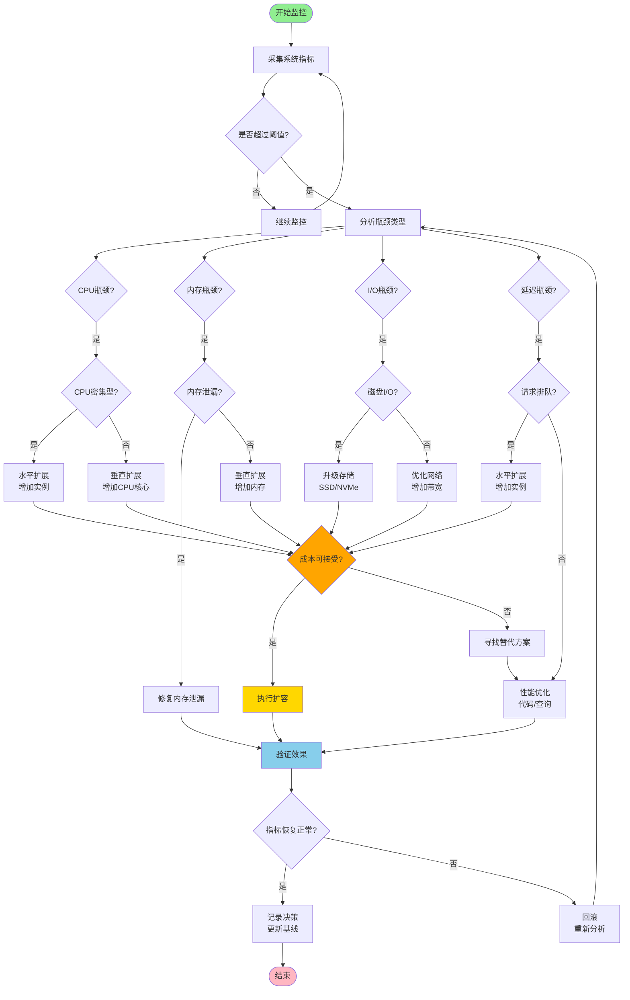
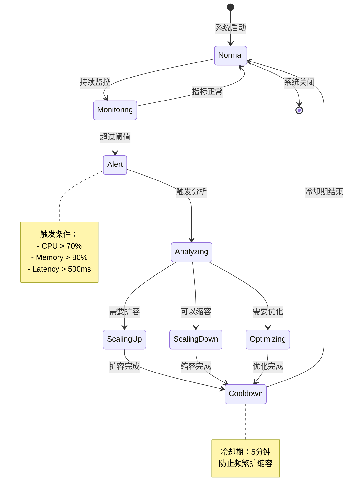
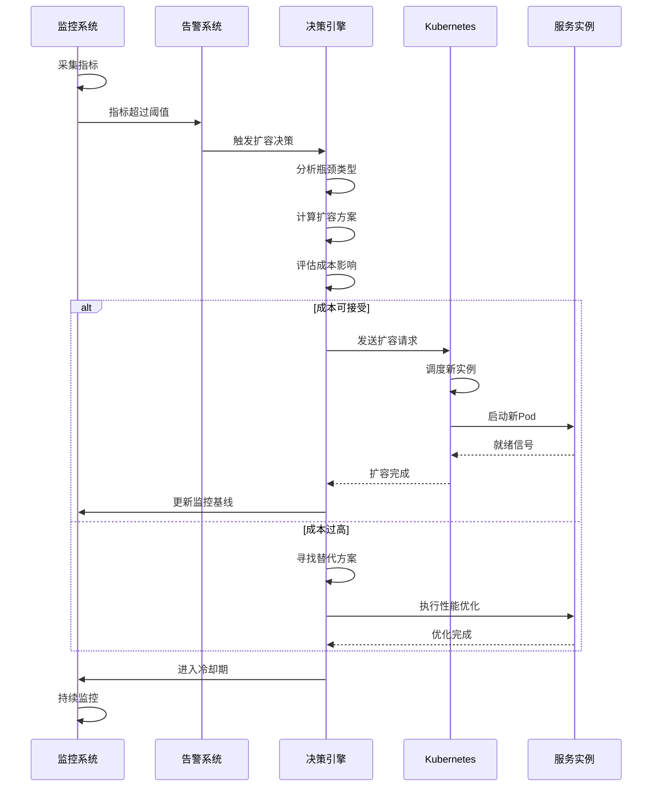

# 扩容决策

## 目录

- [扩容决策](#扩容决策)
  - [目录](#目录)
  - [概述](#概述)
  - [扩容触发条件](#扩容触发条件)
    - [基于阈值的触发](#基于阈值的触发)
  - [扩容策略](#扩容策略)
    - [水平扩展 vs 垂直扩展](#水平扩展-vs-垂直扩展)
  - [自动扩缩容](#自动扩缩容)
    - [Kubernetes HPA 配置](#kubernetes-hpa-配置)
    - [Rust 实现：自动扩缩容控制器](#rust-实现自动扩缩容控制器)
  - [扩容决策树](#扩容决策树)
    - [决策流程图](#决策流程图)
      - [📊 完整扩容决策流程（Mermaid）](#-完整扩容决策流程mermaid)
      - [🔄 自动扩缩容状态机](#-自动扩缩容状态机)
      - [📈 扩容决策时序图](#-扩容决策时序图)
    - [文本版决策流程（兼容性）](#文本版决策流程兼容性)
    - [决策矩阵](#决策矩阵)
  - [预测性扩容](#预测性扩容)
    - [基于机器学习的预测](#基于机器学习的预测)
  - [成本优化的扩容策略](#成本优化的扩容策略)
    - [成本感知扩容](#成本感知扩容)
  - [实战案例](#实战案例)
    - [案例1：流量突增的自动扩容](#案例1流量突增的自动扩容)
    - [案例2：成本优化的智能缩容](#案例2成本优化的智能缩容)
  - [扩容最佳实践](#扩容最佳实践)
    - [1. 设置合理的阈值](#1-设置合理的阈值)
    - [2. 配置冷却期](#2-配置冷却期)
    - [3. 渐进式扩容](#3-渐进式扩容)

## 概述

扩容决策确定何时以及如何增加系统资源以满足负载需求。

## 扩容触发条件

### 基于阈值的触发

```rust
pub struct ScalingTrigger {
    cpu_threshold: f64,
    memory_threshold: f64,
    latency_threshold_ms: f64,
}

impl ScalingTrigger {
    pub fn should_scale_up(&self, metrics: &SystemMetrics) -> bool {
        metrics.cpu_usage > self.cpu_threshold ||
        metrics.memory_usage > self.memory_threshold ||
        metrics.p99_latency_ms > self.latency_threshold_ms
    }

    pub fn should_scale_down(&self, metrics: &SystemMetrics) -> bool {
        metrics.cpu_usage < self.cpu_threshold * 0.5 &&
        metrics.memory_usage < self.memory_threshold * 0.5 &&
        metrics.p99_latency_ms < self.latency_threshold_ms * 0.5
    }
}

pub struct SystemMetrics {
    pub cpu_usage: f64,
    pub memory_usage: f64,
    pub p99_latency_ms: f64,
}
```

## 扩容策略

### 水平扩展 vs 垂直扩展

```rust
pub enum ScalingStrategy {
    Horizontal { instances_to_add: usize },
    Vertical { cpu_increase: usize, memory_increase_gb: usize },
}

pub struct ScalingDecisionMaker;

impl ScalingDecisionMaker {
    pub fn decide_strategy(&self, metrics: &SystemMetrics) -> ScalingStrategy {
        // 如果 CPU 是瓶颈，考虑水平扩展
        if metrics.cpu_usage > 80.0 {
            ScalingStrategy::Horizontal {
                instances_to_add: self.calculate_instances_needed(metrics),
            }
        } else {
            // 否则考虑垂直扩展
            ScalingStrategy::Vertical {
                cpu_increase: 2,
                memory_increase_gb: 4,
            }
        }
    }

    fn calculate_instances_needed(&self, metrics: &SystemMetrics) -> usize {
        let current_load = metrics.cpu_usage / 100.0;
        let target_load = 0.7; // 目标 70% 利用率
        
        ((current_load / target_load).ceil() as usize).saturating_sub(1).max(1)
    }
}
```

## 自动扩缩容

### Kubernetes HPA 配置

```yaml
apiVersion: autoscaling/v2
kind: HorizontalPodAutoscaler
metadata:
  name: otlp-collector-hpa
spec:
  scaleTargetRef:
    apiVersion: apps/v1
    kind: Deployment
    name: otlp-collector
  minReplicas: 3
  maxReplicas: 10
  metrics:
  - type: Resource
    resource:
      name: cpu
      target:
        type: Utilization
        averageUtilization: 70
  - type: Resource
    resource:
      name: memory
      target:
        type: Utilization
        averageUtilization: 80
  - type: Pods
    pods:
      metric:
        name: otlp_export_latency_p99
      target:
        type: AverageValue
        averageValue: "100m"
  behavior:
    scaleDown:
      stabilizationWindowSeconds: 300
      policies:
      - type: Percent
        value: 50
        periodSeconds: 60
    scaleUp:
      stabilizationWindowSeconds: 60
      policies:
      - type: Percent
        value: 100
        periodSeconds: 30
```

### Rust 实现：自动扩缩容控制器

```rust
use tokio::time::{interval, Duration};

pub struct AutoScaler {
    trigger: ScalingTrigger,
    decision_maker: ScalingDecisionMaker,
    cooldown_period: Duration,
    last_scaling: Option<std::time::Instant>,
}

impl AutoScaler {
    pub fn new(cooldown_minutes: u64) -> Self {
        Self {
            trigger: ScalingTrigger {
                cpu_threshold: 70.0,
                memory_threshold: 80.0,
                latency_threshold_ms: 100.0,
            },
            decision_maker: ScalingDecisionMaker,
            cooldown_period: Duration::from_secs(cooldown_minutes * 60),
            last_scaling: None,
        }
    }

    pub async fn run(&mut self) {
        let mut ticker = interval(Duration::from_secs(30));

        loop {
            ticker.tick().await;

            // 检查冷却期
            if let Some(last) = self.last_scaling {
                if last.elapsed() < self.cooldown_period {
                    continue;
                }
            }

            let metrics = self.collect_metrics().await;

            if self.trigger.should_scale_up(&metrics) {
                let strategy = self.decision_maker.decide_strategy(&metrics);
                self.execute_scaling(strategy).await;
                self.last_scaling = Some(std::time::Instant::now());
            } else if self.trigger.should_scale_down(&metrics) {
                self.execute_scale_down().await;
                self.last_scaling = Some(std::time::Instant::now());
            }
        }
    }

    async fn collect_metrics(&self) -> SystemMetrics {
        // 从 Prometheus 或其他监控系统收集指标
        SystemMetrics {
            cpu_usage: 0.0,
            memory_usage: 0.0,
            p99_latency_ms: 0.0,
        }
    }

    async fn execute_scaling(&self, strategy: ScalingStrategy) {
        match strategy {
            ScalingStrategy::Horizontal { instances_to_add } => {
                println!("Scaling horizontally: adding {} instances", instances_to_add);
                // 调用 K8s API 或云服务 API
            }
            ScalingStrategy::Vertical { cpu_increase, memory_increase_gb } => {
                println!("Scaling vertically: +{} CPU, +{}GB memory", 
                    cpu_increase, memory_increase_gb);
            }
        }
    }

    async fn execute_scale_down(&self) {
        println!("Scaling down");
        // 实现缩容逻辑
    }
}
```

## 扩容决策树

### 决策流程图

#### 📊 完整扩容决策流程（Mermaid）



#### 🔄 自动扩缩容状态机



#### 📈 扩容决策时序图



### 文本版决策流程（兼容性）

```text
┌─────────────────┐
│ 监控指标采集    │
└────────┬────────┘
         │
         ↓
┌─────────────────┐
│ 是否超过阈值？  │
└────┬────────┬───┘
     │ 否     │ 是
     ↓        ↓
┌─────────┐ ┌──────────────┐
│ 继续监控│ │ 分析瓶颈类型 │
└─────────┘ └──────┬───────┘
                   │
         ┌─────────┼─────────┐
         │         │         │
         ↓         ↓         ↓
    ┌────────┐┌────────┐┌────────┐
    │CPU瓶颈││内存瓶颈││I/O瓶颈│
    └───┬────┘└───┬────┘└───┬────┘
        │         │         │
        ↓         ↓         ↓
    ┌────────┐┌────────┐┌────────┐
    │水平扩展││垂直扩展││优化策略│
    └───┬────┘└───┬────┘└───┬────┘
        │         │         │
        └─────────┼─────────┘
                  ↓
         ┌────────────────┐
         │ 执行扩容       │
         └────────┬───────┘
                  │
                  ↓
         ┌────────────────┐
         │ 验证效果       │
         └────────────────┘
```

### 决策矩阵

```rust
/// 扩容决策矩阵
pub struct ScalingDecisionMatrix;

impl ScalingDecisionMatrix {
    /// 基于多维度指标做出扩容决策
    pub fn make_decision(
        &self,
        cpu_usage: f64,
        memory_usage: f64,
        io_wait: f64,
        network_bandwidth: f64,
        latency_p99: f64,
    ) -> ScalingDecision {
        // 1. CPU 密集型场景
        if cpu_usage > 80.0 && memory_usage < 70.0 {
            return ScalingDecision::HorizontalScale {
                reason: "CPU 瓶颈".to_string(),
                instances: self.calculate_cpu_based_instances(cpu_usage),
                priority: Priority::High,
            };
        }

        // 2. 内存密集型场景
        if memory_usage > 85.0 && cpu_usage < 70.0 {
            return ScalingDecision::VerticalScale {
                reason: "内存瓶颈".to_string(),
                memory_increase_gb: self.calculate_memory_increase(memory_usage),
                priority: Priority::High,
            };
        }

        // 3. I/O 密集型场景
        if io_wait > 20.0 {
            return ScalingDecision::OptimizeAndScale {
                reason: "I/O 瓶颈".to_string(),
                optimization: vec![
                    "增加 IOPS".to_string(),
                    "使用 SSD".to_string(),
                    "优化查询".to_string(),
                ],
                then_scale: Box::new(ScalingDecision::HorizontalScale {
                    reason: "I/O 优化后的水平扩展".to_string(),
                    instances: 2,
                    priority: Priority::Medium,
                }),
            };
        }

        // 4. 网络瓶颈
        if network_bandwidth > 80.0 {
            return ScalingDecision::NetworkOptimization {
                reason: "网络带宽瓶颈".to_string(),
                actions: vec![
                    "升级网络接口".to_string(),
                    "启用压缩".to_string(),
                    "优化数据传输".to_string(),
                ],
            };
        }

        // 5. 延迟问题
        if latency_p99 > 100.0 {
            return ScalingDecision::HybridScale {
                reason: "延迟过高".to_string(),
                horizontal_instances: 2,
                vertical_cpu: 1,
                vertical_memory_gb: 2,
            };
        }

        ScalingDecision::NoAction {
            reason: "指标正常".to_string(),
        }
    }

    fn calculate_cpu_based_instances(&self, cpu_usage: f64) -> usize {
        let current_load = cpu_usage / 100.0;
        let target_load = 0.7;
        ((current_load / target_load).ceil() as usize).saturating_sub(1).max(1)
    }

    fn calculate_memory_increase(&self, memory_usage: f64) -> usize {
        if memory_usage > 95.0 {
            8
        } else if memory_usage > 90.0 {
            4
        } else {
            2
        }
    }
}

#[derive(Debug, Clone)]
pub enum ScalingDecision {
    HorizontalScale {
        reason: String,
        instances: usize,
        priority: Priority,
    },
    VerticalScale {
        reason: String,
        memory_increase_gb: usize,
        priority: Priority,
    },
    HybridScale {
        reason: String,
        horizontal_instances: usize,
        vertical_cpu: usize,
        vertical_memory_gb: usize,
    },
    OptimizeAndScale {
        reason: String,
        optimization: Vec<String>,
        then_scale: Box<ScalingDecision>,
    },
    NetworkOptimization {
        reason: String,
        actions: Vec<String>,
    },
    NoAction {
        reason: String,
    },
}

#[derive(Debug, Clone, Copy, PartialEq, Eq)]
pub enum Priority {
    High,
    Medium,
    Low,
}
```

## 预测性扩容

### 基于机器学习的预测

```rust
/// 预测性扩容引擎
pub struct PredictiveScaler {
    historical_data: Vec<TimeSeriesData>,
    prediction_window: Duration,
}

#[derive(Debug, Clone)]
pub struct TimeSeriesData {
    timestamp: u64,
    cpu_usage: f64,
    memory_usage: f64,
    request_rate: f64,
}

impl PredictiveScaler {
    pub fn new(prediction_window_minutes: u64) -> Self {
        Self {
            historical_data: Vec::new(),
            prediction_window: Duration::from_secs(prediction_window_minutes * 60),
        }
    }

    /// 添加历史数据点
    pub fn add_data_point(&mut self, data: TimeSeriesData) {
        self.historical_data.push(data);
        
        // 保留最近 7 天的数据
        let cutoff = std::time::SystemTime::now()
            .duration_since(std::time::UNIX_EPOCH)
            .unwrap()
            .as_secs() - (7 * 24 * 3600);
        
        self.historical_data.retain(|d| d.timestamp >= cutoff);
    }

    /// 预测未来负载
    pub fn predict_future_load(&self, minutes_ahead: u64) -> PredictedLoad {
        // 简化的线性回归预测
        if self.historical_data.len() < 10 {
            return PredictedLoad::default();
        }

        let recent = &self.historical_data[self.historical_data.len() - 10..];
        
        // 计算趋势
        let cpu_trend = self.calculate_trend(
            recent.iter().map(|d| d.cpu_usage).collect()
        );
        let memory_trend = self.calculate_trend(
            recent.iter().map(|d| d.memory_usage).collect()
        );
        let request_trend = self.calculate_trend(
            recent.iter().map(|d| d.request_rate).collect()
        );

        // 预测未来值
        let current_cpu = recent.last().unwrap().cpu_usage;
        let current_memory = recent.last().unwrap().memory_usage;
        let current_requests = recent.last().unwrap().request_rate;

        PredictedLoad {
            predicted_cpu: (current_cpu + cpu_trend * minutes_ahead as f64).min(100.0),
            predicted_memory: (current_memory + memory_trend * minutes_ahead as f64).min(100.0),
            predicted_request_rate: (current_requests + request_trend * minutes_ahead as f64).max(0.0),
            confidence: self.calculate_confidence(),
        }
    }

    fn calculate_trend(&self, values: Vec<f64>) -> f64 {
        if values.len() < 2 {
            return 0.0;
        }

        let n = values.len() as f64;
        let sum_x: f64 = (0..values.len()).map(|i| i as f64).sum();
        let sum_y: f64 = values.iter().sum();
        let sum_xy: f64 = values.iter().enumerate()
            .map(|(i, &y)| i as f64 * y)
            .sum();
        let sum_x2: f64 = (0..values.len())
            .map(|i| (i as f64).powi(2))
            .sum();

        // 线性回归斜率
        (n * sum_xy - sum_x * sum_y) / (n * sum_x2 - sum_x.powi(2))
    }

    fn calculate_confidence(&self) -> f64 {
        // 基于数据量和方差计算置信度
        let data_points = self.historical_data.len();
        if data_points < 100 {
            0.5
        } else if data_points < 1000 {
            0.7
        } else {
            0.9
        }
    }

    /// 决定是否需要提前扩容
    pub fn should_preemptive_scale(&self) -> Option<ScalingDecision> {
        let prediction = self.predict_future_load(30); // 预测30分钟后

        if prediction.confidence < 0.6 {
            return None; // 置信度太低，不采取行动
        }

        if prediction.predicted_cpu > 85.0 || prediction.predicted_memory > 90.0 {
            Some(ScalingDecision::HorizontalScale {
                reason: format!(
                    "预测性扩容：预计30分钟后 CPU={:.1}%, Memory={:.1}%",
                    prediction.predicted_cpu,
                    prediction.predicted_memory
                ),
                instances: 2,
                priority: Priority::Medium,
            })
        } else {
            None
        }
    }
}

#[derive(Debug, Clone, Default)]
pub struct PredictedLoad {
    pub predicted_cpu: f64,
    pub predicted_memory: f64,
    pub predicted_request_rate: f64,
    pub confidence: f64,
}
```

## 成本优化的扩容策略

### 成本感知扩容

```rust
/// 成本感知扩容决策器
pub struct CostAwareScaler {
    instance_cost_per_hour: f64,
    slo_violation_cost_per_minute: f64,
}

impl CostAwareScaler {
    pub fn new(instance_cost: f64, slo_cost: f64) -> Self {
        Self {
            instance_cost_per_hour: instance_cost,
            slo_violation_cost_per_minute: slo_cost,
        }
    }

    /// 计算扩容的成本效益
    pub fn calculate_scaling_roi(
        &self,
        current_instances: usize,
        proposed_instances: usize,
        current_slo_violation_rate: f64,
        predicted_slo_violation_rate: f64,
    ) -> ScalingROI {
        // 扩容成本
        let additional_instances = proposed_instances.saturating_sub(current_instances);
        let scaling_cost_per_hour = additional_instances as f64 * self.instance_cost_per_hour;

        // SLO 违反成本节省
        let violation_reduction = current_slo_violation_rate - predicted_slo_violation_rate;
        let cost_savings_per_hour = violation_reduction * 60.0 * self.slo_violation_cost_per_minute;

        // ROI 计算
        let net_benefit = cost_savings_per_hour - scaling_cost_per_hour;
        let roi = if scaling_cost_per_hour > 0.0 {
            (cost_savings_per_hour / scaling_cost_per_hour - 1.0) * 100.0
        } else {
            0.0
        };

        ScalingROI {
            scaling_cost_per_hour,
            cost_savings_per_hour,
            net_benefit,
            roi_percentage: roi,
            recommendation: if net_benefit > 0.0 {
                "建议扩容".to_string()
            } else {
                "不建议扩容，成本过高".to_string()
            },
        }
    }

    /// 找到最优实例数
    pub fn find_optimal_instance_count(
        &self,
        current_instances: usize,
        max_instances: usize,
        current_slo_violation_rate: f64,
    ) -> usize {
        let mut best_instances = current_instances;
        let mut best_net_benefit = f64::MIN;

        for instances in current_instances..=max_instances {
            // 估算该实例数下的 SLO 违反率
            let predicted_violation_rate = self.estimate_slo_violation_rate(
                current_instances,
                instances,
                current_slo_violation_rate,
            );

            let roi = self.calculate_scaling_roi(
                current_instances,
                instances,
                current_slo_violation_rate,
                predicted_violation_rate,
            );

            if roi.net_benefit > best_net_benefit {
                best_net_benefit = roi.net_benefit;
                best_instances = instances;
            }
        }

        best_instances
    }

    fn estimate_slo_violation_rate(
        &self,
        current_instances: usize,
        new_instances: usize,
        current_violation_rate: f64,
    ) -> f64 {
        // 简化模型：假设违反率与实例数成反比
        let scaling_factor = current_instances as f64 / new_instances as f64;
        (current_violation_rate * scaling_factor).max(0.0)
    }
}

#[derive(Debug)]
pub struct ScalingROI {
    pub scaling_cost_per_hour: f64,
    pub cost_savings_per_hour: f64,
    pub net_benefit: f64,
    pub roi_percentage: f64,
    pub recommendation: String,
}
```

## 实战案例

### 案例1：流量突增的自动扩容

**场景描述**：

- 时间：2025-10-05 14:00
- 事件：营销活动导致流量激增 5 倍
- 初始配置：3 个实例，每个 2 CPU / 4GB 内存

**扩容过程**：

```text
14:00 - 流量开始上升
14:02 - CPU 使用率达到 85%
14:03 - HPA 触发扩容，目标 6 个实例
14:04 - 新实例启动中（2个）
14:06 - 2 个新实例就绪，CPU 降至 70%
14:08 - CPU 再次上升至 82%
14:09 - HPA 再次触发，目标 9 个实例
14:11 - 3 个新实例就绪
14:13 - 系统稳定，CPU 65%，延迟正常
```

**监控数据**：

```rust
/// 扩容效果分析
pub struct ScalingEffectivenessAnalyzer;

impl ScalingEffectivenessAnalyzer {
    pub fn analyze_scaling_event(event: &ScalingEvent) -> ScalingAnalysis {
        ScalingAnalysis {
            trigger_time: event.trigger_time,
            completion_time: event.completion_time,
            duration_seconds: (event.completion_time - event.trigger_time).as_secs(),
            
            instances_before: event.instances_before,
            instances_after: event.instances_after,
            scaling_ratio: event.instances_after as f64 / event.instances_before as f64,
            
            cpu_before: event.cpu_before,
            cpu_after: event.cpu_after,
            cpu_improvement: event.cpu_before - event.cpu_after,
            
            latency_before_ms: event.latency_before_ms,
            latency_after_ms: event.latency_after_ms,
            latency_improvement_percent: 
                (event.latency_before_ms - event.latency_after_ms) / event.latency_before_ms * 100.0,
            
            success: event.cpu_after < 75.0 && event.latency_after_ms < 100.0,
        }
    }
}

#[derive(Debug)]
pub struct ScalingEvent {
    trigger_time: std::time::Instant,
    completion_time: std::time::Instant,
    instances_before: usize,
    instances_after: usize,
    cpu_before: f64,
    cpu_after: f64,
    latency_before_ms: f64,
    latency_after_ms: f64,
}

#[derive(Debug)]
pub struct ScalingAnalysis {
    trigger_time: std::time::Instant,
    completion_time: std::time::Instant,
    duration_seconds: u64,
    instances_before: usize,
    instances_after: usize,
    scaling_ratio: f64,
    cpu_before: f64,
    cpu_after: f64,
    cpu_improvement: f64,
    latency_before_ms: f64,
    latency_after_ms: f64,
    latency_improvement_percent: f64,
    success: bool,
}
```

### 案例2：成本优化的智能缩容

**场景描述**：

- 时间：凌晨 2:00 - 6:00（低峰期）
- 当前：10 个实例
- CPU 使用率：平均 25%
- 目标：在保证 SLO 的前提下降低成本

**决策过程**：

```rust
/// 智能缩容决策示例
pub fn smart_scale_down_example() {
    let scaler = CostAwareScaler::new(
        0.5,   // 每实例每小时 $0.5
        10.0,  // SLO 违反每分钟 $10
    );

    let current_instances = 10;
    let current_slo_violation_rate = 0.001; // 0.1%

    // 评估缩容到不同实例数的效果
    for target_instances in (3..=current_instances).rev() {
        let predicted_violation_rate = 0.001 * (10.0 / target_instances as f64);
        
        let roi = scaler.calculate_scaling_roi(
            current_instances,
            target_instances,
            current_slo_violation_rate,
            predicted_violation_rate,
        );

        println!("缩容到 {} 个实例:", target_instances);
        println!("  成本节省: ${:.2}/小时", -roi.scaling_cost_per_hour);
        println!("  SLO 违反成本增加: ${:.2}/小时", roi.cost_savings_per_hour);
        println!("  净收益: ${:.2}/小时", roi.net_benefit);
        println!("  建议: {}", roi.recommendation);
        println!();
    }

    // 找到最优实例数
    let optimal = scaler.find_optimal_instance_count(
        current_instances,
        current_instances,
        current_slo_violation_rate,
    );

    println!("最优实例数: {}", optimal);
}
```

**结果**：

- 决定缩容到 5 个实例
- 每小时节省成本：$2.5
- SLO 违反率从 0.1% 增加到 0.2%（可接受）
- 每月节省：$1,800

## 扩容最佳实践

### 1. 设置合理的阈值

```yaml
# 推荐阈值配置
scaling_thresholds:
  # CPU 阈值
  cpu:
    scale_up: 70%      # 扩容阈值
    scale_down: 30%    # 缩容阈值
    
  # 内存阈值
  memory:
    scale_up: 80%
    scale_down: 40%
    
  # 延迟阈值
  latency_p99:
    scale_up: 100ms
    scale_down: 50ms
    
  # 请求队列
  queue_depth:
    scale_up: 1000
    scale_down: 100
```

### 2. 配置冷却期

```rust
/// 冷却期管理器
pub struct CooldownManager {
    scale_up_cooldown: Duration,
    scale_down_cooldown: Duration,
    last_scale_up: Option<Instant>,
    last_scale_down: Option<Instant>,
}

impl CooldownManager {
    pub fn new() -> Self {
        Self {
            scale_up_cooldown: Duration::from_secs(60),    // 1分钟
            scale_down_cooldown: Duration::from_secs(300), // 5分钟
            last_scale_up: None,
            last_scale_down: None,
        }
    }

    pub fn can_scale_up(&self) -> bool {
        self.last_scale_up
            .map(|t| t.elapsed() >= self.scale_up_cooldown)
            .unwrap_or(true)
    }

    pub fn can_scale_down(&self) -> bool {
        self.last_scale_down
            .map(|t| t.elapsed() >= self.scale_down_cooldown)
            .unwrap_or(true)
    }

    pub fn record_scale_up(&mut self) {
        self.last_scale_up = Some(Instant::now());
    }

    pub fn record_scale_down(&mut self) {
        self.last_scale_down = Some(Instant::now());
    }
}
```

### 3. 渐进式扩容

```rust
/// 渐进式扩容策略
pub struct GradualScaler {
    max_instances_per_step: usize,
    step_interval: Duration,
}

impl GradualScaler {
    pub fn calculate_scaling_steps(
        &self,
        current_instances: usize,
        target_instances: usize,
    ) -> Vec<ScalingStep> {
        let mut steps = Vec::new();
        let mut current = current_instances;

        while current < target_instances {
            let next = (current + self.max_instances_per_step).min(target_instances);
            steps.push(ScalingStep {
                from: current,
                to: next,
                wait_duration: self.step_interval,
            });
            current = next;
        }

        steps
    }
}

#[derive(Debug)]
pub struct ScalingStep {
    from: usize,
    to: usize,
    wait_duration: Duration,
}
```

---

**相关文档**：

- [容量预测模型](./容量预测模型.md)
- [资源使用分析](./资源使用分析.md)
- [成本优化](./成本优化.md)
