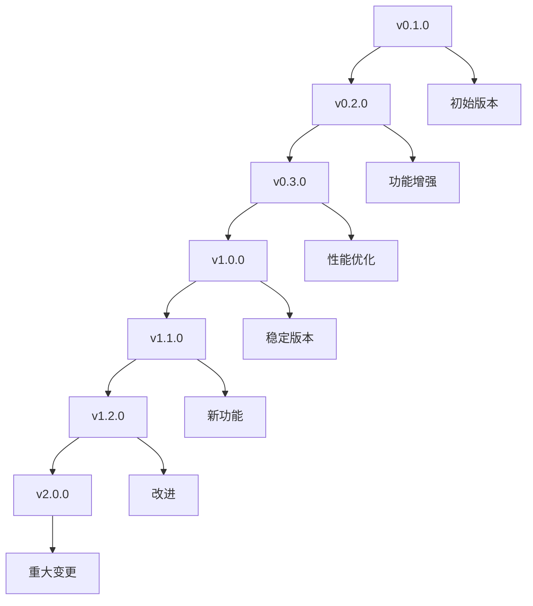

# OTLP Rust 迁移指南和版本升级说明

## 目录

1. [版本升级策略](#版本升级策略)
2. [兼容性说明](#兼容性说明)
3. [升级步骤](#升级步骤)
4. [配置迁移](#配置迁移)
5. [数据迁移](#数据迁移)
6. [API变更](#api变更)
7. [故障排查](#故障排查)
8. [回滚策略](#回滚策略)

## 版本升级策略

### 版本号规范

OTLP Rust项目遵循语义化版本控制(Semantic Versioning)：

- **主版本号(Major)**: 不兼容的API变更
- **次版本号(Minor)**: 向后兼容的功能新增
- **修订号(Patch)**: 向后兼容的问题修复

### 升级路径



### 支持策略

| 版本类型 | 支持期限 | 安全更新 | 功能更新 | 问题修复 |
|----------|----------|----------|----------|----------|
| 当前版本 | 18个月 | ✅ | ✅ | ✅ |
| 前一版本 | 12个月 | ✅ | ❌ | ✅ |
| 更早版本 | 6个月 | ✅ | ❌ | ❌ |

## 兼容性说明

### 1. API兼容性

#### 向后兼容变更

```rust
// v0.1.0
pub struct OtlpClient {
    endpoint: String,
    timeout: Duration,
}

// v0.2.0 - 向后兼容
pub struct OtlpClient {
    endpoint: String,
    timeout: Duration,
    retry_config: RetryConfig, // 新增字段，有默认值
}

impl OtlpClient {
    // 新增方法，不影响现有代码
    pub fn with_retry_config(mut self, config: RetryConfig) -> Self {
        self.retry_config = config;
        self
    }
}
```

#### 不兼容变更

```rust
// v0.1.0
pub fn send_trace(&self, trace: TraceData) -> Result<(), OtlpError>;

// v2.0.0 - 不兼容变更
pub async fn send_trace(&self, trace: TraceData) -> Result<(), OtlpError>;
// 方法变为异步，需要await
```

### 2. 配置兼容性

#### 配置格式变更

```toml
# v0.1.0 配置格式
[otlp]
endpoint = "http://collector:4317"
timeout = 30

# v0.2.0 配置格式 - 向后兼容
[otlp]
endpoint = "http://collector:4317"
timeout = 30
retry_config = { max_attempts = 3, base_delay = 100 }

# v1.0.0 配置格式 - 不兼容变更
[otlp.transport]
endpoint = "http://collector:4317"
timeout = 30

[otlp.resilience]
retry = { max_attempts = 3, base_delay = 100 }
```

### 3. 数据格式兼容性

#### 协议缓冲区兼容性

```protobuf
// v0.1.0
message TraceData {
  string trace_id = 1;
  repeated SpanData spans = 2;
}

// v0.2.0 - 向后兼容
message TraceData {
  string trace_id = 1;
  repeated SpanData spans = 2;
  map<string, string> metadata = 3; // 新增字段
}

// v2.0.0 - 不兼容变更
message TraceData {
  string trace_id = 1;
  repeated SpanData spans = 2;
  TraceMetadata metadata = 3; // 字段类型变更
}
```

## 升级步骤

### 1. 准备阶段

#### 环境检查

```bash
# 检查当前版本
otlp-server --version

# 检查系统要求
rustc --version  # 确保 >= 1.90.0
cargo --version  # 确保 >= 1.90.0

# 检查依赖服务
docker ps | grep otlp-collector
kubectl get pods -n otlp-system
```

#### 备份数据

```bash
# 备份配置文件
cp -r /etc/otlp-rust /backup/otlp-rust-config-$(date +%Y%m%d)

# 备份数据目录
tar -czf /backup/otlp-rust-data-$(date +%Y%m%d).tar.gz /var/lib/otlp-rust

# 备份数据库
pg_dump otlp_database > /backup/otlp-database-$(date +%Y%m%d).sql
```

#### 测试环境验证

```bash
# 在测试环境部署新版本
docker run -d --name otlp-test otlp-rust:v1.0.0

# 运行兼容性测试
cargo test --test compatibility

# 运行性能测试
cargo bench
```

### 2. 升级执行

#### 零停机升级

```bash
#!/bin/bash
# rolling-upgrade.sh

OLD_VERSION="v0.2.0"
NEW_VERSION="v1.0.0"
NAMESPACE="otlp-system"

echo "开始零停机升级..."

# 1. 更新配置
kubectl apply -f configs/v1.0.0/

# 2. 逐个更新Pod
kubectl get pods -n $NAMESPACE -o name | while read pod; do
    echo "更新 $pod..."
    kubectl delete $pod -n $NAMESPACE
    sleep 30  # 等待Pod重启
    kubectl wait --for=condition=ready pod -l app=otlp-collector -n $NAMESPACE
done

echo "升级完成！"
```

#### 蓝绿部署

```bash
#!/bin/bash
# blue-green-deployment.sh

echo "开始蓝绿部署..."

# 1. 部署绿色环境
kubectl apply -f k8s/green/
kubectl wait --for=condition=ready pod -l app=otlp-collector,color=green -n otlp-system

# 2. 切换流量
kubectl patch service otlp-collector -n otlp-system -p '{"spec":{"selector":{"color":"green"}}}'

# 3. 验证绿色环境
sleep 60
curl -f http://otlp-collector/health

# 4. 清理蓝色环境
kubectl delete -f k8s/blue/

echo "蓝绿部署完成！"
```

### 3. 验证阶段

#### 功能验证

```rust
// tests/upgrade_validation.rs
#[tokio::test]
async fn test_post_upgrade_functionality() {
    let client = OtlpClient::new("http://localhost:4317").await.unwrap();
    
    // 测试基本功能
    let span = client.start_span("upgrade_test", |span| {
        span.set_attribute("test", "upgrade");
    });
    span.end();
    
    // 测试新功能
    let result = client.record_metric("upgrade_test", 1.0, vec![("test", "upgrade")]).await;
    assert!(result.is_ok());
    
    // 测试批量处理
    let mut batch = TelemetryBatch::new();
    batch.add_trace(create_test_trace());
    let result = client.send_batch(batch).await;
    assert!(result.is_ok());
}
```

#### 性能验证

```bash
# 运行性能基准测试
cargo bench --bench performance

# 检查关键指标
curl -s http://localhost:8080/metrics | grep otlp_requests_total
curl -s http://localhost:8080/metrics | grep otlp_latency_seconds

# 对比升级前后性能
python scripts/compare_performance.py --before v0.2.0 --after v1.0.0
```

## 配置迁移

### 1. 自动配置迁移

```rust
// src/config/migration.rs
use serde::{Deserialize, Serialize};
use std::collections::HashMap;

pub struct ConfigMigrator {
    migrations: HashMap<String, Box<dyn ConfigMigration>>,
}

pub trait ConfigMigration {
    fn from_version(&self) -> &str;
    fn to_version(&self) -> &str;
    fn migrate(&self, config: serde_json::Value) -> Result<serde_json::Value, MigrationError>;
}

impl ConfigMigrator {
    pub fn new() -> Self {
        let mut migrations = HashMap::new();
        
        // 注册迁移规则
        migrations.insert("0.1.0->0.2.0".to_string(), Box::new(V010To020Migration));
        migrations.insert("0.2.0->1.0.0".to_string(), Box::new(V020To100Migration));
        
        Self { migrations }
    }
    
    pub fn migrate_config(&self, config_path: &str, target_version: &str) -> Result<(), MigrationError> {
        let current_version = self.detect_version(config_path)?;
        let mut config = self.load_config(config_path)?;
        
        let migration_path = self.find_migration_path(&current_version, target_version)?;
        
        for migration_key in migration_path {
            if let Some(migration) = self.migrations.get(&migration_key) {
                config = migration.migrate(config)?;
            }
        }
        
        self.save_config(config_path, &config)?;
        Ok(())
    }
    
    fn find_migration_path(&self, from: &str, to: &str) -> Result<Vec<String>, MigrationError> {
        // 查找迁移路径的实现
        let mut path = Vec::new();
        
        if from == "0.1.0" && to == "1.0.0" {
            path.push("0.1.0->0.2.0".to_string());
            path.push("0.2.0->1.0.0".to_string());
        }
        
        Ok(path)
    }
}

// v0.1.0 -> v0.2.0 迁移
struct V010To020Migration;

impl ConfigMigration for V010To020Migration {
    fn from_version(&self) -> &str { "0.1.0" }
    fn to_version(&self) -> &str { "0.2.0" }
    
    fn migrate(&self, config: serde_json::Value) -> Result<serde_json::Value, MigrationError> {
        let mut new_config = config.clone();
        
        // 添加默认重试配置
        if !new_config["otlp"].as_object().unwrap().contains_key("retry_config") {
            new_config["otlp"]["retry_config"] = serde_json::json!({
                "max_attempts": 3,
                "base_delay": 100,
                "max_delay": 5000
            });
        }
        
        Ok(new_config)
    }
}

// v0.2.0 -> v1.0.0 迁移
struct V020To100Migration;

impl ConfigMigration for V020To100Migration {
    fn from_version(&self) -> &str { "0.2.0" }
    fn to_version(&self) -> &str { "1.0.0" }
    
    fn migrate(&self, config: serde_json::Value) -> Result<serde_json::Value, MigrationError> {
        let mut new_config = serde_json::Map::new();
        
        // 重新组织配置结构
        if let Some(otlp_config) = config.get("otlp").and_then(|v| v.as_object()) {
            // 传输配置
            new_config.insert("transport".to_string(), serde_json::json!({
                "endpoint": otlp_config.get("endpoint"),
                "timeout": otlp_config.get("timeout"),
            }));
            
            // 弹性配置
            if let Some(retry_config) = otlp_config.get("retry_config") {
                new_config.insert("resilience".to_string(), serde_json::json!({
                    "retry": retry_config
                }));
            }
        }
        
        let mut result = serde_json::Map::new();
        result.insert("otlp".to_string(), serde_json::Value::Object(new_config));
        
        Ok(serde_json::Value::Object(result))
    }
}
```

### 2. 手动配置迁移

#### 配置文件转换脚本

```bash
#!/bin/bash
# migrate-config.sh

CONFIG_FILE="/etc/otlp-rust/config.toml"
BACKUP_FILE="/etc/otlp-rust/config.toml.backup"

echo "开始配置迁移..."

# 备份原配置
cp $CONFIG_FILE $BACKUP_FILE

# 检测版本并迁移
VERSION=$(grep "version" $CONFIG_FILE | cut -d'"' -f2)

case $VERSION in
    "0.1.0")
        echo "从 v0.1.0 迁移到 v1.0.0..."
        python3 scripts/migrate_v010_to_v100.py $CONFIG_FILE
        ;;
    "0.2.0")
        echo "从 v0.2.0 迁移到 v1.0.0..."
        python3 scripts/migrate_v020_to_v100.py $CONFIG_FILE
        ;;
    *)
        echo "未知版本: $VERSION"
        exit 1
        ;;
esac

echo "配置迁移完成！"
```

#### Python迁移脚本

```python
# scripts/migrate_v020_to_v100.py
import toml
import sys
import json

def migrate_config(config_file):
    with open(config_file, 'r') as f:
        config = toml.load(f)
    
    # 新配置结构
    new_config = {
        'otlp': {
            'environment': config['otlp'].get('environment', 'production'),
            'log_level': config['otlp'].get('log_level', 'info'),
        }
    }
    
    # 传输配置
    if 'endpoint' in config['otlp']:
        new_config['otlp']['transport'] = {
            'endpoint': config['otlp']['endpoint'],
            'timeout': config['otlp'].get('timeout', 30),
        }
    
    # 弹性配置
    if 'retry_config' in config['otlp']:
        new_config['otlp']['resilience'] = {
            'retry': config['otlp']['retry_config']
        }
    
    # 保存新配置
    with open(config_file, 'w') as f:
        toml.dump(new_config, f)
    
    print("配置迁移完成！")

if __name__ == "__main__":
    migrate_config(sys.argv[1])
```

## 数据迁移

### 1. 数据库迁移

```sql
-- migrations/001_add_metadata_column.sql
-- 添加元数据列到traces表
ALTER TABLE traces ADD COLUMN metadata JSONB;

-- 创建索引
CREATE INDEX idx_traces_metadata ON traces USING GIN (metadata);

-- 迁移现有数据
UPDATE traces SET metadata = '{}' WHERE metadata IS NULL;
```

```rust
// src/database/migration.rs
use sqlx::{PgPool, Row};
use serde_json::Value;

pub struct DatabaseMigrator {
    pool: PgPool,
}

impl DatabaseMigrator {
    pub fn new(pool: PgPool) -> Self {
        Self { pool }
    }
    
    pub async fn run_migrations(&self) -> Result<(), MigrationError> {
        let current_version = self.get_current_version().await?;
        let target_version = env!("CARGO_PKG_VERSION");
        
        if current_version != target_version {
            self.migrate_to_version(target_version).await?;
        }
        
        Ok(())
    }
    
    async fn migrate_to_version(&self, target_version: &str) -> Result<(), MigrationError> {
        let migrations = self.get_pending_migrations(target_version).await?;
        
        for migration in migrations {
            println!("执行迁移: {}", migration.name);
            self.execute_migration(&migration).await?;
        }
        
        self.update_version(target_version).await?;
        Ok(())
    }
    
    async fn execute_migration(&self, migration: &Migration) -> Result<(), MigrationError> {
        // 开始事务
        let mut tx = self.pool.begin().await?;
        
        // 执行迁移SQL
        sqlx::query(&migration.sql)
            .execute(&mut *tx)
            .await?;
        
        // 记录迁移历史
        sqlx::query("INSERT INTO migration_history (name, version, executed_at) VALUES ($1, $2, NOW())")
            .bind(&migration.name)
            .bind(&migration.version)
            .execute(&mut *tx)
            .await?;
        
        // 提交事务
        tx.commit().await?;
        
        Ok(())
    }
}

#[derive(Debug)]
struct Migration {
    name: String,
    version: String,
    sql: String,
}
```

### 2. 数据格式迁移

```rust
// src/data/migration.rs
use serde::{Deserialize, Serialize};
use std::collections::HashMap;

pub struct DataMigrator {
    migrations: HashMap<String, Box<dyn DataMigration>>,
}

pub trait DataMigration {
    fn from_version(&self) -> &str;
    fn to_version(&self) -> &str;
    fn migrate_trace(&self, trace: &mut TraceData) -> Result<(), MigrationError>;
    fn migrate_metric(&self, metric: &mut MetricData) -> Result<(), MigrationError>;
    fn migrate_log(&self, log: &mut LogData) -> Result<(), MigrationError>;
}

impl DataMigrator {
    pub fn new() -> Self {
        let mut migrations = HashMap::new();
        
        migrations.insert("0.1.0->0.2.0".to_string(), Box::new(V010To020DataMigration));
        migrations.insert("0.2.0->1.0.0".to_string(), Box::new(V020To100DataMigration));
        
        Self { migrations }
    }
    
    pub fn migrate_data(&self, data: &mut TelemetryData, target_version: &str) -> Result<(), MigrationError> {
        let current_version = data.version.as_ref().unwrap_or(&"0.1.0".to_string());
        
        if current_version == target_version {
            return Ok(());
        }
        
        let migration_path = self.find_migration_path(current_version, target_version)?;
        
        for migration_key in migration_path {
            if let Some(migration) = self.migrations.get(&migration_key) {
                match data {
                    TelemetryData::Trace(trace) => migration.migrate_trace(trace)?,
                    TelemetryData::Metric(metric) => migration.migrate_metric(metric)?,
                    TelemetryData::Log(log) => migration.migrate_log(log)?,
                }
            }
        }
        
        data.version = Some(target_version.to_string());
        Ok(())
    }
}

// v0.1.0 -> v0.2.0 数据迁移
struct V010To020DataMigration;

impl DataMigration for V010To020DataMigration {
    fn from_version(&self) -> &str { "0.1.0" }
    fn to_version(&self) -> &str { "0.2.0" }
    
    fn migrate_trace(&self, trace: &mut TraceData) -> Result<(), MigrationError> {
        // 添加元数据字段
        if trace.metadata.is_none() {
            trace.metadata = Some(HashMap::new());
        }
        Ok(())
    }
    
    fn migrate_metric(&self, metric: &mut MetricData) -> Result<(), MigrationError> {
        // 添加时间戳字段
        if metric.timestamp.is_none() {
            metric.timestamp = Some(std::time::SystemTime::now());
        }
        Ok(())
    }
    
    fn migrate_log(&self, log: &mut LogData) -> Result<(), MigrationError> {
        // 标准化日志级别
        log.level = log.level.to_lowercase();
        Ok(())
    }
}
```

## API变更

### 1. 破坏性变更

#### 异步API变更

```rust
// v0.1.0 - 同步API
impl OtlpClient {
    pub fn send_trace(&self, trace: TraceData) -> Result<(), OtlpError> {
        // 同步实现
    }
}

// v2.0.0 - 异步API
impl OtlpClient {
    pub async fn send_trace(&self, trace: TraceData) -> Result<(), OtlpError> {
        // 异步实现
    }
}

// 迁移指南
// 旧代码:
// client.send_trace(trace)?;

// 新代码:
// client.send_trace(trace).await?;
```

#### 错误类型变更

```rust
// v0.1.0
pub enum OtlpError {
    TransportError(String),
    ProcessingError(String),
}

// v1.0.0 - 更详细的错误类型
pub enum OtlpError {
    Transport(TransportError),
    Processing(ProcessingError),
    Configuration(ConfigurationError),
    Validation(ValidationError),
}

// 迁移指南
// 旧代码:
// match error {
//     OtlpError::TransportError(msg) => println!("Transport error: {}", msg),
//     OtlpError::ProcessingError(msg) => println!("Processing error: {}", msg),
// }

// 新代码:
// match error {
//     OtlpError::Transport(err) => println!("Transport error: {}", err),
//     OtlpError::Processing(err) => println!("Processing error: {}", err),
//     OtlpError::Configuration(err) => println!("Configuration error: {}", err),
//     OtlpError::Validation(err) => println!("Validation error: {}", err),
// }
```

### 2. 新增功能

#### 批量处理API

```rust
// v0.2.0 新增
impl OtlpClient {
    pub async fn send_batch(&self, batch: TelemetryBatch) -> Result<(), OtlpError> {
        // 批量发送实现
    }
}

// 使用示例
let mut batch = TelemetryBatch::new();
batch.add_trace(trace_data);
batch.add_metric(metric_data);
batch.add_log(log_data);

client.send_batch(batch).await?;
```

#### 配置管理API

```rust
// v1.0.0 新增
impl OtlpClient {
    pub async fn update_config(&self, config: ClientConfig) -> Result<(), OtlpError> {
        // 动态配置更新
    }
    
    pub async fn get_metrics(&self) -> Result<ClientMetrics, OtlpError> {
        // 获取客户端指标
    }
}
```

## 故障排查

### 1. 常见升级问题

#### 版本不兼容

```bash
# 问题: 版本不兼容错误
error: failed to load source for a dependency on `otlp`
    ──> Cargo.toml
    ──> dependency `otlp` in `src/lib.rs`
    ──> failed to load source for dependency `otlp`
    ──> Cargo.toml
    ──> dependency `otlp` in `src/lib.rs`
    ──> failed to load source for dependency `otlp`

# 解决方案: 更新依赖版本
[dependencies]
otlp = "1.0.0"  # 从 0.2.0 更新到 1.0.0
```

#### 配置格式错误

```bash
# 问题: 配置解析错误
Error: failed to parse config file: invalid TOML syntax

# 解决方案: 运行配置迁移
otlp-server --migrate-config --config /etc/otlp-rust/config.toml
```

#### 数据库连接失败

```bash
# 问题: 数据库连接失败
Error: failed to connect to database: connection refused

# 解决方案: 检查数据库状态和迁移
systemctl status postgresql
otlp-server --migrate-database --config /etc/otlp-rust/config.toml
```

### 2. 诊断工具

```rust
// src/diagnostics/upgrade_diagnostics.rs
pub struct UpgradeDiagnostics {
    config_path: String,
    data_path: String,
}

impl UpgradeDiagnostics {
    pub fn new(config_path: String, data_path: String) -> Self {
        Self { config_path, data_path }
    }
    
    pub async fn run_diagnostics(&self) -> Result<DiagnosticReport, DiagnosticError> {
        let mut report = DiagnosticReport::new();
        
        // 检查配置文件
        self.check_config_file(&mut report).await?;
        
        // 检查数据目录
        self.check_data_directory(&mut report).await?;
        
        // 检查数据库
        self.check_database(&mut report).await?;
        
        // 检查网络连接
        self.check_network_connectivity(&mut report).await?;
        
        Ok(report)
    }
    
    async fn check_config_file(&self, report: &mut DiagnosticReport) -> Result<(), DiagnosticError> {
        if !std::path::Path::new(&self.config_path).exists() {
            report.add_issue(DiagnosticIssue {
                severity: IssueSeverity::Critical,
                category: IssueCategory::Configuration,
                message: "配置文件不存在".to_string(),
                suggestion: "请检查配置文件路径".to_string(),
            });
        }
        
        // 验证配置格式
        match self.validate_config().await {
            Ok(_) => report.add_success("配置文件格式正确"),
            Err(e) => report.add_issue(DiagnosticIssue {
                severity: IssueSeverity::High,
                category: IssueCategory::Configuration,
                message: format!("配置格式错误: {}", e),
                suggestion: "运行配置迁移工具".to_string(),
            }),
        }
        
        Ok(())
    }
    
    async fn check_data_directory(&self, report: &mut DiagnosticReport) -> Result<(), DiagnosticError> {
        let data_path = std::path::Path::new(&self.data_path);
        
        if !data_path.exists() {
            report.add_issue(DiagnosticIssue {
                severity: IssueSeverity::High,
                category: IssueCategory::Data,
                message: "数据目录不存在".to_string(),
                suggestion: "创建数据目录或检查路径配置".to_string(),
            });
            return Ok(());
        }
        
        // 检查磁盘空间
        let available_space = self.get_available_space(data_path)?;
        if available_space < 1024 * 1024 * 1024 { // 1GB
            report.add_issue(DiagnosticIssue {
                severity: IssueSeverity::Medium,
                category: IssueCategory::Data,
                message: "磁盘空间不足".to_string(),
                suggestion: "清理磁盘空间或扩展存储".to_string(),
            });
        }
        
        Ok(())
    }
}

#[derive(Debug)]
pub struct DiagnosticReport {
    pub issues: Vec<DiagnosticIssue>,
    pub successes: Vec<String>,
}

#[derive(Debug)]
pub struct DiagnosticIssue {
    pub severity: IssueSeverity,
    pub category: IssueCategory,
    pub message: String,
    pub suggestion: String,
}

#[derive(Debug)]
pub enum IssueSeverity {
    Low,
    Medium,
    High,
    Critical,
}

#[derive(Debug)]
pub enum IssueCategory {
    Configuration,
    Data,
    Network,
    Database,
    Security,
}
```

## 回滚策略

### 1. 自动回滚

```bash
#!/bin/bash
# auto-rollback.sh

echo "检查升级状态..."

# 检查健康状态
HEALTH_STATUS=$(curl -s http://localhost:8080/health | jq -r '.status')

if [ "$HEALTH_STATUS" != "healthy" ]; then
    echo "检测到健康状态异常，开始自动回滚..."
    
    # 回滚到前一版本
    kubectl rollout undo deployment/otlp-collector -n otlp-system
    
    # 等待回滚完成
    kubectl rollout status deployment/otlp-collector -n otlp-system
    
    # 验证回滚结果
    sleep 30
    NEW_HEALTH_STATUS=$(curl -s http://localhost:8080/health | jq -r '.status')
    
    if [ "$NEW_HEALTH_STATUS" = "healthy" ]; then
        echo "回滚成功！"
    else
        echo "回滚失败，需要手动干预"
        exit 1
    fi
else
    echo "系统状态正常，无需回滚"
fi
```

### 2. 手动回滚

```bash
#!/bin/bash
# manual-rollback.sh

BACKUP_DIR="/backup/otlp-rust-$(date +%Y%m%d)"
ROLLBACK_VERSION="v0.2.0"

echo "开始手动回滚到 $ROLLBACK_VERSION..."

# 1. 停止当前服务
systemctl stop otlp-rust

# 2. 恢复配置文件
if [ -d "$BACKUP_DIR/config" ]; then
    cp -r $BACKUP_DIR/config/* /etc/otlp-rust/
    echo "配置文件已恢复"
fi

# 3. 恢复数据目录
if [ -f "$BACKUP_DIR/data.tar.gz" ]; then
    tar -xzf $BACKUP_DIR/data.tar.gz -C /
    echo "数据目录已恢复"
fi

# 4. 安装前一版本
cargo install otlp-rust --version $ROLLBACK_VERSION

# 5. 启动服务
systemctl start otlp-rust

# 6. 验证服务状态
sleep 30
systemctl status otlp-rust

echo "手动回滚完成！"
```

### 3. 数据库回滚

```sql
-- rollback-database.sql
-- 回滚数据库到前一版本

-- 删除新增的表
DROP TABLE IF EXISTS migration_history;

-- 删除新增的列
ALTER TABLE traces DROP COLUMN IF EXISTS metadata;

-- 删除新增的索引
DROP INDEX IF EXISTS idx_traces_metadata;

-- 恢复数据库版本
UPDATE system_info SET version = '0.2.0' WHERE component = 'database';
```

## 总结

本文档提供了OTLP Rust项目的完整迁移指南和版本升级说明，包括：

1. **版本升级策略**: 版本规范、升级路径、支持策略
2. **兼容性说明**: API兼容性、配置兼容性、数据格式兼容性
3. **升级步骤**: 准备阶段、升级执行、验证阶段
4. **配置迁移**: 自动迁移、手动迁移、转换脚本
5. **数据迁移**: 数据库迁移、数据格式迁移
6. **API变更**: 破坏性变更、新增功能
7. **故障排查**: 常见问题、诊断工具
8. **回滚策略**: 自动回滚、手动回滚、数据库回滚

通过遵循这些迁移指南和升级说明，可以确保OTLP Rust项目在版本升级过程中的平滑过渡，最小化对生产环境的影响，并提供可靠的回滚机制。
