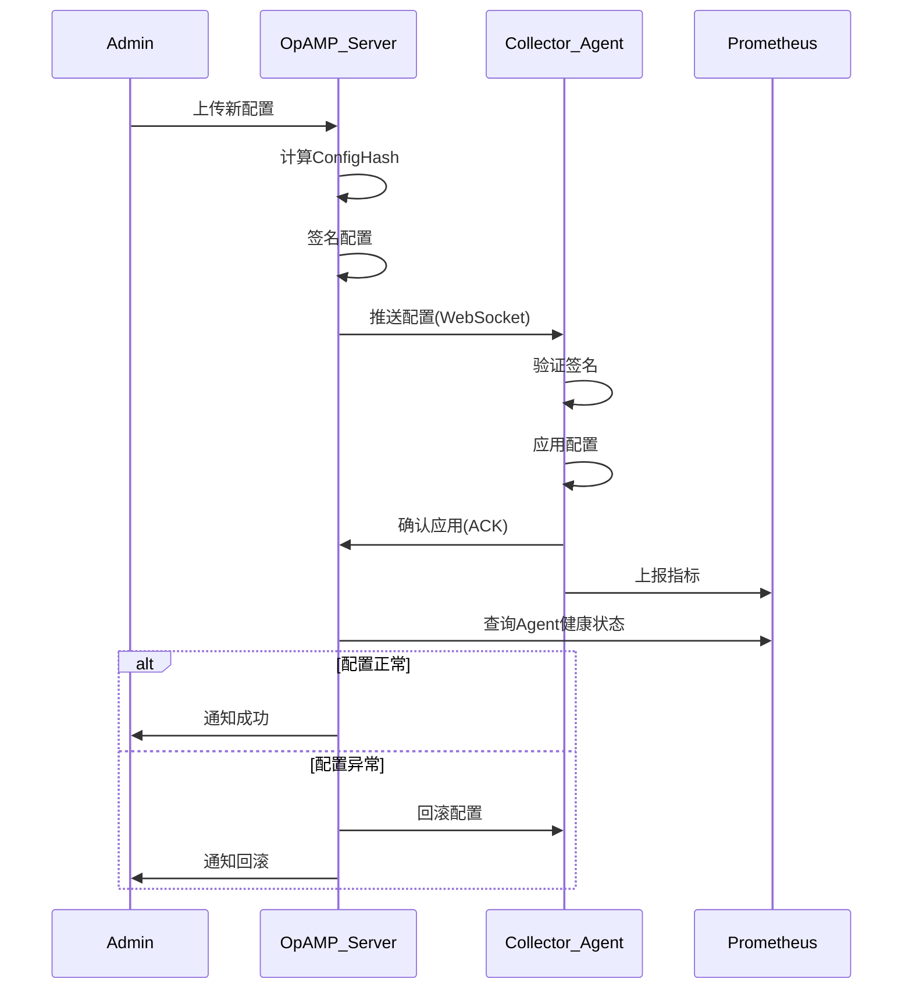

# OpAMP灰度发布与回滚策略完整指南

> **版本**: 2.0  
> **日期**: 2025年10月17日  
> **状态**: ✅ 完整版

---

## 📋 文档概述

本文档提供基于**OpAMP（Open Agent Management Protocol）**的配置灰度发布、证书轮换和自动回滚的完整策略和实施指南。

### 适用场景

- ✅ 多集群配置统一管理
- ✅ 配置安全灰度下发
- ✅ 证书自动轮换
- ✅ 包版本管理
- ✅ 故障自动回滚

---

## 🎯 OpAMP概述

### 什么是OpAMP

OpAMP是OpenTelemetry的**控制面协议**，用于远程管理和配置Collector实例。

**核心能力**:

- **配置管理**: 远程下发和更新配置
- **包管理**: Agent软件包管理和升级
- **健康监控**: Agent状态上报和监控
- **证书管理**: TLS证书自动轮换

### 架构模式

```text
┌─────────────┐         OpAMP协议          ┌──────────────┐
│ OpAMP Server│ ◄──────────────────────── │  Collector   │
│  (Control)  │                            │   Agent 1    │
└─────────────┘                            └──────────────┘
      │                                     
      │          OpAMP协议                  ┌──────────────┐
      └────────────────────────────────────►│  Collector   │
                                            │   Agent 2    │
                                            └──────────────┘
                                                   │
                                                   │
                                            ┌──────────────┐
                                            │  Collector   │
                                            │   Agent N    │
                                            └──────────────┘
```

---

## 📊 SLO与性能目标

### 关键SLO指标

| 指标 | 目标 | 测量方法 |
|------|------|---------|
| **配置下发延迟** | P95 < 5s | 从Server发送到Agent确认的时间 |
| **下发成功率** | > 99.5% | 成功应用配置的比例 |
| **回滚时间** | < 30s | 触发回滚到配置生效的时间 |
| **Agent连接稳定性** | > 99.9% | Agent保持连接的时间比例 |
| **证书轮换成功率** | > 99% | 证书自动轮换成功的比例 |

### 观测门槛

```yaml
# 灰度期间监控阈值
thresholds:
  failure_rate:
    warning: 0.1%
    critical: 0.5%
    
  cpu_increase:
    warning: 5%
    critical: 10%
    
  latency_p95:
    warning: 50ms
    critical: 100ms
    
  error_rate:
    warning: 10 errors/min
    critical: 50 errors/min
```

---

## 🚀 灰度发布策略

### 1. 目标选择器

#### 标签选择器

```yaml
# selector-config.yaml
selectors:
  # 按环境选择
  - name: canary-env
    labels:
      env: canary
      version: ">=2.0.0"
  
  # 按区域选择
  - name: us-west
    labels:
      region: us-west
      datacenter: dc1
  
  # 按租户选择
  - name: tenant-a
    labels:
      tenant: tenant-a
      tier: premium
  
  # 组合选择
  - name: prod-us-west
    labels:
      env: production
      region: us-west
    match: all  # all 或 any
```

#### 能力选择器

```yaml
# capability-based-selector.yaml
selectors:
  - name: ottl-capable
    capabilities:
      - transform_processor
      - ottl_version: ">=1.0"
  
  - name: profiles-capable
    capabilities:
      - profiles_receiver
      - profiles_exporter
```

### 2. 分阶段权重策略

#### 标准3阶段策略

```yaml
# rollout-phases.yaml
phases:
  - name: phase1_canary
    description: "金丝雀测试"
    selector:
      labels:
        env: canary
    weight: 10%           # 10%的目标Agent
    duration: 15m         # 观察15分钟
    auto_advance: true    # 自动进入下一阶段
    success_criteria:
      - metric: failure_rate
        operator: "<"
        threshold: 0.001  # 0.1%
      - metric: cpu_increase
        operator: "<"
        threshold: 0.05   # 5%
      - metric: latency_p95
        operator: "<"
        threshold: 50     # 50ms
  
  - name: phase2_staging
    description: "预生产验证"
    selector:
      labels:
        env: staging
    weight: 30%
    duration: 30m
    auto_advance: true
    success_criteria:
      - metric: failure_rate
        operator: "<"
        threshold: 0.001
      - metric: error_count
        operator: "<"
        threshold: 10
  
  - name: phase3_production
    description: "生产环境全量"
    selector:
      labels:
        env: production
    weight: 100%
    duration: 60m
    auto_advance: false   # 人工确认
    success_criteria:
      - metric: failure_rate
        operator: "<"
        threshold: 0.001
```

#### 渐进式权重策略

```yaml
# progressive-rollout.yaml
phases:
  - {weight: 1%,  duration: 5m}   # 极小规模测试
  - {weight: 5%,  duration: 10m}  # 小规模验证
  - {weight: 10%, duration: 15m}  # 金丝雀
  - {weight: 25%, duration: 20m}  # 扩大范围
  - {weight: 50%, duration: 30m}  # 半数
  - {weight: 100%, duration: 60m} # 全量
```

### 3. OpAMP Server配置

#### 部署OpAMP Server

**Docker Compose示例**:

```yaml
# docker-compose-opamp.yaml
version: '3.8'

services:
  opamp-server:
    image: otel/opamp-server:latest
    ports:
      - "8080:8080"   # HTTP API
      - "4320:4320"   # OpAMP协议
    environment:
      - OPAMP_SERVER_ADDRESS=0.0.0.0:4320
      - OPAMP_HTTP_ADDRESS=0.0.0.0:8080
      - OPAMP_TLS_ENABLED=true
      - OPAMP_TLS_CERT=/certs/server.crt
      - OPAMP_TLS_KEY=/certs/server.key
    volumes:
      - ./certs:/certs:ro
      - ./configs:/configs
      - opamp-data:/data
    networks:
      - otlp-network

volumes:
  opamp-data:

networks:
  otlp-network:
```

**Kubernetes部署**:

```yaml
# opamp-server-deployment.yaml
apiVersion: apps/v1
kind: Deployment
metadata:
  name: opamp-server
  namespace: observability
spec:
  replicas: 3  # 高可用
  selector:
    matchLabels:
      app: opamp-server
  template:
    metadata:
      labels:
        app: opamp-server
    spec:
      containers:
      - name: opamp-server
        image: otel/opamp-server:latest
        ports:
        - containerPort: 4320
          name: opamp
        - containerPort: 8080
          name: http-api
        env:
        - name: OPAMP_SERVER_ADDRESS
          value: "0.0.0.0:4320"
        - name: OPAMP_TLS_ENABLED
          value: "true"
        volumeMounts:
        - name: certs
          mountPath: /certs
          readOnly: true
        - name: config
          mountPath: /config
          readOnly: true
      volumes:
      - name: certs
        secret:
          secretName: opamp-server-certs
      - name: config
        configMap:
          name: opamp-server-config
---
apiVersion: v1
kind: Service
metadata:
  name: opamp-server
  namespace: observability
spec:
  type: ClusterIP
  ports:
  - port: 4320
    targetPort: 4320
    name: opamp
  - port: 8080
    targetPort: 8080
    name: http-api
  selector:
    app: opamp-server
```

#### Collector Agent配置

```yaml
# otel-collector-with-opamp.yaml
extensions:
  opamp:
    server:
      endpoint: wss://opamp-server:4320
      tls:
        insecure: false
        ca_file: /certs/ca.crt
        cert_file: /certs/agent.crt
        key_file: /certs/agent.key
    agent_description:
      identifying_attributes:
        - key: service.name
          value: otel-collector
        - key: service.instance.id
          value: ${HOSTNAME}
      non_identifying_attributes:
        - key: env
          value: ${ENV}
        - key: region
          value: ${REGION}
    capabilities:
      reports_effective_config: true
      reports_own_metrics: true
      reports_health: true
      accepts_remote_config: true

service:
  extensions: [opamp]
  pipelines:
    traces:
      receivers: [otlp]
      processors: [batch]
      exporters: [otlp]
```

---

## 🔐 安全与认证

### 1. TLS/mTLS配置

#### 生成证书

```bash
#!/bin/bash
# generate-certs.sh

# CA证书
openssl genrsa -out ca.key 4096
openssl req -new -x509 -days 3650 -key ca.key -out ca.crt \
  -subj "/CN=OpAMP-CA"

# Server证书
openssl genrsa -out server.key 2048
openssl req -new -key server.key -out server.csr \
  -subj "/CN=opamp-server"
openssl x509 -req -in server.csr -CA ca.crt -CAkey ca.key \
  -CAcreateserial -out server.crt -days 365

# Agent证书
openssl genrsa -out agent.key 2048
openssl req -new -key agent.key -out agent.csr \
  -subj "/CN=otel-collector-agent"
openssl x509 -req -in agent.csr -CA ca.crt -CAkey ca.key \
  -CAcreateserial -out agent.crt -days 365

echo "✓ 证书生成完成"
```

#### mTLS配置

```yaml
# mtls-config.yaml
extensions:
  opamp:
    server:
      endpoint: wss://opamp-server:4320
      tls:
        insecure: false
        ca_file: /certs/ca.crt
        cert_file: /certs/agent.crt
        key_file: /certs/agent.key
        verify_peer: true
        min_version: "1.3"  # TLS 1.3
```

### 2. JWT认证

```yaml
# jwt-auth-config.yaml
extensions:
  opamp:
    server:
      endpoint: wss://opamp-server:4320
      headers:
        Authorization: "Bearer ${JWT_TOKEN}"
    
auth_config:
  jwt:
    issuer: "opamp-auth-server"
    audience: "opamp-agents"
    signing_key: /secrets/jwt-signing-key
    expiration: 3600  # 1小时
```

### 3. OIDC认证

```yaml
# oidc-config.yaml
extensions:
  opamp:
    server:
      endpoint: wss://opamp-server:4320
    
    oidc:
      issuer_url: https://auth.company.com
      client_id: opamp-collector
      client_secret: ${OIDC_CLIENT_SECRET}
      scopes: ["openid", "profile", "opamp"]
```

---

## 🔄 配置管理

### 1. 配置版本管理

#### ConfigHash机制

```go
// 配置哈希计算
func calculateConfigHash(config []byte) string {
    hash := sha256.Sum256(config)
    return hex.EncodeToString(hash[:])
}

// 验证配置完整性
func verifyConfigHash(config []byte, expectedHash string) bool {
    actualHash := calculateConfigHash(config)
    return actualHash == expectedHash
}
```

#### 配置签名

```bash
#!/bin/bash
# sign-config.sh

CONFIG_FILE=$1
PRIVATE_KEY=/secrets/signing-key.pem

# 计算配置哈希
config_hash=$(sha256sum $CONFIG_FILE | cut -d' ' -f1)

# 签名哈希
echo -n $config_hash | openssl dgst -sha256 -sign $PRIVATE_KEY | base64 > config.sig

echo "✓ 配置已签名"
echo "Hash: $config_hash"
echo "Signature: $(cat config.sig)"
```

### 2. 配置下发流程



---

## 🔙 回滚机制

### 1. 自动回滚触发

```yaml
# auto-rollback-config.yaml
rollback:
  enabled: true
  
  triggers:
    # 失败率触发
    - name: high_failure_rate
      condition: |
        rate(otelcol_exporter_send_failed_spans[5m]) > 0.001
      for: 5m
      action: rollback
      
    # CPU异常触发
    - name: cpu_spike
      condition: |
        (rate(process_cpu_seconds_total[5m]) - 
         avg_over_time(rate(process_cpu_seconds_total[5m])[7d:5m])) > 0.1
      for: 5m
      action: rollback
      
    # 内存泄漏触发
    - name: memory_leak
      condition: |
        deriv(process_resident_memory_bytes[10m]) > 10485760  # 10MB/min增长
      for: 10m
      action: rollback
      
    # 错误日志触发
    - name: error_spike
      condition: |
        rate(log_messages{level="error"}[5m]) > 10
      for: 3m
      action: rollback
  
  # 回滚策略
  strategy:
    method: immediate  # immediate | gradual
    preserve_history: true
    max_rollback_depth: 5  # 最多回滚5个版本
```

### 2. 手动回滚API

```bash
# 回滚到上一个版本
curl -X POST http://opamp-server:8080/api/v1/rollback \
  -H "Content-Type: application/json" \
  -d '{
    "selector": {"labels": {"env": "production"}},
    "to_version": "previous",
    "reason": "High failure rate detected",
    "requested_by": "sre-team"
  }'

# 回滚到指定ConfigHash
curl -X POST http://opamp-server:8080/api/v1/rollback \
  -H "Content-Type: application/json" \
  -d '{
    "selector": {"labels": {"env": "production"}},
    "config_hash": "sha256-abc123...",
    "reason": "Manual rollback to known good config"
  }'
```

### 3. 回滚验证

```bash
#!/bin/bash
# verify-rollback.sh

CONFIG_HASH=$1
TIMEOUT=300  # 5分钟超时

echo "=== 验证回滚到: $CONFIG_HASH ==="

start_time=$(date +%s)

while true; do
  # 检查所有Agent是否已回滚
  current_agents=$(curl -s http://opamp-server:8080/api/v1/agents | \
    jq -r --arg hash "$CONFIG_HASH" '.agents[] | select(.config_hash != $hash) | .id')
  
  if [ -z "$current_agents" ]; then
    echo "✓ 所有Agent已回滚"
    break
  fi
  
  # 超时检查
  current_time=$(date +%s)
  if [ $((current_time - start_time)) -gt $TIMEOUT ]; then
    echo "✗ 回滚超时，部分Agent未完成回滚"
    echo "未完成的Agent: $current_agents"
    exit 1
  fi
  
  echo "等待回滚完成... (剩余Agent: $(echo $current_agents | wc -w))"
  sleep 5
done

echo "✓ 回滚验证通过"
```

---

## 🔄 证书轮换

### 自动证书轮换

```yaml
# cert-rotation-config.yaml
extensions:
  opamp:
    server:
      endpoint: wss://opamp-server:4320
    
    certificate_rotation:
      enabled: true
      check_interval: 24h
      renewal_threshold: 168h  # 7天前开始续期
      
      # 证书来源
      cert_provider:
        type: cert-manager  # cert-manager | vault | acme
        config:
          issuer: letsencrypt
          dns_names:
            - opamp-server.company.com
```

### Cert-Manager集成

```yaml
# certificate.yaml
apiVersion: cert-manager.io/v1
kind: Certificate
metadata:
  name: opamp-server-cert
  namespace: observability
spec:
  secretName: opamp-server-certs
  issuerRef:
    name: letsencrypt-prod
    kind: ClusterIssuer
  dnsNames:
  - opamp-server.company.com
  duration: 2160h  # 90天
  renewBefore: 360h  # 15天前续期
  privateKey:
    algorithm: RSA
    size: 2048
```

---

## 📊 监控与运维

### 1. OpAMP指标

```promql
# Agent连接数
opamp_server_connected_agents

# 配置下发成功率
rate(opamp_config_apply_success_total[5m]) 
/ 
rate(opamp_config_apply_total[5m])

# 配置下发延迟
histogram_quantile(0.95, rate(opamp_config_apply_duration_bucket[5m]))

# 回滚次数
rate(opamp_rollback_total[1h])
```

### 2. 告警规则

```yaml
# opamp-alerts.yaml
groups:
  - name: opamp_health
    rules:
      - alert: OpAMPServerDown
        expr: up{job="opamp-server"} == 0
        for: 1m
        labels:
          severity: critical
        annotations:
          summary: "OpAMP Server不可用"
          
      - alert: OpAMPHighConfigFailureRate
        expr: |
          rate(opamp_config_apply_fail_total[5m]) 
          / 
          rate(opamp_config_apply_total[5m]) > 0.01
        for: 5m
        labels:
          severity: warning
        annotations:
          summary: "OpAMP配置应用失败率过高"
          
      - alert: OpAMPFrequentRollbacks
        expr: rate(opamp_rollback_total[1h]) > 2
        labels:
          severity: warning
        annotations:
          summary: "OpAMP回滚过于频繁"
```

### 3. Grafana仪表板

参考: `scaffold/grafana/dashboards/opamp-overview.json`

**关键面板**:

- Agent连接状态
- 配置下发成功率
- 配置应用延迟分布
- 回滚事件时间线
- 证书到期时间

---

## 🧪 演练与测试

### 灰度发布演练

```bash
#!/bin/bash
# drill-gradual-rollout.sh

echo "=== OpAMP灰度发布演练 ==="

# 1. 准备测试配置
cat > test-config.yaml <<EOF
processors:
  batch:
    timeout: 15s  # 变更：从10s改为15s
EOF

# 2. 计算ConfigHash
config_hash=$(sha256sum test-config.yaml | cut -d' ' -f1)
echo "Config Hash: $config_hash"

# 3. 阶段1: 金丝雀(10%)
echo "[Phase 1] 金丝雀发布 (10%)"
curl -X POST http://opamp-server:8080/api/v1/config \
  -d @test-config.yaml
./validate-rollout.sh canary 15 || exit 1

# 4. 阶段2: 预生产(30%)
echo "[Phase 2] 预生产发布 (30%)"
# OpAMP自动推进
sleep 900  # 15分钟
./validate-rollout.sh staging 30 || exit 1

# 5. 阶段3: 生产(100%)
echo "[Phase 3] 生产全量发布 (100%)"
read -p "继续全量发布? (yes/no): " confirm
if [ "$confirm" != "yes" ]; then
    echo "取消发布"
    exit 0
fi
# 继续发布
./validate-rollout.sh production 60

echo "✓ 演练完成"
```

### 回滚演练

```bash
#!/bin/bash
# drill-rollback.sh

echo "=== OpAMP回滚演练 ==="

# 1. 记录当前ConfigHash
current_hash=$(curl -s http://opamp-server:8080/api/v1/agents | \
  jq -r '.agents[0].config_hash')
echo "当前Config Hash: $current_hash"

# 2. 触发回滚
echo "触发回滚..."
curl -X POST http://opamp-server:8080/api/v1/rollback \
  -d '{"selector": {"labels": {"env": "test"}}, "to_version": "previous"}'

# 3. 验证回滚
./verify-rollback.sh $current_hash

# 4. 检查指标
echo "检查回滚后指标..."
sleep 60
./scripts/prom_query.sh

echo "✓ 回滚演练完成"
```

---

## 📚 相关文档

- [规则治理](./RULES_GOVERNANCE.md) - OTTL规则灰度发布
- [OpAMP部署指南](./OPAMP_DEPLOYMENT_GUIDE.md) - OpAMP详细配置
- [运维手册](./RUNBOOK.md) - 日常运维流程
- [告警基线](./ALERTING_BASELINE.md) - 监控和告警
- [安全合规指南](./SECURITY_COMPLIANCE_GUIDE.md) - 安全最佳实践

---

## 📝 变更历史

| 版本 | 日期 | 说明 |
|------|------|------|
| 2.0 | 2025-10-17 | 完整版发布：扩展为生产级OpAMP灰度策略 |
| 1.0 | 2025-09-XX | 初始版本：基础灰度流程 |

---

**借助OpAMP实现安全、可控的配置管理！** 🚀✨
