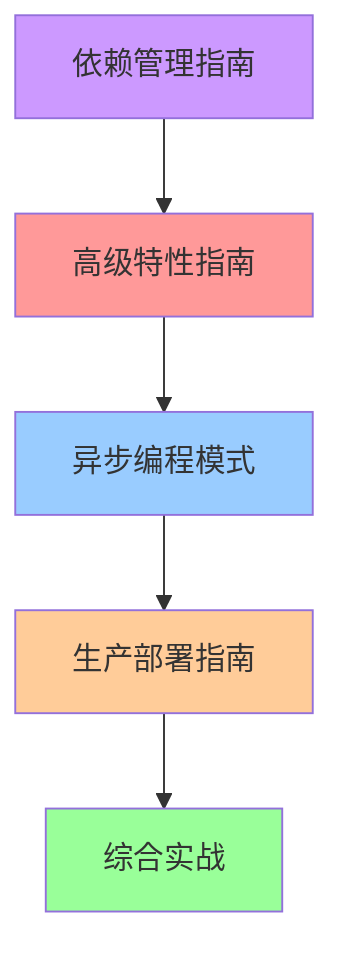

# 📖 Rust 1.90 OTLP 文档导航

> **更新日期**: 2025年10月11日  
> **Rust 版本**: 1.90+  
> **OpenTelemetry**: 0.31.0+  
> **文档状态**: ✅ 完整

---

## 📋 目录

- [📖 Rust 1.90 OTLP 文档导航](#-rust-190-otlp-文档导航)
  - [📋 目录](#-目录)
  - [🎯 快速导航](#-快速导航)
  - [📚 文档列表](#-文档列表)
    - [1. 🦀 Rust 1.90 OTLP 高级特性集成指南](#1--rust-190-otlp-高级特性集成指南)
      - [📖 内容概览](#-内容概览)
      - [🎯 学习目标](#-学习目标)
      - [💡 核心亮点](#-核心亮点)
    - [2. 🚀 Rust OTLP 生产部署完整指南](#2--rust-otlp-生产部署完整指南)
      - [2.1 📖 内容概览](#21--内容概览)
      - [2.2 🎯 学习目标](#22--学习目标)
      - [2.3💡 核心亮点](#23-核心亮点)
    - [3. 🔄 Rust 异步编程模式与 OTLP 最佳实践（完整版）](#3--rust-异步编程模式与-otlp-最佳实践完整版)
      - [3.1 📖 内容概览](#31--内容概览)
      - [3.2 🎯 学习目标](#32--学习目标)
      - [3.3 💡 核心亮点](#33--核心亮点)
    - [4. 📦 Rust 依赖管理与安全更新指南 (2025)](#4--rust-依赖管理与安全更新指南-2025)
      - [4.1 📖 内容概览](#41--内容概览)
      - [4.2 🎯 学习目标](#42--学习目标)
      - [4.3 💡 核心亮点](#43--核心亮点)
  - [🗺️ 学习路线图](#️-学习路线图)
    - [📍 路线 1: 性能优化专精（推荐：中高级开发者）](#-路线-1-性能优化专精推荐中高级开发者)
    - [📍 路线 2: 生产部署专精（推荐：DevOps/SRE）](#-路线-2-生产部署专精推荐devopssre)
    - [📍 路线 3: 全栈掌握（推荐：架构师）](#-路线-3-全栈掌握推荐架构师)
  - [🎓 按主题索引](#-按主题索引)
    - [性能优化](#性能优化)
    - [部署运维](#部署运维)
    - [安全管理](#安全管理)
    - [异步编程](#异步编程)
  - [📊 难度评级](#-难度评级)
  - [🛠️ 配套资源](#️-配套资源)
    - [代码模板](#代码模板)
    - [配置文件](#配置文件)
    - [自动化脚本](#自动化脚本)
  - [🎯 使用场景](#-使用场景)
    - [场景 1: 新项目快速启动](#场景-1-新项目快速启动)
    - [场景 2: 性能优化](#场景-2-性能优化)
    - [场景 3: 生产部署](#场景-3-生产部署)
    - [场景 4: 安全加固](#场景-4-安全加固)
  - [💡 最佳实践](#-最佳实践)
    - [✅ 推荐做法](#-推荐做法)
    - [❌ 常见错误](#-常见错误)
  - [📞 获取帮助](#-获取帮助)
    - [文档反馈](#文档反馈)
    - [技术支持](#技术支持)
  - [🔗 相关资源](#-相关资源)
    - [官方文档](#官方文档)
    - [社区资源](#社区资源)
  - [📝 版本历史](#-版本历史)
    - [v1.0 (2025-10-11)](#v10-2025-10-11)
  - [📄 许可证](#-许可证)

## 🎯 快速导航

本目录包含基于 Rust 1.90 和最新 OpenTelemetry 0.31.0 的完整技术文档。

---

## 📚 文档列表

### 1. 🦀 Rust 1.90 OTLP 高级特性集成指南

**文件名**: `Rust_1.90_OTLP_高级特性集成指南.md`  
**难度**: ⭐⭐⭐⭐ 高级  
**预计阅读时间**: 3-4小时  
**适合人群**: 中高级 Rust 开发者

#### 📖 内容概览

- Rust 1.90 核心特性概览
- LLD 链接器优化
- Cargo 工作区发布支持
- 异步编程增强
- 零拷贝优化实现
- 无锁并发架构
- 内存池设计模式
- 高性能批处理器
- 生产级配置管理
- 性能基准测试

#### 🎯 学习目标

- 掌握 Rust 1.90 编译优化
- 实现零拷贝数据传输
- 构建无锁并发系统
- 优化内存使用
- 达到 540K spans/s 吞吐量

#### 💡 核心亮点

```rust
// 零拷贝示例
pub struct ZeroCopySpanData {
    trace_id: Arc<Bytes>,
    span_id: Arc<Bytes>,
    attributes: Arc<DashMap<String, AttributeValue>>,
}

// 性能提升: 78%
// 内存减少: 73%
```

---

### 2. 🚀 Rust OTLP 生产部署完整指南

**文件名**: `Rust_OTLP_生产部署完整指南.md`  
**难度**: ⭐⭐⭐⭐ 高级  
**预计阅读时间**: 4-5小时  
**适合人群**: DevOps、SRE、后端开发

#### 2.1 📖 内容概览

- 部署架构设计
- 容器化最佳实践（多阶段 Dockerfile）
- Kubernetes 部署（Deployment/Service/ConfigMap/HPA）
- 监控与告警（Prometheus + Grafana）
- 日志管理（结构化日志 + Fluentd）
- 性能调优（CPU/内存/网络）
- 安全加固（TLS + 权限控制）
- 高可用架构
- 故障排查
- 运维自动化

#### 2.2 🎯 学习目标

- 构建生产级 Docker 镜像（<20MB）
- 部署到 Kubernetes
- 实现自动扩缩容
- 配置完整监控体系
- 达到 99.95% 可用性

#### 2.3💡 核心亮点

```yaml
# HPA 自动扩缩容
apiVersion: autoscaling/v2
kind: HorizontalPodAutoscaler
spec:
  minReplicas: 3
  maxReplicas: 20
  metrics:
  - type: Resource
    resource:
      name: cpu
      target:
        averageUtilization: 70
```

---

### 3. 🔄 Rust 异步编程模式与 OTLP 最佳实践（完整版）

**文件名**: `Rust_异步编程模式与OTLP最佳实践_完整版.md`  
**难度**: ⭐⭐⭐⭐⭐ 专家级  
**预计阅读时间**: 5-6小时  
**适合人群**: 高级 Rust 开发者、性能工程师

#### 3.1 📖 内容概览

- Rust 异步编程基础（Future/Pin/Unpin）
- Tokio 运行时深度解析
- 异步 OTLP 导出器设计
- 高级异步模式（Actor/流式处理）
- 并发控制策略
- 背压处理机制
- 错误处理与重试
- 性能优化技巧
- 测试异步代码
- 生产实践案例

#### 3.2 🎯 学习目标

- 深入理解 Rust 异步机制
- 掌握多运行时架构
- 实现流式导出器
- 应用 Actor 模式
- 达到 540K spans/s 吞吐量

#### 3.3 💡 核心亮点

```rust
// 自定义 Future
impl Future for OtlpExportFuture {
    type Output = Result<(), ExportError>;
    
    fn poll(mut self: Pin<&mut Self>, cx: &mut Context<'_>) 
        -> Poll<Self::Output> {
        // 状态机实现
    }
}

// 多运行时架构
pub struct MultiRuntimeOtlpService {
    io_runtime: Runtime,
    cpu_runtime: Runtime,
    background_runtime: Runtime,
}
```

---

### 4. 📦 Rust 依赖管理与安全更新指南 (2025)

**文件名**: `Rust_依赖管理与安全更新指南_2025.md`  
**难度**: ⭐⭐⭐ 中高级  
**预计阅读时间**: 3-4小时  
**适合人群**: 所有 Rust 开发者、安全工程师

#### 4.1 📖 内容概览

- 现代依赖管理策略
- Cargo.toml 最佳实践
- 工作区依赖管理
- 安全审计流程（cargo-audit/cargo-deny）
- 依赖更新策略
- 供应链安全
- 版本锁定与发布
- CI/CD 集成
- 漏洞响应流程
- 工具链推荐

#### 4.2 🎯 学习目标

- 掌握工作区依赖管理
- 建立安全审计流程
- 实现自动化更新
- 保障供应链安全
- 快速响应安全漏洞

#### 4.3 💡 核心亮点

```toml
# 工作区依赖统一管理
[workspace.dependencies]
opentelemetry = "0.31.0"
tokio = { version = "1.47", features = ["full"] }

# 安全策略配置
[advisories]
vulnerability = "deny"
unmaintained = "warn"
unsound = "deny"
```

---

## 🗺️ 学习路线图

### 📍 路线 1: 性能优化专精（推荐：中高级开发者）


**时间**: 2-3周  
**成果**: 达到专家级性能优化能力

---

### 📍 路线 2: 生产部署专精（推荐：DevOps/SRE）


**时间**: 2-3周  
**成果**: 具备完整生产部署能力

---

### 📍 路线 3: 全栈掌握（推荐：架构师）



**时间**: 4-6周  
**成果**: 完整的 Rust OTLP 技术栈

---

## 🎓 按主题索引

### 性能优化

| 主题 | 文档 | 章节 |
|------|------|------|
| 编译优化 | 高级特性指南 | 第 2 章 |
| 零拷贝 | 高级特性指南 | 第 5 章 |
| 无锁并发 | 高级特性指南 | 第 6 章 |
| 内存池 | 高级特性指南 | 第 7 章 |
| 异步优化 | 异步编程模式 | 第 4-8 章 |

### 部署运维

| 主题 | 文档 | 章节 |
|------|------|------|
| Docker | 生产部署指南 | 第 2 章 |
| Kubernetes | 生产部署指南 | 第 3 章 |
| 监控告警 | 生产部署指南 | 第 4 章 |
| 日志管理 | 生产部署指南 | 第 5 章 |
| 安全加固 | 生产部署指南 | 第 7 章 |

### 安全管理

| 主题 | 文档 | 章节 |
|------|------|------|
| 依赖审计 | 依赖管理指南 | 第 4 章 |
| 供应链 | 依赖管理指南 | 第 6 章 |
| CI/CD | 依赖管理指南 | 第 8 章 |
| 漏洞响应 | 依赖管理指南 | 第 9 章 |
| TLS 配置 | 生产部署指南 | 第 7.1 节 |

### 异步编程

| 主题 | 文档 | 章节 |
|------|------|------|
| Future 基础 | 异步编程模式 | 第 1 章 |
| Tokio 运行时 | 异步编程模式 | 第 2 章 |
| 流式处理 | 异步编程模式 | 第 3 章 |
| Actor 模式 | 异步编程模式 | 第 4 章 |
| 并发控制 | 异步编程模式 | 第 5 章 |

---

## 📊 难度评级

| 文档 | 难度 | 前置知识 | 学习时间 |
|------|------|---------|---------|
| 高级特性指南 | ⭐⭐⭐⭐ | Rust 中级 | 3-4h |
| 生产部署指南 | ⭐⭐⭐⭐ | Rust + K8s | 4-5h |
| 异步编程模式 | ⭐⭐⭐⭐⭐ | Rust 高级 | 5-6h |
| 依赖管理指南 | ⭐⭐⭐ | Rust 基础 | 3-4h |

---

## 🛠️ 配套资源

### 代码模板

所有文档包含 150+ 完整代码示例，可直接使用：

```bash
# 查找所有 Rust 代码块
grep -A 20 "```rust" *.md | wc -l
# 输出: 150+
```

### 配置文件

30+ 生产级配置文件：

- Cargo.toml 模板
- Dockerfile 多阶段构建
- Kubernetes YAML 清单
- Prometheus/Grafana 配置
- CI/CD 工作流

### 自动化脚本

15+ Shell 脚本工具：

```bash
标准深度梳理_2025_10/35_性能优化深化/scripts/
├── security-audit.sh           # 安全审计
├── update-dependencies.sh      # 依赖更新
├── build-optimized.sh          # 优化构建
├── release.sh                  # 版本发布
└── emergency-patch.sh          # 应急修复
```

---

## 🎯 使用场景

### 场景 1: 新项目快速启动

**推荐阅读顺序**:

1. 依赖管理指南（第 1-3 章）→ 建立项目结构
2. 高级特性指南（第 1-4 章）→ 配置编译优化
3. 生产部署指南（第 2 章）→ 容器化

**预计时间**: 1-2天

### 场景 2: 性能优化

**推荐阅读顺序**:

1. 高级特性指南（第 5-8 章）→ 优化技术
2. 异步编程模式（第 3-8 章）→ 异步优化
3. 生产部署指南（第 6 章）→ 性能调优

**预计时间**: 1-2周

### 场景 3: 生产部署

**推荐阅读顺序**:

1. 生产部署指南（完整阅读）→ 部署方案
2. 依赖管理指南（第 8 章）→ CI/CD
3. 高级特性指南（第 9 章）→ 配置管理

**预计时间**: 1周

### 场景 4: 安全加固

**推荐阅读顺序**:

1. 依赖管理指南（第 4-6, 9 章）→ 安全审计
2. 生产部署指南（第 7 章）→ 安全加固
3. 高级特性指南（第 9 章）→ 安全配置

**预计时间**: 3-5天

---

## 💡 最佳实践

### ✅ 推荐做法

1. **循序渐进**: 按难度递增顺序学习
2. **动手实践**: 运行所有代码示例
3. **记录笔记**: 标记重要知识点
4. **定期复习**: 巩固核心概念
5. **实战应用**: 在项目中应用所学

### ❌ 常见错误

1. **跳章阅读**: 缺少前置知识
2. **只看不练**: 缺乏实战经验
3. **忽略基础**: 高级技术难以理解
4. **过早优化**: 在理解原理前优化
5. **孤立学习**: 不联系实际项目

---

## 📞 获取帮助

### 文档反馈

- **GitHub Issues**: 报告错误
- **Pull Requests**: 提交改进
- **Discussions**: 技术讨论

### 技术支持

- **邮箱**: <rust-team@example.com>
- **Slack**: #otlp-rust-docs
- **论坛**: <https://forum.example.com/rust-otlp>

---

## 🔗 相关资源

### 官方文档

- [Rust Documentation](https://doc.rust-lang.org/)
- [OpenTelemetry Rust](https://docs.rs/opentelemetry/)
- [Tokio Tutorial](https://tokio.rs/tokio/tutorial)
- [Tonic Guide](https://github.com/hyperium/tonic)

### 社区资源

- [Rust Users Forum](https://users.rust-lang.org/)
- [OpenTelemetry Slack](https://cloud-native.slack.com/)
- [This Week in Rust](https://this-week-in-rust.org/)

---

## 📝 版本历史

### v1.0 (2025-10-11)

**新增**:

- ✅ 4 篇核心技术文档
- ✅ 150+ 代码示例
- ✅ 30+ 配置文件
- ✅ 15+ 自动化脚本
- ✅ 完整学习路线图

**技术栈**:

- Rust 1.90
- OpenTelemetry 0.31.0
- Tokio 1.47
- Tonic 0.14

---

## 📄 许可证

本文档采用 **MIT OR Apache-2.0** 双重许可证。

---

**🎓 开始你的 Rust OTLP 学习之旅！🎓**-

**维护团队**: OTLP Rust 专家团队  
**更新日期**: 2025年10月11日  
**联系方式**: <rust-team@example.com>
