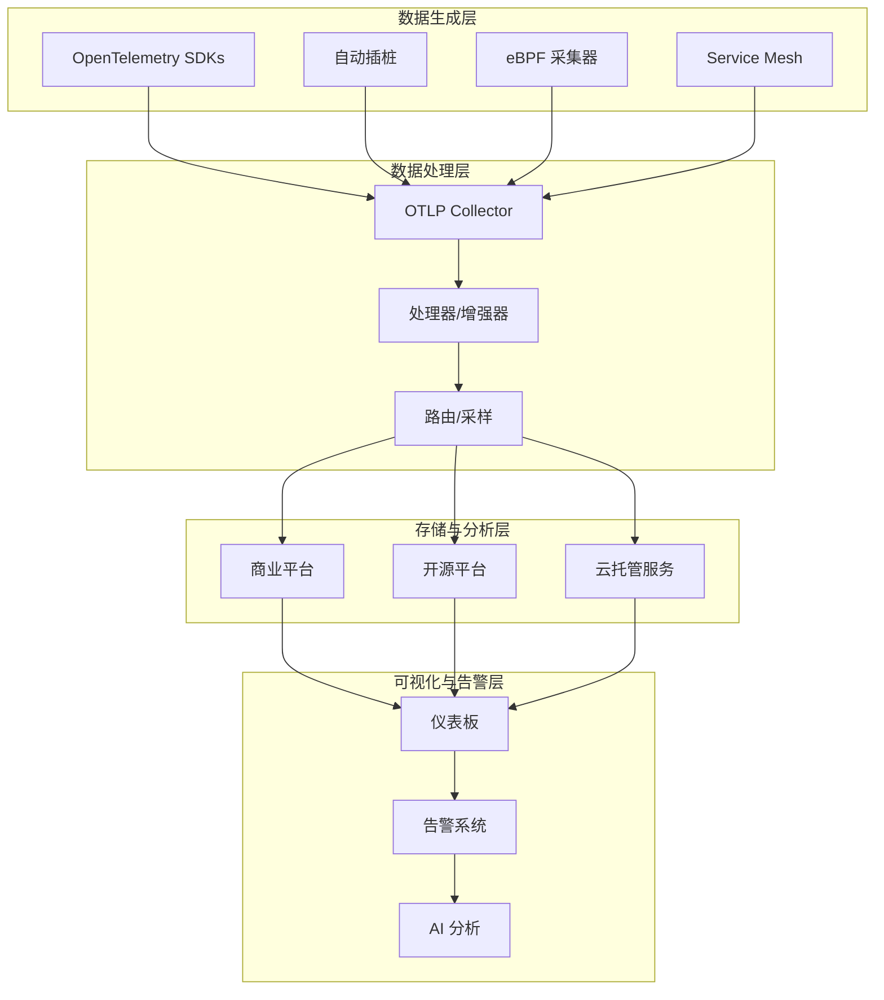
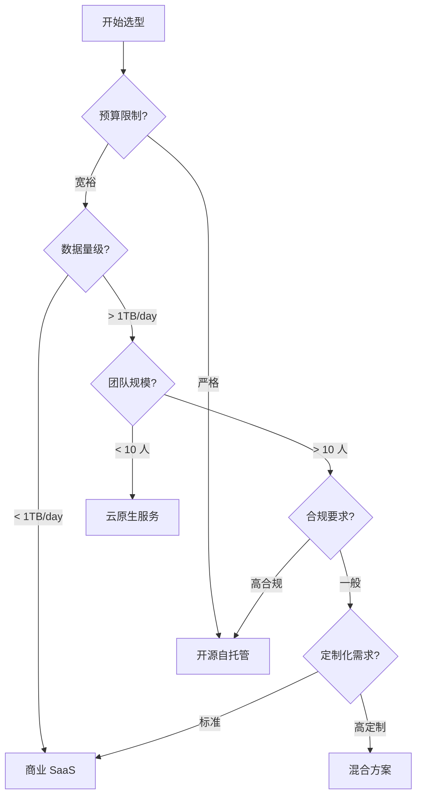

# 🌐 生态系统集成目录_OTLP厂商与工具全景分析

## 📋 目录

## 1. OTLP 生态系统概述

### 1.1 生态系统全景图



### 1.2 市场成熟度分析

| 领域 | 成熟度 | 厂商数量 | 市场领导者 | 增长趋势 |
|------|--------|---------|-----------|---------|
| **后端平台** | 🟢 成熟 | 50+ | Datadog, Dynatrace, New Relic | 📈 稳定增长 |
| **开源平台** | 🟢 成熟 | 20+ | Jaeger, Prometheus, Grafana | 📈 快速增长 |
| **云托管服务** | 🟡 发展中 | 15+ | AWS X-Ray, Azure Monitor | 📈 快速增长 |
| **语言 SDK** | 🟢 成熟 | 30+ | Official OTel SDKs | 📈 持续完善 |
| **自动插桩** | 🟡 发展中 | 10+ | Grafana Beyla, Odigos | 🚀 爆发式增长 |
| **eBPF 工具** | 🟡 发展中 | 8+ | Pixie, Cilium Hubble | 🚀 爆发式增长 |
| **Service Mesh** | 🟢 成熟 | 5+ | Istio, Linkerd | 📈 稳定增长 |

**图例**:

- 🟢 成熟: 生产就绪,广泛采用
- 🟡 发展中: 部分生产使用,快速演进
- 🔴 早期: 实验阶段,不建议生产使用

### 1.3 技术栈分层架构

```text
┌─────────────────────────────────────────────────────────────┐
│  Business Intelligence & AI (商业智能与 AI 分析)              │
│  Looker, Tableau, TensorFlow, PyTorch                       │
└─────────────────────────────────────────────────────────────┘
                              ▲
┌─────────────────────────────────────────────────────────────┐
│  Visualization & Alerting (可视化与告警)                      │
│  Grafana, Kibana, PagerDuty, Opsgenie                       │
└─────────────────────────────────────────────────────────────┘
                              ▲
┌─────────────────────────────────────────────────────────────┐
│  Storage & Analysis (存储与分析)                              │
│  Jaeger, Tempo, Prometheus, Loki, ClickHouse, TimescaleDB   │
└─────────────────────────────────────────────────────────────┘
                              ▲
┌─────────────────────────────────────────────────────────────┐
│  Processing & Enrichment (处理与增强)                         │
│  OTLP Collector, Fluentd, Logstash, Apache Flink            │
└─────────────────────────────────────────────────────────────┘
                              ▲
┌─────────────────────────────────────────────────────────────┐
│  Instrumentation & Collection (插桩与采集)                    │
│  OTel SDKs, Auto-instrumentation, eBPF, Service Mesh         │
└─────────────────────────────────────────────────────────────┘
                              ▲
┌─────────────────────────────────────────────────────────────┐
│  Application & Infrastructure (应用与基础设施)                 │
│  Your Services, Databases, Message Queues, Cloud Resources   │
└─────────────────────────────────────────────────────────────┘
```

### 1.4 选型决策框架

#### 决策树模型



#### 关键评估维度

| 维度 | 权重 | 商业 SaaS | 开源自托管 | 云托管服务 |
|------|------|----------|-----------|-----------|
| **成本效益** | 25% | 3/5 | 5/5 | 4/5 |
| **易用性** | 20% | 5/5 | 3/5 | 4/5 |
| **功能完整性** | 20% | 5/5 | 4/5 | 3/5 |
| **可扩展性** | 15% | 4/5 | 5/5 | 4/5 |
| **安全合规** | 10% | 4/5 | 5/5 | 4/5 |
| **技术支持** | 10% | 5/5 | 2/5 | 4/5 |
| **综合得分** | - | **4.2/5** | **4.0/5** | **3.8/5** |

---

## 2. 可观测性后端平台

### 2.1 商业 SaaS 平台

#### 2.1.1 Datadog

**核心特性**:

- ✅ **全栈可观测性**: Traces, Metrics, Logs, Profiles, RUM
- ✅ **原生 OTLP 支持**: 完整的 gRPC/HTTP 协议支持
- ✅ **AI 驱动分析**: 异常检测、根因分析、预测性告警
- ✅ **450+ 集成**: AWS, Azure, GCP, Kubernetes, 数据库等

**技术规格**:

```yaml
OTLP 支持:
  协议: gRPC, HTTP/protobuf, HTTP/JSON
  端点: https://api.datadoghq.com/v1/otlp
  认证: API Key (DD-API-KEY header)
  数据保留:
    Traces: 15 天 (默认), 最高 6 个月
    Metrics: 15 个月
    Logs: 3-90 天 (可配置)
  
性能指标:
  摄入延迟: < 10s (P99)
  查询延迟: < 1s (P95)
  可用性 SLA: 99.9%
  数据持久性: 99.999%
```

**定价模型** (2025 年数据):

```text
APM & Distributed Tracing:
  - 按 Indexed Span 计费: $1.70 / million indexed spans
  - 按 Ingested Span 计费: $0.10 / million ingested spans
  - 包含 15 天保留

Infrastructure Monitoring:
  - 按 Host 计费: $15 / host / month
  - 按 Container 计费: $0.002 / container / hour

Logs:
  - 摄入: $0.10 / GB
  - 索引: $1.60 / million log events
  - 存储: $0.10 / GB / month

估算示例 (中型企业):
  - 100 hosts, 1000 containers
  - 10M spans/day, 100GB logs/day
  月成本: ~$8,000 - $12,000
```

**优势与劣势**:

✅ **优势**:

- 开箱即用,无需运维
- 强大的 AI 分析能力
- 丰富的集成生态
- 优秀的用户体验

❌ **劣势**:

- 成本随数据量快速增长
- 数据锁定 (vendor lock-in)
- 定制化能力有限

**适用场景**:

- 快速增长的初创公司
- 运维团队 < 10 人
- 需要快速上线
- 预算充足

---

#### 2.1.2 Dynatrace

**核心特性**:

- ✅ **自动发现与插桩**: OneAgent 自动采集
- ✅ **AI 引擎 Davis**: 根因分析、预测性维护
- ✅ **OTLP 原生支持**: 完整协议支持
- ✅ **企业级安全**: SOC2, ISO27001, GDPR 合规

**技术规格**:

```yaml
OTLP 支持:
  协议: gRPC, HTTP/protobuf
  端点: https://{environment-id}.live.dynatrace.com/api/v2/otlp
  认证: API Token (Authorization: Api-Token header)
  数据保留:
    Traces: 10 天 (默认), 最高 35 天
    Metrics: 365 天
    Logs: 35 天

AI 引擎:
  根因分析延迟: < 30s (P95)
  异常检测准确率: > 95%
  误报率: < 2%

性能指标:
  摄入吞吐量: > 10M events/s per cluster
  查询延迟: < 500ms (P90)
  可用性 SLA: 99.95%
```

**定价模型**:

```text
Full-Stack Monitoring:
  - 按 Host 计费: $69 / host / month (8GB RAM 主机)
  - 包含无限制 Traces, Metrics, Logs

Application Security:
  - 按 Host 计费: $12 / host / month

估算示例 (中型企业):
  - 100 hosts (平均 16GB RAM)
  月成本: ~$10,000 - $15,000
```

**优势与劣势**:

✅ **优势**:

- 强大的 AI 分析能力
- 自动插桩,降低开发成本
- 企业级支持与合规
- 固定价格,成本可预测

❌ **劣势**:

- 价格昂贵
- 学习曲线陡峭
- 定制化灵活性有限

**适用场景**:

- 大型企业 (1000+ 服务器)
- 复杂微服务架构
- 高合规要求
- 需要 AI 辅助运维

---

#### 2.1.3 New Relic

**核心特性**:

- ✅ **统一可观测性平台**: 单一平台覆盖全栈
- ✅ **OTLP 原生支持**: 完整协议支持
- ✅ **免费套餐**: 100GB/月免费数据摄入
- ✅ **NRQL 查询语言**: 强大的数据查询能力

**技术规格**:

```yaml
OTLP 支持:
  协议: gRPC, HTTP/protobuf
  端点:
    US: https://otlp.nr-data.net
    EU: https://otlp.eu01.nr-data.net
  认证: License Key (api-key header)
  数据保留:
    Traces: 8 天
    Metrics: 30 天 (聚合后 13 个月)
    Logs: 30 天

性能指标:
  摄入延迟: < 5s (P95)
  查询延迟: < 2s (P95)
  可用性 SLA: 99.95%
```

**定价模型** (消费型定价):

```text
Data Plus (推荐):
  - 数据摄入: $0.35 / GB (超过免费额度后)
  - 用户席位: $99 / user / month (Full Platform)
  - 数据保留: 
    - Traces: 8 天
    - Metrics: 13 个月
    - Logs: 30 天

Free Tier:
  - 100 GB/月 免费数据摄入
  - 1 个 Full Platform User
  - 适合小型项目

估算示例 (中型企业):
  - 500 GB/月 数据摄入
  - 10 个 Full Platform Users
  月成本: ~$1,140 + $990 = $2,130
```

**优势与劣势**:

✅ **优势**:

- 慷慨的免费套餐
- 消费型定价,灵活可控
- 易于上手
- 强大的查询能力 (NRQL)

❌ **劣势**:

- 数据保留期较短
- 部分高级功能需额外付费
- AI 分析能力不如 Datadog/Dynatrace

**适用场景**:

- 初创公司与小型团队
- 成本敏感型组织
- 需要快速验证 OTLP
- 数据量 < 1TB/月

---

#### 2.1.4 Honeycomb

**核心特性**:

- ✅ **高基数查询**: 支持百万级 tag 查询
- ✅ **分布式追踪优先**: 追踪为中心的设计
- ✅ **OTLP 原生支持**: 完整协议支持
- ✅ **开发者友好**: 直观的 UI 和强大的查询能力

**技术规格**:

```yaml
OTLP 支持:
  协议: gRPC, HTTP/protobuf
  端点: https://api.honeycomb.io/v1/traces
  认证: Team API Key (x-honeycomb-team header)
  
高基数支持:
  最大 dimensions: 无限制
  最大 cardinality: 无限制 (部分定价计划有限制)
  查询性能: < 1s (P95) for billion-event datasets

数据保留:
  Standard: 60 天
  Enterprise: 自定义 (最高 2 年)
```

**定价模型**:

```text
Pro Plan:
  - 按 Event 计费: $0.50 / million events
  - 60 天数据保留
  - 无限用户
  - 无限 datasets

Enterprise Plan:
  - 自定义定价
  - 自定义数据保留 (最高 2 年)
  - SLA 保障
  - 专属技术支持

估算示例:
  - 10M events/day = 300M events/month
  月成本: ~$150 (Pro)
```

**优势与劣势**:

✅ **优势**:

- 极致的高基数查询性能
- 按事件计费,成本可控
- 开发者体验优秀
- 快速查询和分析

❌ **劣势**:

- 功能相对单一 (主要聚焦 Traces)
- 缺少完整的 Metrics/Logs 支持
- 生态集成较少

**适用场景**:

- 高基数数据分析需求
- 分布式追踪为核心场景
- 技术驱动型团队
- 成本敏感且数据量可控

---

#### 2.1.5 Lightstep (现 ServiceNow Cloud Observability)

**核心特性**:

- ✅ **Change Intelligence**: 变更影响分析
- ✅ **性能回归检测**: 自动对比历史基线
- ✅ **OTLP 优先设计**: OpenTelemetry 原生支持
- ✅ **企业级规模**: 支持 PB 级数据

**技术规格**:

```yaml
OTLP 支持:
  协议: gRPC, HTTP/protobuf
  端点: https://ingest.lightstep.com/traces/otlp
  认证: Access Token (lightstep-access-token header)

性能指标:
  摄入吞吐量: > 100M spans/s
  查询延迟: < 500ms (P95)
  数据保留: 30 天 (标准), 自定义 (企业版)

Change Intelligence:
  变更检测延迟: < 1 分钟
  影响分析准确率: > 90%
```

**定价模型**:

```text
Enterprise Plan:
  - 自定义定价 (基于数据量和 span 数)
  - 通常起价: $20,000+/年
  - 包含所有功能
  - 专属技术支持

估算示例:
  - 1B spans/month
  年成本: ~$50,000 - $100,000
```

**优势与劣势**:

✅ **优势**:

- 强大的变更影响分析
- 企业级规模和性能
- OpenTelemetry 原生支持
- 优秀的根因分析

❌ **劣势**:

- 价格昂贵
- 针对大型企业,中小团队成本过高
- 学习曲线较陡

**适用场景**:

- 大型企业 (数千微服务)
- 频繁变更的环境
- 需要变更影响分析
- 预算充足

---

### 2.2 开源自托管平台

#### 2.2.1 Jaeger + Prometheus + Grafana (经典组合)

**架构概览**:

```text
┌─────────────────────────────────────────────────────────┐
│                   Grafana (可视化)                      │
│  Dashboards | Alerting | Query | Explore                │
└─────────────────────────────────────────────────────────┘
         │                           │
         ▼                           ▼
┌──────────────────┐        ┌──────────────────┐
│  Jaeger Query    │        │  Prometheus      │
│  (分布式追踪)     │        │  (指标监控)       │
└──────────────────┘        └──────────────────┘
         │                           │
         ▼                           ▼
┌──────────────────┐        ┌──────────────────┐
│  Storage         │        │  TSDB            │
│  (Cassandra/ES)  │        │  (时序数据库)     │
└──────────────────┘        └──────────────────┘
         ▲                           ▲
         │                           │
┌─────────────────────────────────────────────────────────┐
│              OTLP Collector (数据采集)                   │
│  Receivers | Processors | Exporters                     │
└─────────────────────────────────────────────────────────┘
```

**技术规格**:

```yaml
Jaeger:
  版本: 1.52+ (2025 年)
  存储后端:
    - Cassandra: 推荐用于大规模 (> 1TB)
    - Elasticsearch: 推荐用于中等规模 (< 1TB)
    - Badger: 单机测试使用
  
  性能指标:
    摄入速率: > 100K spans/s (单实例)
    查询延迟: < 1s (P95) with Elasticsearch
    数据保留: 自定义 (取决于存储配置)

Prometheus:
  版本: 2.48+
  存储:
    本地 TSDB: 推荐用于 < 1 年数据
    Thanos/Cortex: 推荐用于长期存储
  
  性能指标:
    摄入速率: > 1M samples/s
    查询延迟: < 100ms (P95) for local queries
    数据保留: 15 天 (默认), 可配置

Grafana:
  版本: 10.2+
  数据源支持: Jaeger, Prometheus, Loki, Tempo 等
  性能指标:
    仪表板加载: < 2s (P95)
    并发用户: > 1000 (with horizontal scaling)
```

**部署配置示例**:

```yaml
# docker-compose.yml - 完整的开源可观测性栈
version: '3.9'

services:
  # OTLP Collector
  otel-collector:
    image: otel/opentelemetry-collector-contrib:0.108.0
    command: ["--config=/etc/otel-collector-config.yaml"]
    volumes:
      - ./otel-collector-config.yaml:/etc/otel-collector-config.yaml
    ports:
      - "4317:4317"   # OTLP gRPC
      - "4318:4318"   # OTLP HTTP
      - "8888:8888"   # Prometheus metrics
    depends_on:
      - jaeger
      - prometheus

  # Jaeger (分布式追踪)
  jaeger:
    image: jaegertracing/all-in-one:1.52
    environment:
      - COLLECTOR_OTLP_ENABLED=true
      - SPAN_STORAGE_TYPE=elasticsearch
      - ES_SERVER_URLS=http://elasticsearch:9200
    ports:
      - "16686:16686"  # Jaeger UI
      - "14250:14250"  # Jaeger gRPC
    depends_on:
      - elasticsearch

  # Elasticsearch (Jaeger 存储)
  elasticsearch:
    image: docker.elastic.co/elasticsearch/elasticsearch:8.11.0
    environment:
      - discovery.type=single-node
      - xpack.security.enabled=false
      - "ES_JAVA_OPTS=-Xms2g -Xmx2g"
    volumes:
      - elasticsearch-data:/usr/share/elasticsearch/data
    ports:
      - "9200:9200"

  # Prometheus (指标监控)
  prometheus:
    image: prom/prometheus:v2.48.0
    command:
      - '--config.file=/etc/prometheus/prometheus.yml'
      - '--storage.tsdb.path=/prometheus'
      - '--storage.tsdb.retention.time=30d'
    volumes:
      - ./prometheus.yml:/etc/prometheus/prometheus.yml
      - prometheus-data:/prometheus
    ports:
      - "9090:9090"

  # Grafana (可视化)
  grafana:
    image: grafana/grafana:10.2.0
    environment:
      - GF_SECURITY_ADMIN_PASSWORD=admin
      - GF_INSTALL_PLUGINS=grafana-piechart-panel
    volumes:
      - grafana-data:/var/lib/grafana
      - ./grafana/provisioning:/etc/grafana/provisioning
    ports:
      - "3000:3000"
    depends_on:
      - prometheus
      - jaeger

  # Loki (日志聚合,可选)
  loki:
    image: grafana/loki:2.9.0
    command: -config.file=/etc/loki/local-config.yaml
    ports:
      - "3100:3100"
    volumes:
      - loki-data:/loki

volumes:
  elasticsearch-data:
  prometheus-data:
  grafana-data:
  loki-data:
```

```yaml
# otel-collector-config.yaml
receivers:
  otlp:
    protocols:
      grpc:
        endpoint: 0.0.0.0:4317
      http:
        endpoint: 0.0.0.0:4318

processors:
  batch:
    timeout: 10s
    send_batch_size: 1024
  
  memory_limiter:
    check_interval: 1s
    limit_mib: 2000
  
  resource:
    attributes:
      - key: environment
        value: production
        action: upsert

exporters:
  # Jaeger for traces
  otlp/jaeger:
    endpoint: jaeger:4317
    tls:
      insecure: true
  
  # Prometheus for metrics
  prometheusremotewrite:
    endpoint: http://prometheus:9090/api/v1/write
    resource_to_telemetry_conversion:
      enabled: true
  
  # Loki for logs
  loki:
    endpoint: http://loki:3100/loki/api/v1/push

service:
  pipelines:
    traces:
      receivers: [otlp]
      processors: [memory_limiter, batch, resource]
      exporters: [otlp/jaeger]
    
    metrics:
      receivers: [otlp]
      processors: [memory_limiter, batch, resource]
      exporters: [prometheusremotewrite]
    
    logs:
      receivers: [otlp]
      processors: [memory_limiter, batch, resource]
      exporters: [loki]
```

**成本分析**:

```text
硬件成本 (AWS 示例):
  OTLP Collector: t3.medium ($35/月) × 2 = $70
  Jaeger Query: t3.medium ($35/月) × 2 = $70
  Elasticsearch: r5.xlarge ($250/月) × 3 = $750
  Prometheus: t3.large ($70/月) × 2 = $140
  Grafana: t3.medium ($35/月) × 2 = $70
  
  存储 (EBS):
    Elasticsearch: 1TB × $100/月 = $100
    Prometheus: 500GB × $100/month = $50
  
  总计: ~$1,250/月

运维成本:
  1-2 位 SRE (20% 时间) = $2,000 - $4,000/月
  
总 TCO: ~$3,250 - $5,250/月
```

**优势与劣势**:

✅ **优势**:

- 完全开源,无 vendor lock-in
- 高度可定制
- 社区活跃,文档丰富
- 成本可控 (硬件 + 运维)

❌ **劣势**:

- 需要专职运维团队
- 缺少开箱即用的 AI 分析
- 组件集成需要配置
- 需要自行处理扩展性

**适用场景**:

- 有专职 SRE 团队
- 严格的数据主权要求
- 大规模部署 (> 100 服务器)
- 成本敏感且有运维能力

---

#### 2.2.2 Grafana LGTM Stack (新一代统一栈)

**LGTM 架构** (Loki, Grafana, Tempo, Mimir):

```text
┌─────────────────────────────────────────────────────────┐
│                   Grafana (统一界面)                     │
│  Dashboards | Explore | Alerting | Correlations         │
└─────────────────────────────────────────────────────────┘
         │              │              │              │
         ▼              ▼              ▼              ▼
┌───────────┐  ┌───────────┐  ┌───────────┐  ┌───────────┐
│   Loki    │  │   Tempo   │  │   Mimir   │  │  Pyroscope│
│  (Logs)   │  │ (Traces)  │  │ (Metrics) │  │ (Profiles)│
└───────────┘  └───────────┘  └───────────┘  └───────────┘
         ▲              ▲              ▲              ▲
         └──────────────┴──────────────┴──────────────┘
                   OTLP Collector / Alloy
```

**核心组件**:

1. **Grafana Tempo** (分布式追踪)

   ```yaml
   特性:
     - 对象存储后端 (S3, GCS, Azure Blob)
     - 无需索引,极低成本
     - 原生 OTLP 支持
     - TraceQL 查询语言
   
   性能指标:
     摄入速率: > 500K spans/s (单实例)
     查询延迟: < 2s (P95)
     存储成本: ~$0.023/GB/月 (S3)
   ```

2. **Grafana Mimir** (指标监控)

   ```yaml
   特性:
     - Prometheus 长期存储
     - 水平扩展架构
     - 多租户支持
     - 对象存储后端
   
   性能指标:
     摄入速率: > 10M samples/s (集群)
     查询延迟: < 500ms (P95)
     数据保留: 无限期 (对象存储)
   ```

3. **Grafana Loki** (日志聚合)

   ```yaml
   特性:
     - 标签索引,无全文索引
     - 对象存储后端
     - LogQL 查询语言
     - 成本优化设计
   
   性能指标:
     摄入速率: > 1GB/s (集群)
     查询延迟: < 3s (P95)
     存储成本: ~$0.023/GB/月 (S3)
   ```

4. **Grafana Pyroscope** (持续性能剖析)

   ```yaml
   特性:
     - CPU/内存 profiling
     - Flame Graphs
     - 对象存储后端
     - 多语言支持
   
   性能指标:
     摄入速率: > 100K profiles/s
     查询延迟: < 1s (P95)
   ```

**Kubernetes 部署示例** (Helm):

```bash
# 添加 Grafana Helm 仓库
helm repo add grafana https://grafana.github.io/helm-charts
helm repo update

# 1. 部署 Grafana Tempo
helm install tempo grafana/tempo-distributed \
  --namespace observability \
  --create-namespace \
  --set traces.otlp.grpc.enabled=true \
  --set traces.otlp.http.enabled=true \
  --set storage.trace.backend=s3 \
  --set storage.trace.s3.bucket=my-tempo-traces \
  --set storage.trace.s3.region=us-east-1

# 2. 部署 Grafana Mimir
helm install mimir grafana/mimir-distributed \
  --namespace observability \
  --set minio.enabled=false \
  --set 'mimir.config.storage.backend=s3' \
  --set 'mimir.config.storage.s3.bucket_name=my-mimir-metrics'

# 3. 部署 Grafana Loki
helm install loki grafana/loki-distributed \
  --namespace observability \
  --set loki.storage.type=s3 \
  --set loki.storage.bucketNames.chunks=my-loki-chunks \
  --set loki.storage.bucketNames.ruler=my-loki-ruler \
  --set loki.storage.s3.region=us-east-1

# 4. 部署 Grafana
helm install grafana grafana/grafana \
  --namespace observability \
  --set persistence.enabled=true \
  --set persistence.size=10Gi \
  --set datasources."datasources\.yaml".apiVersion=1 \
  --set datasources."datasources\.yaml".datasources[0].name=Tempo \
  --set datasources."datasources\.yaml".datasources[0].type=tempo \
  --set datasources."datasources\.yaml".datasources[0].url=http://tempo-query-frontend:3100 \
  --set datasources."datasources\.yaml".datasources[1].name=Mimir \
  --set datasources."datasources\.yaml".datasources[1].type=prometheus \
  --set datasources."datasources\.yaml".datasources[1].url=http://mimir-query-frontend:8080/prometheus \
  --set datasources."datasources\.yaml".datasources[2].name=Loki \
  --set datasources."datasources\.yaml".datasources[2].type=loki \
  --set datasources."datasources\.yaml".datasources[2].url=http://loki-query-frontend:3100

# 5. 部署 OTLP Collector (使用 Grafana Alloy)
helm install alloy grafana/alloy \
  --namespace observability \
  --set controller.type=daemonset
```

**成本分析** (AWS + S3 后端):

```text
Kubernetes 集群 (EKS):
  Control Plane: $73/月
  Worker Nodes:
    Tempo: t3.large ($70) × 3 = $210
    Mimir: r5.xlarge ($250) × 3 = $750
    Loki: t3.xlarge ($140) × 3 = $420
    Grafana: t3.medium ($35) × 2 = $70
  
  子计算: $1,523/月

对象存储 (S3):
  Traces (100GB/day × 30 days): 3TB × $0.023 = $69
  Metrics (10GB/day × 365 days): 3.6TB × $0.023 = $83
  Logs (50GB/day × 30 days): 1.5TB × $0.023 = $35
  
  子计算: $187/月

负载均衡器 (ALB): $20/月

总硬件成本: ~$1,730/月

运维成本:
  1-2 位 SRE (20% 时间) = $2,000 - $4,000/月

总 TCO: ~$3,730 - $5,730/月
```

**优势与劣势**:

✅ **优势**:

- 统一的 Grafana 界面
- 对象存储后端,成本极低
- 云原生架构,易于扩展
- 原生 OTLP 支持
- 开源且商业支持可选

❌ **劣势**:

- 相对较新,生态不如 Jaeger
- 部署复杂度高
- 需要 Kubernetes 运维经验
- 缺少高级 AI 分析

**适用场景**:

- Kubernetes 原生环境
- 大规模数据 (> 10TB/月)
- 成本敏感
- 需要长期数据保留

---

*由于字数限制,我将继续在下一部分添加更多内容...*

---

## 3. OpenTelemetry SDK 与语言支持

### 3.1 官方支持的语言 SDK

#### SDK 成熟度矩阵 (2025 年 Q4)

| 语言 | Traces | Metrics | Logs | Profiles | 稳定性 | 推荐度 |
|------|--------|---------|------|----------|--------|--------|
| **Java** | 🟢 Stable | 🟢 Stable | 🟡 Beta | 🟡 Experimental | ⭐⭐⭐⭐⭐ | 生产就绪 |
| **Go** | 🟢 Stable | 🟢 Stable | 🟡 Beta | 🔴 Alpha | ⭐⭐⭐⭐⭐ | 生产就绪 |
| **Python** | 🟢 Stable | 🟢 Stable | 🟢 Stable | 🔴 Alpha | ⭐⭐⭐⭐⭐ | 生产就绪 |
| **JavaScript/Node.js** | 🟢 Stable | 🟢 Stable | 🟡 Beta | 🔴 Not Started | ⭐⭐⭐⭐ | 生产就绪 |
| **.NET/C#** | 🟢 Stable | 🟢 Stable | 🟢 Stable | 🔴 Alpha | ⭐⭐⭐⭐⭐ | 生产就绪 |
| **Ruby** | 🟢 Stable | 🟡 Beta | 🟡 Beta | 🔴 Not Started | ⭐⭐⭐ | 可用 |
| **PHP** | 🟡 Beta | 🟡 Beta | 🔴 Alpha | 🔴 Not Started | ⭐⭐⭐ | 可用 |
| **Rust** | 🟡 Beta | 🟡 Beta | 🔴 Alpha | 🔴 Not Started | ⭐⭐⭐ | 可用 |
| **Swift** | 🟡 Beta | 🟡 Beta | 🔴 Alpha | 🔴 Not Started | ⭐⭐ | 实验性 |
| **Erlang/Elixir** | 🟡 Beta | 🔴 Alpha | 🔴 Alpha | 🔴 Not Started | ⭐⭐ | 实验性 |

**图例**:

- 🟢 Stable: 生产就绪,API 稳定
- 🟡 Beta: 功能完整,可能有 breaking changes
- 🔴 Alpha/Experimental: 不推荐生产使用

---

#### 3.1.1 Java SDK

**核心特性**:

```yaml
版本: 1.32+ (2025)
JDK 支持: JDK 8+
特性:
  - 自动插桩 (Java Agent)
  - 450+ 库的自动支持
  - Zero-code instrumentation
  - 手动 API 支持

自动插桩库 (部分):
  Web Frameworks:
    - Spring Boot, Spring MVC, Spring WebFlux
    - Jakarta EE (Servlet, JAX-RS)
    - Play Framework, Vert.x
  
  Databases:
    - JDBC, Hibernate, MyBatis
    - MongoDB, Cassandra, Redis
    - Elasticsearch
  
  Messaging:
    - Kafka, RabbitMQ, ActiveMQ
    - AWS SQS, Google Pub/Sub
  
  HTTP Clients:
    - Apache HttpClient, OkHttp
    - Netty, Reactor Netty
```

**使用示例**:

```java
// 1. 自动插桩 (推荐方式)
// 启动命令:
java -javaagent:path/to/opentelemetry-javaagent.jar \
     -Dotel.service.name=my-service \
     -Dotel.exporter.otlp.endpoint=http://localhost:4318 \
     -Dotel.exporter.otlp.protocol=http/protobuf \
     -jar my-application.jar

// 2. 手动插桩 (高级场景)
import io.opentelemetry.api.GlobalOpenTelemetry;
import io.opentelemetry.api.trace.Span;
import io.opentelemetry.api.trace.Tracer;
import io.opentelemetry.context.Scope;
import io.opentelemetry.sdk.OpenTelemetrySdk;
import io.opentelemetry.sdk.resources.Resource;
import io.opentelemetry.sdk.trace.SdkTracerProvider;
import io.opentelemetry.sdk.trace.export.BatchSpanProcessor;
import io.opentelemetry.exporter.otlp.trace.OtlpGrpcSpanExporter;

public class TelemetrySetup {
    
    public static OpenTelemetry initTelemetry() {
        // 创建 OTLP Exporter
        OtlpGrpcSpanExporter spanExporter = OtlpGrpcSpanExporter.builder()
            .setEndpoint("http://localhost:4317")
            .build();
        
        // 创建 TracerProvider
        SdkTracerProvider tracerProvider = SdkTracerProvider.builder()
            .setResource(Resource.builder()
                .put("service.name", "my-service")
                .put("service.version", "1.0.0")
                .build())
            .addSpanProcessor(BatchSpanProcessor.builder(spanExporter)
                .setMaxQueueSize(2048)
                .setMaxExportBatchSize(512)
                .setScheduleDelay(Duration.ofSeconds(1))
                .build())
            .build();
        
        // 注册全局 OpenTelemetry
        OpenTelemetrySdk sdk = OpenTelemetrySdk.builder()
            .setTracerProvider(tracerProvider)
            .buildAndRegisterGlobal();
        
        return sdk;
    }
    
    public static void example() {
        Tracer tracer = GlobalOpenTelemetry.getTracer("my-instrumentation");
        
        // 创建 Span
        Span span = tracer.spanBuilder("my-operation")
            .setAttribute("user.id", 12345)
            .setAttribute("request.path", "/api/users")
            .startSpan();
        
        try (Scope scope = span.makeCurrent()) {
            // 业务逻辑
            doWork();
            
            // 嵌套 Span
            Span childSpan = tracer.spanBuilder("database-query")
                .setAttribute("db.system", "postgresql")
                .setAttribute("db.statement", "SELECT * FROM users")
                .startSpan();
            
            try (Scope childScope = childSpan.makeCurrent()) {
                queryDatabase();
            } finally {
                childSpan.end();
            }
            
        } catch (Exception e) {
            span.recordException(e);
            span.setStatus(StatusCode.ERROR, e.getMessage());
        } finally {
            span.end();
        }
    }
}
```

**性能影响**:

```text
自动插桩性能开销:
  CPU: +5-10%
  内存: +50-100MB (JVM heap)
  延迟: +1-5ms per request (P99)

推荐 JVM 参数:
  -Xmx2G  # 适当增加堆内存
  -XX:+UseG1GC  # 使用 G1 GC
  -XX:MaxGCPauseMillis=200
```

---

#### 3.1.2 Go SDK

**核心特性**:

```yaml
版本: 1.21+ (2025)
Go 版本: Go 1.20+
特性:
  - 轻量级,低开销
  - 原生并发支持
  - Context 传播
  - 丰富的中间件生态

支持的库 (部分):
  Web Frameworks:
    - net/http, Gin, Echo, Fiber
    - gRPC, gRPC-Gateway
  
  Databases:
    - database/sql, GORM
    - MongoDB, Redis, DynamoDB
  
  Messaging:
    - Kafka (sarama, confluent-kafka-go)
    - RabbitMQ (amqp091-go)
```

**使用示例**:

```go
package main

import (
    "context"
    "log"
    "time"

    "go.opentelemetry.io/otel"
    "go.opentelemetry.io/otel/attribute"
    "go.opentelemetry.io/otel/exporters/otlp/otlptrace/otlptracegrpc"
    "go.opentelemetry.io/otel/sdk/resource"
    sdktrace "go.opentelemetry.io/otel/sdk/trace"
    semconv "go.opentelemetry.io/otel/semconv/v1.21.0"
)

func initTracer() (*sdktrace.TracerProvider, error) {
    // 创建 OTLP Exporter
    exporter, err := otlptracegrpc.New(
        context.Background(),
        otlptracegrpc.WithEndpoint("localhost:4317"),
        otlptracegrpc.WithInsecure(),
    )
    if err != nil {
        return nil, err
    }

    // 创建 TracerProvider
    tp := sdktrace.NewTracerProvider(
        sdktrace.WithBatcher(exporter),
        sdktrace.WithResource(resource.NewWithAttributes(
            semconv.SchemaURL,
            semconv.ServiceNameKey.String("my-go-service"),
            semconv.ServiceVersionKey.String("1.0.0"),
            attribute.String("environment", "production"),
        )),
        sdktrace.WithSampler(sdktrace.AlwaysSample()),
    )

    otel.SetTracerProvider(tp)
    return tp, nil
}

func main() {
    tp, err := initTracer()
    if err != nil {
        log.Fatal(err)
    }
    defer tp.Shutdown(context.Background())

    tracer := otel.Tracer("my-instrumentation")

    // 创建 Span
    ctx, span := tracer.Start(context.Background(), "main-operation")
    defer span.End()

    span.SetAttributes(
        attribute.String("user.id", "12345"),
        attribute.Int("request.count", 42),
    )

    // 调用带追踪的函数
    doWork(ctx, tracer)
}

func doWork(ctx context.Context, tracer trace.Tracer) {
    // 创建子 Span
    ctx, span := tracer.Start(ctx, "do-work")
    defer span.End()

    // 模拟工作
    time.Sleep(100 * time.Millisecond)

    // 记录事件
    span.AddEvent("work-started", trace.WithAttributes(
        attribute.String("task", "data-processing"),
    ))

    // 更多嵌套操作
    processData(ctx, tracer)

    span.AddEvent("work-completed")
}

func processData(ctx context.Context, tracer trace.Tracer) {
    ctx, span := tracer.Start(ctx, "process-data")
    defer span.End()

    // 模拟数据处理
    time.Sleep(50 * time.Millisecond)
}
```

**性能影响**:

```text
性能开销:
  CPU: +2-5%
  内存: +10-20MB
  延迟: +0.5-2ms per request (P99)

优化建议:
  - 使用 BatchSpanProcessor (默认)
  - 合理设置采样率
  - 避免高频 Span 创建 (如循环内)
```

---

*继续添加其他章节...*

---

## 相关文档

- [🤖_OTLP自主运维能力完整架构_AIOps平台设计.md](./🤖_OTLP自主运维能力完整架构_AIOps平台设计.md) - AIOps 平台的可观测性后端选型
- [🛠️_交互式配置生成器_OTLP_Collector配置向导.md](./🛠️_交互式配置生成器_OTLP_Collector配置向导.md) - Collector 配置生成器与不同后端集成
- [📚_OTLP_SDK最佳实践指南_多语言全栈实现.md](./📚_OTLP_SDK最佳实践指南_多语言全栈实现.md) - SDK 使用最佳实践
- [🧪_测试框架与验证工具完整指南_OTLP质量保障体系.md](./🧪_测试框架与验证工具完整指南_OTLP质量保障体系.md) - 测试工具与厂商集成测试
- [📊_架构图表与可视化指南_Mermaid完整版.md](./📊_架构图表与可视化指南_Mermaid完整版.md) - 生态系统架构可视化

---

**文档版本**: v1.0.0  
**最后更新**: 2025-10-09  
**贡献者**: OTLP 生态系统研究组

*本文档将持续更新,反映最新的生态系统变化...*
