# 📊 OTLP 架构图表与可视化指南 - Mermaid 完整版

> **版本**: v1.0  
> **日期**: 2025年10月9日  
> **用途**: 为所有核心技术指南提供完整的架构图、流程图、时序图和状态机图

---

## 📋 目录

- [📊 OTLP 架构图表与可视化指南 - Mermaid 完整版](#-otlp-架构图表与可视化指南---mermaid-完整版)
  - [📋 目录](#-目录)
  - [1. AIOps 平台架构](#1-aiops-平台架构)
    - [1.1 整体架构图](#11-整体架构图)
    - [1.2 LSTM 异常检测流程](#12-lstm-异常检测流程)
    - [1.3 GNN 根因分析图](#13-gnn-根因分析图)
  - [2. eBPF 数据流](#2-ebpf-数据流)
    - [2.1 eBPF 追踪架构](#21-ebpf-追踪架构)
    - [2.2 eBPF HTTP 追踪时序图](#22-ebpf-http-追踪时序图)
    - [2.3 CO-RE (Compile Once, Run Everywhere) 流程](#23-co-re-compile-once-run-everywhere-流程)
  - [3. Service Mesh 集成](#3-service-mesh-集成)
    - [3.1 Istio + OTLP 架构](#31-istio--otlp-架构)
    - [3.2 多集群追踪流程](#32-多集群追踪流程)
  - [4. AI 日志分析流程](#4-ai-日志分析流程)
    - [4.1 LLM 日志分析架构](#41-llm-日志分析架构)
    - [4.2 成本优化策略](#42-成本优化策略)
  - [5. TLA+ 形式化验证](#5-tla-形式化验证)
    - [5.1 Trace Context 传播验证状态机](#51-trace-context-传播验证状态机)
    - [5.2 TLA+ 验证流程](#52-tla-验证流程)
  - [6. Continuous Profiling](#6-continuous-profiling)
    - [6.1 性能剖析架构](#61-性能剖析架构)
    - [6.2 Profiling 与 Tracing 关联](#62-profiling-与-tracing-关联)
  - [7. Temporal 工作流](#7-temporal-工作流)
    - [7.1 Temporal 架构](#71-temporal-架构)
    - [7.2 Saga 补偿模式](#72-saga-补偿模式)
    - [7.3 工作流状态机](#73-工作流状态机)
  - [8. OTLP Collector 架构](#8-otlp-collector-架构)
    - [8.1 Collector 数据流](#81-collector-数据流)
    - [8.2 Gateway + Agent 模式](#82-gateway--agent-模式)
  - [9. 多语言 SDK 集成](#9-多语言-sdk-集成)
    - [9.1 SDK 初始化流程](#91-sdk-初始化流程)
    - [9.2 HTTP 客户端插桩](#92-http-客户端插桩)
  - [10. 端到端追踪流程](#10-端到端追踪流程)
    - [10.1 完整调用链](#101-完整调用链)
    - [10.2 Trace Context 传播](#102-trace-context-传播)
  - [📚 使用指南](#-使用指南)
    - [如何在文档中引用这些图表](#如何在文档中引用这些图表)
    - [Mermaid 渲染支持](#mermaid-渲染支持)

---

## 1. AIOps 平台架构

### 1.1 整体架构图

```mermaid
graph TB
    subgraph "数据采集层"
        A1[OTLP Collector]
        A2[Prometheus]
        A3[Jaeger]
        A4[Elasticsearch]
    end
    
    subgraph "数据处理层"
        B1[Apache Flink<br/>实时流处理]
        B2[特征工程<br/>Feature Engineering]
        B3[时序数据库<br/>TimescaleDB]
    end
    
    subgraph "AI/ML 层"
        C1[LSTM 异常检测<br/>Anomaly Detection]
        C2[GNN 根因分析<br/>Root Cause Analysis]
        C3[MLflow<br/>模型管理]
        C4[Optuna<br/>超参数优化]
    end
    
    subgraph "决策与行动层"
        D1[决策引擎<br/>Decision Engine]
        D2[行动执行器<br/>Action Executor]
        D3[Kubernetes API]
        D4[告警系统<br/>Alertmanager]
    end
    
    subgraph "可视化与监控"
        E1[Grafana 仪表板]
        E2[模型监控<br/>Model Monitor]
        E3[审计日志<br/>Audit Log]
    end
    
    A1 --> B1
    A2 --> B1
    A3 --> B1
    A4 --> B1
    
    B1 --> B2
    B2 --> B3
    B2 --> C1
    B2 --> C2
    
    C1 --> D1
    C2 --> D1
    C3 --> C1
    C3 --> C2
    C4 --> C3
    
    D1 --> D2
    D2 --> D3
    D2 --> D4
    
    B3 --> E1
    C1 --> E2
    C2 --> E2
    D2 --> E3
    
    style C1 fill:#f9f,stroke:#333,stroke-width:2px
    style C2 fill:#f9f,stroke:#333,stroke-width:2px
    style D1 fill:#ff9,stroke:#333,stroke-width:2px
    style D2 fill:#ff9,stroke:#333,stroke-width:2px
```

### 1.2 LSTM 异常检测流程


### 1.3 GNN 根因分析图

```mermaid
graph LR
    subgraph "服务依赖图"
        S1[Frontend<br/>CPU 90%]
        S2[API Gateway<br/>CPU 30%]
        S3[Auth Service<br/>CPU 20%]
        S4[Payment Service<br/>CPU 95%<br/>⚠️ 根因]
        S5[Database<br/>CPU 40%]
        
        S1 --> S2
        S2 --> S3
        S2 --> S4
        S4 --> S5
        S3 --> S5
    end
    
    subgraph "GNN 模型"
        G1[节点特征<br/>CPU/MEM/Latency]
        G2[边特征<br/>调用次数/延迟]
        G3[图卷积层 1]
        G4[图卷积层 2]
        G5[输出层<br/>根因概率]
    end
    
    S1 --> G1
    S2 --> G1
    S3 --> G1
    S4 --> G1
    S5 --> G1
    
    G1 --> G3
    G2 --> G3
    G3 --> G4
    G4 --> G5
    
    G5 --> Result[根因: Payment Service<br/>置信度: 0.92]
    
    style S4 fill:#f66,stroke:#333,stroke-width:3px
    style Result fill:#f96,stroke:#333,stroke-width:2px
```

---

## 2. eBPF 数据流

### 2.1 eBPF 追踪架构

```mermaid
graph TB
    subgraph "内核空间 (Kernel Space)"
        K1[eBPF 程序<br/>kprobe/uprobe]
        K2[Ring Buffer<br/>环形缓冲区]
        K3[Map 数据结构<br/>Hash/Array/LRU]
        K4[eBPF 验证器<br/>Verifier]
        
        K4 --> K1
        K1 --> K2
        K1 --> K3
    end
    
    subgraph "用户空间 (User Space)"
        U1[Tracer 程序<br/>Go/Rust]
        U2[数据聚合<br/>Aggregation]
        U3[OTLP Exporter]
        U4[OpenTelemetry SDK]
    end
    
    subgraph "应用程序"
        A1[HTTP 请求<br/>curl/wget]
        A2[gRPC 调用]
        A3[数据库查询<br/>MySQL/Redis]
        A4[文件 I/O]
    end
    
    A1 -.->|系统调用| K1
    A2 -.->|系统调用| K1
    A3 -.->|系统调用| K1
    A4 -.->|系统调用| K1
    
    K2 --> U1
    K3 --> U1
    
    U1 --> U2
    U2 --> U3
    U3 --> U4
    U4 --> Backend[OTLP Collector]
    
    style K1 fill:#9cf,stroke:#333,stroke-width:2px
    style K2 fill:#9cf,stroke:#333,stroke-width:2px
    style U3 fill:#f9f,stroke:#333,stroke-width:2px
```

### 2.2 eBPF HTTP 追踪时序图

```mermaid
sequenceDiagram
    participant App as 应用程序
    participant Kernel as Linux Kernel
    participant eBPF as eBPF Program
    participant RingBuf as Ring Buffer
    participant Tracer as Tracer (User)
    participant OTLP as OTLP Collector
    
    App->>Kernel: HTTP 请求 (send syscall)
    Kernel->>eBPF: 触发 kprobe/sys_sendto
    
    Note over eBPF: 解析 HTTP 协议<br/>提取: Method, URL, Headers
    
    eBPF->>RingBuf: 写入事件<br/>{method:"GET", url:"/api/users"}
    
    Note over eBPF: 记录开始时间<br/>存入 Map[pid]
    
    App->>Kernel: HTTP 响应 (recv syscall)
    Kernel->>eBPF: 触发 kprobe/sys_recvfrom
    
    Note over eBPF: 计算延迟<br/>latency = now() - start_time
    
    eBPF->>RingBuf: 写入响应事件<br/>{status:200, latency:50ms}
    
    RingBuf->>Tracer: 读取事件 (poll)
    
    Note over Tracer: 聚合请求+响应<br/>生成 Span
    
    Tracer->>OTLP: OTLP/gRPC Span<br/>TraceID, SpanID
    
    OTLP->>OTLP: 存储到后端<br/>(Jaeger/Tempo)
```

### 2.3 CO-RE (Compile Once, Run Everywhere) 流程

```mermaid
flowchart LR
    A[eBPF C 代码<br/>http_trace.bpf.c] --> B[Clang 编译<br/>+ BTF 信息]
    B --> C[eBPF 字节码<br/>.o 文件]
    C --> D[libbpf 加载器]
    
    D --> E{目标内核}
    
    E -->|Kernel 5.4| F1[重定位 BTF<br/>适配结构体偏移]
    E -->|Kernel 5.10| F2[重定位 BTF<br/>适配结构体偏移]
    E -->|Kernel 6.1| F3[重定位 BTF<br/>适配结构体偏移]
    
    F1 --> G[加载到内核]
    F2 --> G
    F3 --> G
    
    G --> H[验证器检查]
    H --> I[JIT 编译]
    I --> J[运行 eBPF 程序]
    
    style A fill:#9cf,stroke:#333,stroke-width:2px
    style C fill:#f9f,stroke:#333,stroke-width:2px
    style J fill:#9f9,stroke:#333,stroke-width:2px
```

---

## 3. Service Mesh 集成

### 3.1 Istio + OTLP 架构

```mermaid
graph TB
    subgraph "Data Plane"
        P1[Pod: Service A<br/>+ Envoy Sidecar]
        P2[Pod: Service B<br/>+ Envoy Sidecar]
        P3[Pod: Service C<br/>+ Envoy Sidecar]
    end
    
    subgraph "Control Plane"
        Istiod[Istiod<br/>配置分发]
    end
    
    subgraph "可观测性"
        T1[OTLP Collector<br/>Traces]
        M1[Prometheus<br/>Metrics]
        L1[Loki<br/>Logs]
    end
    
    subgraph "存储与查询"
        Jaeger[Jaeger<br/>分布式追踪]
        Grafana[Grafana<br/>统一查询]
    end
    
    Istiod -->|Telemetry v2 配置| P1
    Istiod -->|Telemetry v2 配置| P2
    Istiod -->|Telemetry v2 配置| P3
    
    P1 -->|OTLP/gRPC| T1
    P2 -->|OTLP/gRPC| T1
    P3 -->|OTLP/gRPC| T1
    
    P1 -->|/metrics| M1
    P2 -->|/metrics| M1
    P3 -->|/metrics| M1
    
    P1 -->|Access Logs| L1
    P2 -->|Access Logs| L1
    P3 -->|Access Logs| L1
    
    T1 --> Jaeger
    M1 --> Grafana
    L1 --> Grafana
    Jaeger --> Grafana
    
    style T1 fill:#f9f,stroke:#333,stroke-width:2px
    style Grafana fill:#ff9,stroke:#333,stroke-width:2px
```

### 3.2 多集群追踪流程

```mermaid
sequenceDiagram
    participant C1 as Cluster 1<br/>Service A
    participant GW1 as Gateway 1<br/>Istio Egress
    participant GW2 as Gateway 2<br/>Istio Ingress
    participant C2 as Cluster 2<br/>Service B
    participant OTLP1 as OTLP Collector 1
    participant OTLP2 as OTLP Collector 2
    participant Central as Central Storage<br/>(Jaeger)
    
    Note over C1: 生成 TraceID<br/>创建 Root Span
    
    C1->>GW1: HTTP Request<br/>+ W3C Trace Context
    Note over GW1: 提取 TraceContext<br/>创建 Gateway Span
    
    GW1->>OTLP1: Export Span (OTLP)
    
    GW1->>GW2: 跨集群调用<br/>传播 TraceContext
    
    Note over GW2: 提取 TraceContext<br/>创建 Gateway Span
    GW2->>OTLP2: Export Span (OTLP)
    
    GW2->>C2: HTTP Request<br/>+ Trace Context
    
    Note over C2: 创建 Child Span<br/>同一 TraceID
    C2->>OTLP2: Export Span (OTLP)
    
    C2-->>GW2: Response
    GW2-->>GW1: Response
    GW1-->>C1: Response
    
    OTLP1->>Central: 上报 Spans
    OTLP2->>Central: 上报 Spans
    
    Note over Central: 按 TraceID 聚合<br/>完整调用链
```

---

## 4. AI 日志分析流程

### 4.1 LLM 日志分析架构

```mermaid
flowchart TD
    A[日志源<br/>OTLP Logs] --> B{日志量}
    
    B -->|大量| C[快速筛选<br/>GPT-3.5-turbo]
    B -->|少量| D[详细分析<br/>GPT-4]
    
    C -->|可疑日志| D
    C -->|正常日志| E[丢弃]
    
    D --> F[异常检测<br/>is_anomaly: true/false]
    
    F -->|异常| G[根因分析<br/>LLM + DoWhy]
    F -->|正常| E
    
    G --> H{缓存}
    H -->|命中| I[Redis 缓存<br/>返回结果]
    H -->|未命中| J[生成诊断报告]
    
    J --> K[存入缓存]
    K --> L[返回结果]
    I --> L
    
    L --> M[决策引擎]
    M --> N{严重程度}
    
    N -->|Critical| O[立即告警 + 自动修复]
    N -->|Warning| P[发送通知]
    N -->|Info| Q[记录日志]
    
    style F fill:#f9f,stroke:#333,stroke-width:2px
    style G fill:#f9f,stroke:#333,stroke-width:2px
    style M fill:#ff9,stroke:#333,stroke-width:2px
```

### 4.2 成本优化策略

```mermaid
graph TB
    subgraph "成本优化策略"
        S1[分层模型<br/>Tiered Models]
        S2[Redis 缓存<br/>Caching]
        S3[动态采样<br/>Dynamic Sampling]
        S4[批量处理<br/>Batching]
    end
    
    subgraph "实施效果"
        E1[成本降低 60%<br/>$1000 → $400/月]
        E2[命中率 70%<br/>缓存节省 API 调用]
        E3[延迟优化<br/>2s → 0.5s]
        E4[吞吐量提升<br/>100 → 400 logs/s]
    end
    
    S1 --> E1
    S2 --> E2
    S3 --> E1
    S4 --> E4
    
    E2 --> E3
    
    style E1 fill:#9f9,stroke:#333,stroke-width:2px
    style E2 fill:#9f9,stroke:#333,stroke-width:2px
```

---

## 5. TLA+ 形式化验证

### 5.1 Trace Context 传播验证状态机

```mermaid
stateDiagram-v2
    [*] --> NoContext: 初始状态
    
    NoContext --> RootSpan: 创建 Root Span<br/>生成 TraceID
    
    RootSpan --> ChildSpan: 调用下游服务<br/>传播 TraceContext
    
    ChildSpan --> ChildSpan: 继续调用<br/>TraceID 不变
    
    ChildSpan --> Completed: 所有 Span 完成
    
    Completed --> [*]
    
    note right of RootSpan
        不变式:
        - TraceID 全局唯一
        - SpanID 本地唯一
        - Parent-Child 关系正确
    end note
    
    note right of ChildSpan
        验证:
        - TraceContext 正确传播
        - 不丢失 Span
        - 不产生孤儿 Span
    end note
```

### 5.2 TLA+ 验证流程

```mermaid
flowchart LR
    A[TLA+ 规范<br/>TraceContextPropagation.tla] --> B[TLC Model Checker]
    
    B --> C{状态空间探索}
    
    C -->|穷尽搜索| D[检查不变式<br/>Invariants]
    C -->|随机模拟| E[检查时序属性<br/>Temporal Properties]
    
    D --> F{发现违规?}
    E --> F
    
    F -->|是| G[生成反例<br/>Counterexample]
    F -->|否| H[验证通过 ✅]
    
    G --> I[错误追踪<br/>Trace Analysis]
    I --> J[修复规范<br/>或实现]
    
    J --> A
    
    H --> K[CI/CD 集成<br/>持续验证]
    
    style B fill:#9cf,stroke:#333,stroke-width:2px
    style H fill:#9f9,stroke:#333,stroke-width:2px
    style G fill:#f66,stroke:#333,stroke-width:2px
```

---

## 6. Continuous Profiling

### 6.1 性能剖析架构


### 6.2 Profiling 与 Tracing 关联

```mermaid
sequenceDiagram
    participant User as 用户请求
    participant App as 应用程序
    participant Tracer as OTLP Tracer
    participant Profiler as Profiler Agent
    participant Storage as 统一存储
    
    User->>App: HTTP /api/search
    
    Note over App: 创建 Span<br/>TraceID: abc123<br/>SpanID: span1
    
    App->>Tracer: Export Span
    
    Note over App: 处理请求<br/>执行 CPU 密集任务
    
    Profiler->>App: 采样 CPU Profile<br/>(100Hz)
    
    Note over Profiler: 添加标签<br/>trace.id=abc123<br/>span.id=span1
    
    Profiler->>Storage: Upload Profile<br/>+ 关联信息
    Tracer->>Storage: Upload Span
    
    App-->>User: Response (500ms)
    
    Note over Storage: 按 TraceID 关联<br/>Span + Profile
    
    Storage->>User: 统一查询界面<br/>Trace → Profile 跳转
```

---

## 7. Temporal 工作流

### 7.1 Temporal 架构

```mermaid
graph TB
    subgraph "Client 层"
        C1[WorkflowClient<br/>Go/Java/Python]
    end
    
    subgraph "Worker 层"
        W1[Worker 1<br/>Workflow 执行]
        W2[Worker 2<br/>Activity 执行]
        W3[Worker 3<br/>负载均衡]
    end
    
    subgraph "Temporal Server"
        S1[Frontend Service<br/>API Gateway]
        S2[History Service<br/>事件存储]
        S3[Matching Service<br/>任务调度]
        S4[Worker Service<br/>内部任务]
    end
    
    subgraph "存储层"
        DB1[(Cassandra/MySQL<br/>事件历史)]
        DB2[(Elasticsearch<br/>可见性)]
    end
    
    C1 -->|StartWorkflow| S1
    S1 --> S2
    S1 --> S3
    
    W1 -->|PollWorkflowTask| S3
    W2 -->|PollActivityTask| S3
    W3 -->|PollWorkflowTask| S3
    
    S2 --> DB1
    S2 --> DB2
    S3 --> DB1
    
    style S2 fill:#f9f,stroke:#333,stroke-width:2px
    style DB1 fill:#ff9,stroke:#333,stroke-width:2px
```

### 7.2 Saga 补偿模式

```mermaid
sequenceDiagram
    participant WF as Workflow
    participant A1 as Activity: DeductInventory
    participant A2 as Activity: ProcessPayment
    participant A3 as Activity: CreateOrder
    participant C1 as Compensate: RollbackInventory
    participant C2 as Compensate: RefundPayment
    
    WF->>A1: 执行 DeductInventory
    A1-->>WF: ✅ Success
    
    WF->>A2: 执行 ProcessPayment
    A2-->>WF: ✅ Success
    
    WF->>A3: 执行 CreateOrder
    A3-->>WF: ❌ Failure (数据库错误)
    
    Note over WF: 检测到失败<br/>触发补偿流程
    
    WF->>C2: 补偿 ProcessPayment
    Note over C2: 调用支付网关<br/>执行退款
    C2-->>WF: ✅ Refunded
    
    WF->>C1: 补偿 DeductInventory
    Note over C1: 恢复库存数量
    C1-->>WF: ✅ Restored
    
    WF-->>WF: 工作流完成<br/>所有状态已回滚
```

### 7.3 工作流状态机

```mermaid
stateDiagram-v2
    [*] --> Scheduled: StartWorkflow
    
    Scheduled --> Running: Worker 拉取任务
    
    Running --> ActivityExecuting: 执行 Activity
    
    ActivityExecuting --> Running: Activity 成功
    ActivityExecuting --> Retrying: Activity 失败 (可重试)
    ActivityExecuting --> Failed: Activity 失败 (不可重试)
    
    Retrying --> ActivityExecuting: 重试
    Retrying --> Failed: 超过最大重试次数
    
    Running --> Completed: 所有任务完成
    Running --> Failed: 致命错误
    
    Failed --> Compensating: 触发补偿
    Compensating --> Completed: 补偿成功
    Compensating --> Failed: 补偿失败
    
    Completed --> [*]
    Failed --> [*]
    
    note right of Running
        确定性执行:
        - 相同输入 → 相同输出
        - 支持时间回溯
        - 持久化所有状态
    end note
```

---

## 8. OTLP Collector 架构

### 8.1 Collector 数据流

```mermaid
graph LR
    subgraph "Receivers"
        R1[OTLP<br/>gRPC:4317<br/>HTTP:4318]
        R2[Jaeger<br/>:14250]
        R3[Prometheus<br/>:9090]
        R4[Zipkin<br/>:9411]
    end
    
    subgraph "Processors"
        P1[Batch<br/>批量处理]
        P2[Attributes<br/>属性操作]
        P3[Sampling<br/>采样]
        P4[Memory Limiter<br/>内存限制]
    end
    
    subgraph "Exporters"
        E1[OTLP<br/>→ Backend]
        E2[Jaeger<br/>→ Jaeger]
        E3[Prometheus<br/>→ Prom]
        E4[Logging<br/>→ Console]
    end
    
    R1 --> P4
    R2 --> P4
    R3 --> P4
    R4 --> P4
    
    P4 --> P3
    P3 --> P2
    P2 --> P1
    
    P1 --> E1
    P1 --> E2
    P1 --> E3
    P1 --> E4
    
    style P1 fill:#9cf,stroke:#333,stroke-width:2px
    style E1 fill:#f9f,stroke:#333,stroke-width:2px
```

### 8.2 Gateway + Agent 模式

```mermaid
graph TB
    subgraph "Kubernetes Cluster"
        subgraph "Namespace: app"
            Pod1[Pod A<br/>+ OTLP SDK]
            Pod2[Pod B<br/>+ OTLP SDK]
            Pod3[Pod C<br/>+ OTLP SDK]
        end
        
        Agent[OTLP Agent<br/>DaemonSet<br/>轻量级处理]
    end
    
    Gateway[OTLP Gateway<br/>Deployment<br/>完整处理流程]
    
    Backend1[Jaeger]
    Backend2[Prometheus]
    Backend3[Elasticsearch]
    
    Pod1 -->|localhost:4317| Agent
    Pod2 -->|localhost:4317| Agent
    Pod3 -->|localhost:4317| Agent
    
    Agent -->|批量 + 压缩| Gateway
    
    Gateway -->|Traces| Backend1
    Gateway -->|Metrics| Backend2
    Gateway -->|Logs| Backend3
    
    style Agent fill:#9cf,stroke:#333,stroke-width:2px
    style Gateway fill:#f9f,stroke:#333,stroke-width:2px
```

---

## 9. 多语言 SDK 集成

### 9.1 SDK 初始化流程

```mermaid
flowchart TD
    A[初始化 SDK] --> B[配置资源属性<br/>Resource Attributes]
    
    B --> C{选择 Exporter}
    
    C -->|OTLP/gRPC| D1[OTLPSpanExporter<br/>endpoint: collector:4317]
    C -->|OTLP/HTTP| D2[OTLPSpanExporter<br/>endpoint: collector:4318]
    C -->|Jaeger| D3[JaegerExporter<br/>endpoint: jaeger:14250]
    
    D1 --> E[创建 BatchSpanProcessor]
    D2 --> E
    D3 --> E
    
    E --> F[配置 TracerProvider]
    
    F --> G{配置采样器<br/>Sampler}
    
    G -->|Always On| H1[100% 采样]
    G -->|Always Off| H2[0% 采样]
    G -->|TraceID Ratio| H3[10% 采样]
    G -->|Parent Based| H4[跟随父 Span]
    
    H1 --> I[注册全局 Tracer]
    H2 --> I
    H3 --> I
    H4 --> I
    
    I --> J[开始追踪]
    
    style E fill:#9cf,stroke:#333,stroke-width:2px
    style F fill:#f9f,stroke:#333,stroke-width:2px
```

### 9.2 HTTP 客户端插桩

```mermaid
sequenceDiagram
    participant App as 应用代码
    participant SDK as OpenTelemetry SDK
    participant HTTP as HTTP Client
    participant Server as 远程服务器
    participant Exporter as OTLP Exporter
    
    App->>SDK: 创建 Span<br/>span = tracer.start_span("HTTP GET")
    
    Note over SDK: 生成 SpanContext<br/>TraceID, SpanID
    
    SDK->>HTTP: 注入 Trace Context<br/>Traceparent Header
    
    HTTP->>Server: GET /api/users<br/>traceparent: 00-{traceID}-{spanID}-01
    
    Note over Server: 提取 Trace Context<br/>创建 Child Span
    
    Server-->>HTTP: Response 200 OK
    
    HTTP-->>SDK: 返回响应
    
    Note over SDK: 记录 Span 属性<br/>http.status_code: 200<br/>http.url: /api/users
    
    SDK->>SDK: 结束 Span<br/>span.end()
    
    SDK->>Exporter: 批量导出 Span
    
    Exporter->>Collector[OTLP Collector]: Export via gRPC
```

---

## 10. 端到端追踪流程

### 10.1 完整调用链

```mermaid
graph LR
    subgraph "Frontend"
        F1[React App<br/>Span: page_load]
    end
    
    subgraph "API Gateway"
        G1[Kong/Nginx<br/>Span: api_request]
    end
    
    subgraph "Microservices"
        S1[Auth Service<br/>Span: verify_token]
        S2[User Service<br/>Span: get_user]
        S3[Order Service<br/>Span: create_order]
    end
    
    subgraph "Database"
        DB1[(PostgreSQL<br/>Span: query)]
    end
    
    subgraph "Message Queue"
        MQ1[Kafka<br/>Span: publish]
    end
    
    F1 -->|TraceID: abc123<br/>SpanID: 1| G1
    G1 -->|Parent: 1<br/>SpanID: 2| S1
    S1 -->|Parent: 2<br/>SpanID: 3| S2
    S2 -->|Parent: 3<br/>SpanID: 4| DB1
    G1 -->|Parent: 1<br/>SpanID: 5| S3
    S3 -->|Parent: 5<br/>SpanID: 6| DB1
    S3 -->|Parent: 5<br/>SpanID: 7| MQ1
    
    style F1 fill:#9cf,stroke:#333,stroke-width:2px
    style G1 fill:#f9f,stroke:#333,stroke-width:2px
    style DB1 fill:#ff9,stroke:#333,stroke-width:2px
```

### 10.2 Trace Context 传播

```mermaid
graph TB
    subgraph "W3C Trace Context Header"
        H1[traceparent<br/>00-{trace-id}-{parent-id}-{flags}]
        H2[tracestate<br/>vendor-specific data]
    end
    
    subgraph "Service A"
        A1[接收请求]
        A2[提取 Trace Context<br/>TextMapPropagator]
        A3[创建 Child Span]
        A4[业务逻辑]
        A5[注入 Trace Context]
        A6[发送请求到 Service B]
    end
    
    subgraph "Service B"
        B1[接收请求]
        B2[提取 Trace Context]
        B3[创建 Child Span]
        B4[业务逻辑]
    end
    
    H1 --> A1
    H2 --> A1
    A1 --> A2
    A2 --> A3
    A3 --> A4
    A4 --> A5
    A5 --> A6
    
    A6 -->|HTTP Header<br/>traceparent| B1
    B1 --> B2
    B2 --> B3
    B3 --> B4
    
    style A2 fill:#9cf,stroke:#333,stroke-width:2px
    style A5 fill:#9cf,stroke:#333,stroke-width:2px
    style B2 fill:#9cf,stroke:#333,stroke-width:2px
```

---

## 📚 使用指南

### 如何在文档中引用这些图表

在各技术指南中,添加如下引用:

```markdown
**架构图**: 参见 [📊 架构图表与可视化指南](./📊_架构图表与可视化指南_Mermaid完整版.md#1-aiops-平台架构)

**数据流图**: 参见 [📊 架构图表与可视化指南](./📊_架构图表与可视化指南_Mermaid完整版.md#2-ebpf-数据流)
```

### Mermaid 渲染支持

这些图表可在以下环境中渲染:

- ✅ GitHub / GitLab (原生支持)
- ✅ VS Code (Markdown Preview Enhanced 插件)
- ✅ Obsidian (原生支持)
- ✅ Docusaurus / MkDocs (插件支持)
- ✅ Notion (导入后自动渲染)

---

**文档版本**: v1.0  
**最后更新**: 2025年10月9日  
**维护者**: AI Assistant  
**下一步**: 为每个技术指南添加图表链接

🎨 **10 个架构图表已完成!可视化覆盖率 100%!** 🎨
