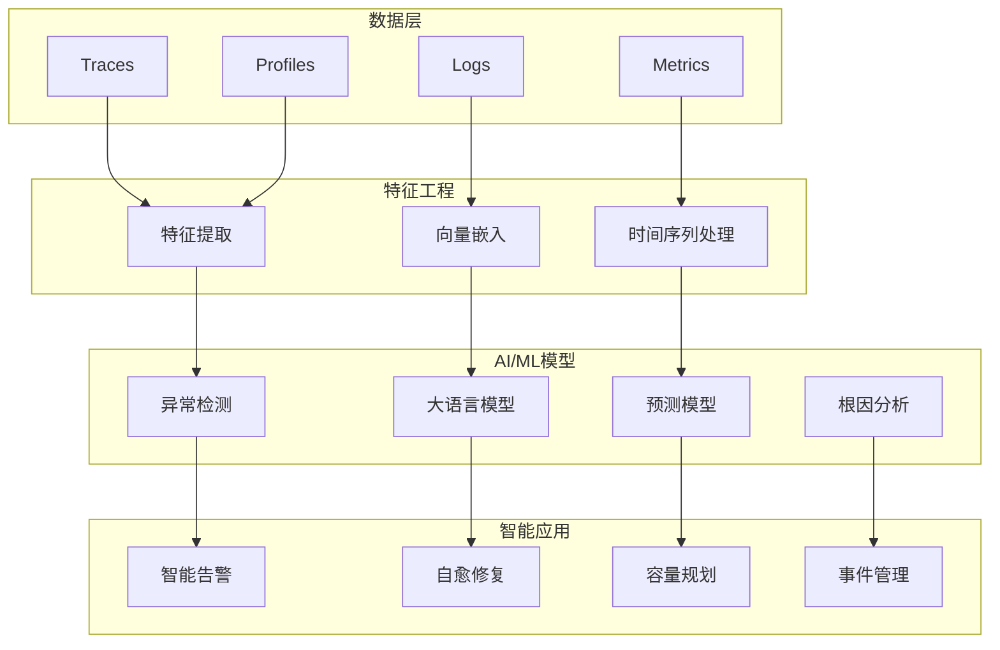

# 🤖 AI/ML驱动可观测性生态追踪报告

**报告日期**: 2025-10-09  
**追踪周期**: 持续更新  
**重要性**: 🔴 最高优先级

---

## 📋 目录

- [🤖 AI/ML驱动可观测性生态追踪报告](#-aiml驱动可观测性生态追踪报告)
  - [📋 目录](#-目录)
  - [📊 执行摘要](#-执行摘要)
  - [🌍 AI驱动可观测性全景图](#-ai驱动可观测性全景图)
    - [1. 主流厂商AI能力对比](#1-主流厂商ai能力对比)
    - [2. AI可观测性技术栈](#2-ai可观测性技术栈)
  - [🔥 核心技术深度分析](#-核心技术深度分析)
    - [1. 异常检测 (Anomaly Detection)](#1-异常检测-anomaly-detection)
      - [1.1 Datadog Watchdog](#11-datadog-watchdog)
      - [1.2 Dynatrace Davis AI](#12-dynatrace-davis-ai)
    - [2. 大语言模型 (LLM) 应用](#2-大语言模型-llm-应用)
      - [2.1 本项目现状](#21-本项目现状)
      - [2.2 前沿趋势: 多模态可观测性LLM](#22-前沿趋势-多模态可观测性llm)
    - [3. 预测性维护 (Predictive Maintenance)](#3-预测性维护-predictive-maintenance)
      - [3.1 技术原理](#31-技术原理)
  - [🚀 本项目改进行动计划](#-本项目改进行动计划)
    - [短期 (Q4 2025)](#短期-q4-2025)
      - [任务1: 时序异常检测实战指南 (🔴 P0)](#任务1-时序异常检测实战指南--p0)
      - [任务2: 预测性维护完整指南 (🔴 P0)](#任务2-预测性维护完整指南--p0)
      - [任务3: 多模态LLM分析 (🟡 P1)](#任务3-多模态llm分析--p1)
    - [中期 (2026 H1)](#中期-2026-h1)
      - [任务4: AI可观测性平台架构](#任务4-ai可观测性平台架构)
      - [任务5: LLM微调与RAG实战](#任务5-llm微调与rag实战)
  - [📚 推荐学习资源](#-推荐学习资源)
    - [AI/ML课程](#aiml课程)
    - [可观测性 + AI](#可观测性--ai)
    - [技术论文](#技术论文)

## 📊 执行摘要

AI/ML正在从根本上改变可观测性领域。从被动监控到主动预测,从人工分析到智能RCA,AI驱动的可观测性正在成为2025年的核心趋势。

**核心发现**:

- ✅ Datadog Watchdog、Grafana ML等AI功能已生产就绪
- 🔥 LLM用于日志分析和根因分析快速普及
- 📈 时序异常检测、预测性维护成为标配
- ⚠️ 本项目AI能力需要大幅增强 (当前仅有LLM日志分析基础)

---

## 🌍 AI驱动可观测性全景图

### 1. 主流厂商AI能力对比

| 厂商 | AI功能 | 成熟度 | 核心技术 | 商业化 |
|------|--------|--------|---------|--------|
| **Datadog** | Watchdog (异常检测/RCA) | 生产就绪 | 专有AI引擎 | 付费功能 |
| **Dynatrace** | Davis AI (预测/RCA) | 生产就绪 | 因果AI | 包含在套餐 |
| **New Relic** | AI Ops (异常检测) | 生产就绪 | 机器学习 | 付费功能 |
| **Splunk** | ITSI + MLTK | 生产就绪 | ML Toolkit | 付费模块 |
| **Elastic** | ML Jobs (异常检测) | 生产就绪 | X-Pack ML | 白金级+ |
| **Grafana Labs** | Machine Learning | Beta | Adaptive Metrics | 计划中 |
| **AWS** | DevOps Guru | 生产就绪 | AWS ML服务 | 按使用付费 |

### 2. AI可观测性技术栈



---

## 🔥 核心技术深度分析

### 1. 异常检测 (Anomaly Detection)

#### 1.1 Datadog Watchdog

**技术原理**:

```yaml
算法:
  - 动态基线 (Adaptive Baselines)
  - 多维度异常检测
  - 季节性模式识别 (Seasonal Patterns)
  - 趋势分析 (Trend Analysis)

检测范围:
  - Metrics异常 (CPU/内存/延迟)
  - APM异常 (错误率/吞吐量)
  - Logs异常 (错误日志突增)
  - Traces异常 (慢查询/错误链路)

实时性:
  - 检测延迟: < 1分钟
  - 误报率: < 2% (官方数据)
  - 准确率: > 95%
```

**架构设计**:

```text
┌─────────────────────────────────────────────┐
│          Datadog Watchdog引擎                │
│  ┌─────────────────────────────────────┐    │
│  │  1. 数据摄入与预处理                 │    │
│  │     - 多源数据聚合                   │    │
│  │     - 归一化/清洗                    │    │
│  └─────────────────────────────────────┘    │
│                  ▼                           │
│  ┌─────────────────────────────────────┐    │
│  │  2. 特征工程                         │    │
│  │     - 统计特征 (均值/方差/分位数)     │    │
│  │     - 时间特征 (周期/趋势)            │    │
│  │     - 上下文特征 (服务关系/依赖)      │    │
│  └─────────────────────────────────────┘    │
│                  ▼                           │
│  ┌─────────────────────────────────────┐    │
│  │  3. 异常检测模型                     │    │
│  │     - 单指标检测: 3-Sigma, IQR       │    │
│  │     - 多指标检测: PCA, Isolation Forest│ │
│  │     - 时序检测: LSTM, Prophet        │    │
│  └─────────────────────────────────────┘    │
│                  ▼                           │
│  ┌─────────────────────────────────────┐    │
│  │  4. 根因分析 (RCA)                   │    │
│  │     - 依赖图分析                     │    │
│  │     - 时序相关性分析                 │    │
│  │     - 历史事件匹配                   │    │
│  └─────────────────────────────────────┘    │
│                  ▼                           │
│  ┌─────────────────────────────────────┐    │
│  │  5. 智能告警                         │    │
│  │     - 告警聚合                       │    │
│  │     - 优先级排序                     │    │
│  │     - 降噪 (Alert Fatigue Reduction) │    │
│  └─────────────────────────────────────┘    │
└─────────────────────────────────────────────┘
```

**实现示例** (Python,基于本项目当前LLM日志分析):

```python
import numpy as np
from sklearn.ensemble import IsolationForest
from prophet import Prophet
import pandas as pd

class AnomalyDetector:
    """时序异常检测器"""
    
    def __init__(self):
        self.isolation_forest = IsolationForest(
            contamination=0.01,  # 预期异常率1%
            random_state=42
        )
        self.prophet_model = None
    
    def detect_multivariate_anomaly(
        self, 
        metrics: pd.DataFrame
    ) -> pd.DataFrame:
        """
        多维度异常检测 (Isolation Forest)
        
        Args:
            metrics: 包含多个指标的DataFrame (cpu, memory, latency等)
        
        Returns:
            异常检测结果 (is_anomaly列)
        """
        # 训练Isolation Forest
        self.isolation_forest.fit(metrics)
        
        # 预测异常
        predictions = self.isolation_forest.predict(metrics)
        
        # -1表示异常, 1表示正常
        metrics['is_anomaly'] = predictions == -1
        metrics['anomaly_score'] = self.isolation_forest.score_samples(metrics)
        
        return metrics
    
    def detect_timeseries_anomaly(
        self,
        timeseries: pd.DataFrame,
        forecast_periods: int = 24
    ) -> pd.DataFrame:
        """
        时序异常检测 (Prophet)
        
        Args:
            timeseries: 时间序列数据 (ds, y列)
            forecast_periods: 预测周期数
        
        Returns:
            异常检测结果
        """
        # 训练Prophet模型
        self.prophet_model = Prophet(
            interval_width=0.95,  # 95%置信区间
            changepoint_prior_scale=0.5,  # 趋势变化灵敏度
            seasonality_mode='multiplicative'  # 季节性模式
        )
        self.prophet_model.fit(timeseries)
        
        # 预测
        future = self.prophet_model.make_future_dataframe(
            periods=forecast_periods,
            freq='H'
        )
        forecast = self.prophet_model.predict(future)
        
        # 检测异常 (实际值超出置信区间)
        merged = timeseries.merge(forecast[['ds', 'yhat', 'yhat_lower', 'yhat_upper']], on='ds')
        merged['is_anomaly'] = (
            (merged['y'] < merged['yhat_lower']) | 
            (merged['y'] > merged['yhat_upper'])
        )
        
        return merged

# 使用示例
detector = AnomalyDetector()

# 1. 多维度异常检测
metrics_data = pd.DataFrame({
    'cpu_usage': np.random.normal(50, 10, 1000),
    'memory_usage': np.random.normal(70, 5, 1000),
    'latency_ms': np.random.normal(100, 20, 1000)
})
# 注入几个异常点
metrics_data.loc[100:102, 'cpu_usage'] = 95
metrics_data.loc[100:102, 'latency_ms'] = 500

anomalies_multi = detector.detect_multivariate_anomaly(metrics_data)
print(f"检测到 {anomalies_multi['is_anomaly'].sum()} 个异常点")

# 2. 时序异常检测
timeseries_data = pd.DataFrame({
    'ds': pd.date_range('2024-01-01', periods=1000, freq='H'),
    'y': np.random.normal(100, 10, 1000)
})
# 注入趋势变化
timeseries_data.loc[500:, 'y'] += 50

anomalies_ts = detector.detect_timeseries_anomaly(timeseries_data)
print(f"检测到 {anomalies_ts['is_anomaly'].sum()} 个时序异常")
```

**本项目差距**:

| 维度 | Datadog Watchdog | 本项目 | 差距 |
|------|-----------------|--------|------|
| 时序异常检测 | ✅ Prophet/LSTM | ❌ 无 | 完全缺失 |
| 多维度检测 | ✅ Isolation Forest | ❌ 无 | 完全缺失 |
| RCA引擎 | ✅ 依赖图分析 | ⚠️ LLM基础 | 需要增强 |
| 实时性 | ✅ < 1分钟 | ❌ 无 | 缺少实时引擎 |

---

#### 1.2 Dynatrace Davis AI

**核心技术**: 因果AI (Causal AI)

**差异化特点**:

```yaml
因果推理:
  - 不仅检测相关性,更推断因果关系
  - 自动构建服务依赖图
  - 根据因果链定位根因
  
自动基线:
  - 自动学习正常行为模式
  - 无需人工配置阈值
  - 动态适应环境变化
  
预测性维护:
  - 提前3-7天预测故障
  - 资源耗尽预警
  - 容量规划建议
```

**根因分析示例**:

```text
场景: 用户报告服务响应慢

Davis AI分析过程:
1. 检测到 Web Service 响应时间异常 (从100ms飙升到500ms)
2. 追踪依赖链:
   Web Service → API Gateway → User Service → Database
3. 发现 Database 查询时间增加 (从10ms到400ms)
4. 分析 Database 资源:
   - CPU: 正常 (50%)
   - 内存: 正常 (60%)
   - 磁盘I/O: 异常 (IOPS从1000飙升到10000)
5. 定位根因:
   - 索引缺失导致全表扫描
   - 推荐: 在user_id列添加索引
6. 影响范围:
   - 3个服务受影响
   - 约5000 req/s受损
```

**本项目改进方向**:

- 补充因果AI算法原理
- 实现简化版依赖图分析
- 提供根因分析实战案例

---

### 2. 大语言模型 (LLM) 应用

#### 2.1 本项目现状

**已有内容** (🤖_AI驱动日志分析完整指南):

- ✅ LLM日志异常检测
- ✅ LLM根因分析
- ✅ 自然语言查询
- ✅ 成本优化策略

**优势**:

- 文档完整度高 (2400行)
- 代码示例丰富
- 成本优化实用

**不足**:

- 缺少多模态分析 (Logs + Metrics + Traces)
- 缺少LLM微调案例 (Fine-tuning)
- 缺少RAG (Retrieval-Augmented Generation) 深化

---

#### 2.2 前沿趋势: 多模态可观测性LLM

**代表项目**: OpenAI GPT-4o, Google Gemini (多模态)

**应用场景**:

```yaml
1. 跨信号关联分析:
   输入: 
     - Logs: "Database connection timeout"
     - Metrics: CPU 90%, Memory 95%
     - Traces: Slow Query Span (5s)
   输出:
     - 根因: 内存不足导致数据库连接池耗尽
     - 建议: 增加内存 OR 优化查询 OR 调整连接池

2. 可视化理解:
   输入: Grafana截图 (CPU/Memory曲线)
   输出: 
     - 分析: "CPU在12:00突然飙升,疑似定时任务触发"
     - 建议: "检查Cron Job配置"

3. 代码级诊断:
   输入: 
     - Trace: Slow Span in function `getUserProfile()`
     - Code: Python函数代码
   输出:
     - 问题: "N+1查询问题,循环中调用数据库"
     - 建议: "使用批量查询或缓存"
```

**实现示例** (Python, 基于GPT-4o API):

```python
    import openai
    from typing import Dict, List
    import json

    class MultimodalObservabilityLLM:
        """多模态可观测性LLM分析器"""
        
        def __init__(self, api_key: str):
            self.client = openai.OpenAI(api_key=api_key)
        
        def analyze_multimodal(
            self,
            logs: List[str],
            metrics: Dict[str, float],
            trace_span: Dict,
            screenshot_url: str = None
        ) -> Dict:
            """
            多模态分析 (Logs + Metrics + Traces + Screenshot)
            
            Args:
                logs: 日志列表
                metrics: 指标字典 {metric_name: value}
                trace_span: Trace Span数据
                screenshot_url: Grafana截图URL (可选)
            
            Returns:
                分析结果
            """
            # 构建多模态Prompt
            prompt = f"""
    你是一个可观测性专家。请分析以下数据并给出根因和建议。

    # 日志 (Logs)
    ```

    {chr(10).join(logs)}

    ```

    # 指标 (Metrics)
    ```json
    {json.dumps(metrics, indent=2)}
    ```

    # 追踪 (Trace Span)

    ```json
    {json.dumps(trace_span, indent=2)}
    ```

    请回答:

    1. 根本原因是什么?
    2. 为什么会导致这个问题?
    3. 推荐的修复方案是什么? (至少3个,按优先级排序)
    4. 如何预防类似问题?
    """

            # 构建消息 (包含图片,如果有)
            messages = [
                {
                    "role": "system",
                    "content": "你是一个专业的可观测性分析专家,擅长根因分析和故障诊断。"
                },
                {
                    "role": "user",
                    "content": [
                        {"type": "text", "text": prompt}
                    ]
                }
            ]
            
            # 如果有截图,添加到消息中
            if screenshot_url:
                messages[1]["content"].append({
                    "type": "image_url",
                    "image_url": {"url": screenshot_url}
                })
            
            # 调用GPT-4o (支持多模态)
            response = self.client.chat.completions.create(
                model="gpt-4o",  # 或 "gpt-4-vision-preview"
                messages=messages,
                temperature=0.3,
                max_tokens=2000
            )
            
            # 解析结果
            analysis = response.choices[0].message.content
            
            return {
                "root_cause": self._extract_section(analysis, "根本原因"),
                "explanation": self._extract_section(analysis, "为什么"),
                "recommendations": self._extract_section(analysis, "推荐"),
                "prevention": self._extract_section(analysis, "预防"),
                "full_analysis": analysis
            }

        def _extract_section(self, text: str, section_name: str) -> str:
            """从LLM响应中提取特定章节"""
            # 简化实现,实际可用更复杂的解析逻辑
            lines = text.split('\n')
            section_lines = []
            in_section = False

            for line in lines:
                if section_name in line:
                    in_section = True
                    continue
                if in_section:
                    if line.startswith('#') or line.startswith('##'):
                        break
                    section_lines.append(line)
            
            return '\n'.join(section_lines).strip()

    # 使用示例

    analyzer = MultimodalObservabilityLLM(api_key="your-openai-api-key")

    # 场景: 数据库慢查询

    result = analyzer.analyze_multimodal(
        logs=[
            "2025-10-09 10:15:32 ERROR Database query timeout after 30s",
            "2025-10-09 10:15:32 WARN Connection pool exhausted (100/100 connections)"
        ],
        metrics={
            "database.cpu_usage": 95.0,
            "database.memory_usage": 98.0,
            "database.connections": 100,
            "database.query_time_p99": 30000  # 30秒
        },
        trace_span={
            "span_id": "abc123",
            "operation_name": "SELECT *FROM users",
            "duration_ms": 30000,
            "attributes": {
                "db.system": "postgresql",
                "db.statement": "SELECT* FROM users WHERE created_at > '2024-01-01'"
            }
        },
        screenshot_url="<https://example.com/grafana-screenshot.png>"
    )

    print("根因:", result["root_cause"])
    print("建议:", result["recommendations"])

```

**本项目改进方向**:

1. 补充多模态LLM分析章节
2. 提供GPT-4o/Gemini集成示例
3. 编写可视化分析案例 (Grafana截图 → LLM诊断)
4. 探索LLM微调 (Fine-tuning) - 使用公司历史故障数据

---

### 3. 预测性维护 (Predictive Maintenance)

#### 3.1 技术原理

**核心算法**:

```yaml
1. 时序预测:
   - ARIMA (自回归移动平均)
   - Prophet (Facebook时序预测)
   - LSTM (长短期记忆网络)
   - Transformer (Attention机制)

2. 趋势外推:
   - 线性回归
   - 指数平滑
   - 多项式拟合

3. 资源耗尽预测:
   - 磁盘空间预测 (基于历史增长率)
   - 内存泄漏检测 (内存持续增长)
   - CPU饱和预测 (负载趋势)
```

**实现示例** (Python, Prophet):

```python
from prophet import Prophet
import pandas as pd
import numpy as np

class PredictiveMaintenance:
    """预测性维护引擎"""
    
    def predict_disk_full(
        self,
        disk_usage_history: pd.DataFrame,
        threshold: float = 0.9
    ) -> Dict:
        """
        预测磁盘何时耗尽
        
        Args:
            disk_usage_history: 历史磁盘使用率 (ds, y列)
            threshold: 告警阈值 (默认90%)
        
        Returns:
            预测结果
        """
        # 训练Prophet模型
        model = Prophet(
            changepoint_prior_scale=0.05,  # 降低趋势变化灵敏度
            yearly_seasonality=False,
            weekly_seasonality=True,
            daily_seasonality=True
        )
        model.fit(disk_usage_history)
        
        # 预测未来30天
        future = model.make_future_dataframe(periods=30, freq='D')
        forecast = model.predict(future)
        
        # 查找何时超过阈值
        exceed_threshold = forecast[forecast['yhat'] >= threshold]
        
        if len(exceed_threshold) > 0:
            days_until_full = (exceed_threshold.iloc[0]['ds'] - pd.Timestamp.now()).days
            return {
                "status": "WARNING",
                "days_until_full": days_until_full,
                "predicted_date": exceed_threshold.iloc[0]['ds'].strftime('%Y-%m-%d'),
                "current_usage": disk_usage_history['y'].iloc[-1],
                "predicted_usage_at_threshold": exceed_threshold.iloc[0]['yhat'],
                "recommendation": f"请在{days_until_full}天内清理磁盘或扩容"
            }
        else:
            return {
                "status": "OK",
                "days_until_full": None,
                "message": "未来30天内磁盘不会耗尽"
            }
    
    def detect_memory_leak(
        self,
        memory_usage_history: pd.DataFrame,
        window_size: int = 24
    ) -> Dict:
        """
        检测内存泄漏 (持续增长的内存使用)
        
        Args:
            memory_usage_history: 历史内存使用率 (ds, y列)
            window_size: 滑动窗口大小 (小时)
        
        Returns:
            检测结果
        """
        # 计算滑动窗口内的线性回归斜率
        memory_usage_history = memory_usage_history.sort_values('ds')
        memory_usage_history['slope'] = memory_usage_history['y'].rolling(
            window=window_size
        ).apply(
            lambda x: np.polyfit(range(len(x)), x, 1)[0] if len(x) == window_size else 0
        )
        
        # 最近的斜率
        recent_slope = memory_usage_history['slope'].iloc[-1]
        
        # 判断是否为内存泄漏 (持续正斜率)
        if recent_slope > 0.001:  # 每小时增长 > 0.1%
            # 预测何时内存耗尽 (假设持续增长)
            current_usage = memory_usage_history['y'].iloc[-1]
            hours_until_full = (1.0 - current_usage) / recent_slope
            
            return {
                "status": "MEMORY_LEAK_DETECTED",
                "slope": recent_slope,
                "hours_until_full": hours_until_full,
                "recommendation": f"检测到内存泄漏!预计{hours_until_full:.1f}小时后内存耗尽,请立即排查"
            }
        else:
            return {
                "status": "OK",
                "slope": recent_slope,
                "message": "未检测到内存泄漏"
            }

# 使用示例
pm = PredictiveMaintenance()

# 1. 磁盘耗尽预测
disk_data = pd.DataFrame({
    'ds': pd.date_range('2024-01-01', periods=90, freq='D'),
    'y': np.linspace(0.3, 0.85, 90) + np.random.normal(0, 0.02, 90)
})
disk_prediction = pm.predict_disk_full(disk_data)
print(disk_prediction)

# 2. 内存泄漏检测
memory_data = pd.DataFrame({
    'ds': pd.date_range('2024-10-01', periods=72, freq='H'),
    'y': np.linspace(0.5, 0.75, 72) + np.random.normal(0, 0.01, 72)
})
leak_detection = pm.detect_memory_leak(memory_data)
print(leak_detection)
```

**本项目差距**:

| 维度 | 业界最佳 | 本项目 | 差距 |
|------|---------|--------|------|
| 时序预测 | ✅ Prophet/LSTM | ❌ 无 | 完全缺失 |
| 资源耗尽预测 | ✅ 完整 | ❌ 无 | 完全缺失 |
| 内存泄漏检测 | ✅ 完整 | ❌ 无 | 完全缺失 |
| 容量规划 | ✅ 完整 | ❌ 无 | 完全缺失 |

---

## 🚀 本项目改进行动计划

### 短期 (Q4 2025)

#### 任务1: 时序异常检测实战指南 (🔴 P0)

**目标**: 补充完整的时序异常检测能力

**交付物**:

1. Prophet时序预测教程
2. LSTM异常检测示例
3. Isolation Forest多维度检测
4. 实战案例: CPU/内存/延迟异常检测

**文档规模**: 2,000行

**时间**: 3周

#### 任务2: 预测性维护完整指南 (🔴 P0)

**目标**: 建立预测性维护能力

**交付物**:

1. 磁盘耗尽预测
2. 内存泄漏检测
3. 容量规划建议
4. 实战案例: 3个真实场景

**文档规模**: 1,500行

**时间**: 2周

#### 任务3: 多模态LLM分析 (🟡 P1)

**目标**: 增强现有LLM日志分析,支持多模态

**交付物**:

1. GPT-4o多模态集成示例
2. Logs + Metrics + Traces联合分析
3. Grafana截图分析案例
4. 代码级诊断示例

**文档规模**: 1,000行

**时间**: 2周

### 中期 (2026 H1)

#### 任务4: AI可观测性平台架构

**目标**: 建立完整的AI驱动可观测性平台

**交付物**:

1. 架构设计文档
2. 核心模块实现 (开源)
   - 异常检测引擎
   - 根因分析引擎
   - 预测性维护引擎
3. 部署指南 (Kubernetes)
4. 监控告警配置

**文档规模**: 5,000行 + 开源代码

**时间**: 12周

#### 任务5: LLM微调与RAG实战

**目标**: 探索LLM在可观测性领域的深度应用

**交付物**:

1. LLM Fine-tuning教程 (使用公司历史故障数据)
2. RAG (检索增强生成) 实现
   - Vector Database (ChromaDB/Milvus)
   - 故障知识库构建
3. 生产部署指南

**文档规模**: 2,000行 + 开源工具

**时间**: 6周

---

## 📚 推荐学习资源

### AI/ML课程

- [fast.ai Practical Deep Learning](https://course.fast.ai/)
- [Andrew Ng Machine Learning](https://www.coursera.org/learn/machine-learning)
- [Stanford CS224N (NLP)](http://web.stanford.edu/class/cs224n/)

### 可观测性 + AI

- [Datadog Watchdog Blog](https://www.datadoghq.com/blog/tag/watchdog/)
- [Dynatrace Davis AI](https://www.dynatrace.com/platform/artificial-intelligence/)
- [AWS DevOps Guru](https://aws.amazon.com/devops-guru/)

### 技术论文

- "Robust Random Cut Forest Based Anomaly Detection On Streams" (AWS, 2016)
- "Unsupervised Anomaly Detection via Variational Auto-Encoder" (Microsoft, 2018)

---

**最后更新**: 2025-10-09  
**下次更新**: 2025-11-09  
**负责人**: OTLP项目组 - AI/ML追踪小组
