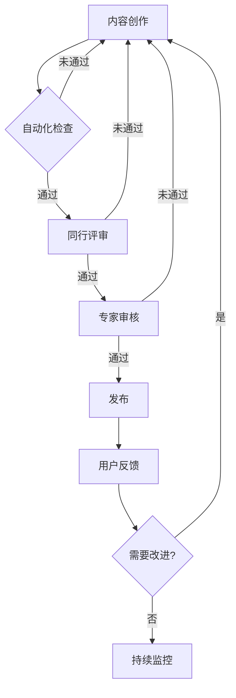

# OTLP标准深度梳理项目 - 全面推进实施方案

> **方案日期**: 2025年10月9日  
> **实施周期**: 2025 Q4 - 2026 Q4（15个月）  
> **目标**: 系统性推进改进完善，实现项目持续优化  
> **策略**: 分阶段、可落地、可跟踪、可衡量

---

## 📋 目录

- [OTLP标准深度梳理项目 - 全面推进实施方案](#otlp标准深度梳理项目---全面推进实施方案)
  - [📋 目录](#-目录)
  - [执行概要](#执行概要)
    - [总体目标](#总体目标)
    - [核心策略](#核心策略)
    - [关键成果](#关键成果)
  - [实施原则](#实施原则)
    - [1. 优先级驱动](#1-优先级驱动)
    - [2. 小步快跑](#2-小步快跑)
    - [3. 自动化优先](#3-自动化优先)
    - [4. 质量第一](#4-质量第一)
    - [5. 开放协作](#5-开放协作)
  - [分阶段推进计划](#分阶段推进计划)
    - [阶段0: 准备期（2025年10月9-31日）](#阶段0-准备期2025年10月9-31日)
      - [关键任务](#关键任务)
    - [阶段1: 止损修复期（2025年11月-2026年1月）](#阶段1-止损修复期2025年11月-2026年1月)
      - [2025年11月: 版本更新](#2025年11月-版本更新)
      - [2025年12月: 自动化机制](#2025年12月-自动化机制)
    - [Python脚本实现](#python脚本实现)
    - [任务分解](#任务分解)
    - [质量标准](#质量标准)
  - [任务2: 建立代码测试框架Alpha版（35小时）](#任务2-建立代码测试框架alpha版35小时)
    - [架构设计](#架构设计)
    - [任务分解1](#任务分解1)
    - [Alpha版目标](#alpha版目标)
  - [任务3: 文档质量自动化检查（25小时）](#任务3-文档质量自动化检查25小时)
    - [检查项](#检查项)
    - [实现工具](#实现工具)
    - [质量标准1](#质量标准1)
      - [2026年1月: 总结与规划](#2026年1月-总结与规划)
    - [阶段2: 能力建设期（2026年2月-4月）](#阶段2-能力建设期2026年2月-4月)
      - [2026年2月: 精简版文档](#2026年2月-精简版文档)
      - [2. 快速集成清单（10小时, ~1,000字）](#2-快速集成清单10小时-1000字)
      - [3. 常用配置速查（12小时, ~1,500字）](#3-常用配置速查12小时-1500字)
      - [4. 故障排查速查（12小时, ~1,200字）](#4-故障排查速查12小时-1200字)
      - [5. 性能优化速查（10小时, ~1,000字）](#5-性能优化速查10小时-1000字)
      - [6. API速查表（8小时, ~2,000字）](#6-api速查表8小时-2000字)
      - [2026年3月: 代码验证强化](#2026年3月-代码验证强化)
      - [2026年4月: 本地化启动](#2026年4月-本地化启动)
    - [任务分解2](#任务分解2)
  - [P1-4: 腾讯云集成指南（40小时, ~2,500行）](#p1-4-腾讯云集成指南40小时-2500行)
    - [内容大纲](#内容大纲)
    - [阶段3: 内容扩展期（2026年5月-9月）](#阶段3-内容扩展期2026年5月-9月)
      - [关键任务3](#关键任务3)
    - [阶段4: 生态拓展期（2026年10月-12月）](#阶段4-生态拓展期2026年10月-12月)
      - [关键任务4](#关键任务4)
  - [具体任务清单](#具体任务清单)
    - [P0任务清单（紧急，已在阶段1详细规划）](#p0任务清单紧急已在阶段1详细规划)
    - [P1任务清单（重要，已在阶段2详细规划）](#p1任务清单重要已在阶段2详细规划)
    - [P2任务清单（中等，已在阶段3规划）](#p2任务清单中等已在阶段3规划)
    - [P3任务清单（一般，持续进行）](#p3任务清单一般持续进行)
  - [自动化机制建设](#自动化机制建设)
    - [1. 版本同步自动化](#1-版本同步自动化)
    - [2. 代码测试自动化](#2-代码测试自动化)
    - [3. 文档质量自动化](#3-文档质量自动化)
    - [4. 用户反馈自动化](#4-用户反馈自动化)
  - [质量保证体系](#质量保证体系)
    - [1. 内容质量标准](#1-内容质量标准)
    - [2. 代码质量标准](#2-代码质量标准)
    - [3. 审核流程](#3-审核流程)
  - [进度跟踪机制](#进度跟踪机制)
    - [1. GitHub Project看板](#1-github-project看板)
    - [2. 每周例会](#2-每周例会)
    - [3. 月度总结](#3-月度总结)
    - [4. 季度复盘](#4-季度复盘)
  - [风险应对预案](#风险应对预案)
    - [1. 人力资源风险](#1-人力资源风险)
    - [2. 技术变更风险](#2-技术变更风险)
    - [3. 质量控制风险](#3-质量控制风险)
    - [4. 进度延误风险](#4-进度延误风险)
    - [5. 资金短缺风险](#5-资金短缺风险)
  - [资源调配方案](#资源调配方案)
    - [1. 人力资源分配](#1-人力资源分配)
    - [2. 预算分配](#2-预算分配)
    - [3. 时间分配](#3-时间分配)
    - [4. 工具和平台](#4-工具和平台)
  - [成功标准定义](#成功标准定义)
    - [1. 定量指标](#1-定量指标)
    - [2. 定性目标](#2-定性目标)
    - [3. 里程碑检查](#3-里程碑检查)
  - [附录: 实施工具包](#附录-实施工具包)
    - [1. 文档模板](#1-文档模板)
    - [2. Issue模板](#2-issue模板)
    - [3. PR审核清单](#3-pr审核清单)
  - [结语](#结语)
    - [实施承诺](#实施承诺)
    - [期待成果](#期待成果)
    - [联系我们](#联系我们)

---

## 执行概要

### 总体目标

**将项目从"优秀但需改进"（4/5）提升到"卓越"（4.8/5）**-

```text
当前状态（2025年10月）:
├─ 内容完整性: ⭐⭐⭐⭐⭐ 5.0/5.0
├─ 技术深度:   ⭐⭐⭐⭐⭐ 5.0/5.0
├─ 实用性:     ⭐⭐⭐⭐   4.0/5.0
├─ 准确性:     ⭐⭐⭐⭐   4.0/5.0 ⚠️ 版本滞后
└─ 及时性:     ⭐⭐⭐     3.0/5.0 ⚠️ 需改进
综合评分: 4.0/5.0

目标状态（2026年12月）:
├─ 内容完整性: ⭐⭐⭐⭐⭐ 5.0/5.0 ✅ 保持
├─ 技术深度:   ⭐⭐⭐⭐⭐ 5.0/5.0 ✅ 保持
├─ 实用性:     ⭐⭐⭐⭐⭐ 5.0/5.0 ⬆️ 提升
├─ 准确性:     ⭐⭐⭐⭐⭐ 5.0/5.0 ⬆️ 提升
└─ 及时性:     ⭐⭐⭐⭐⭐ 5.0/5.0 ⬆️ 提升
综合评分: 4.8/5.0 🎯 目标
```

### 核心策略

**四大支柱策略**:

1. **止损修复** (2025 Q4): 立即修复P0问题，恢复版本同步
2. **能力建设** (2026 Q1): 建立自动化和质量保证机制
3. **内容扩展** (2026 Q2-Q3): 补充本地化和高级内容
4. **生态拓展** (2026 Q4): 社区建设和国际化推广

### 关键成果

**2026年末交付清单**:

```text
✅ 文档更新:
   - 版本同步: OTLP v1.3.0+, SemConv v1.28.0+
   - 新增文档: 20+篇（本地化+高级主题）
   - 总行数: 254,900 → 320,000+ (增长25%+)

✅ 质量提升:
   - 代码测试覆盖率: 0% → 80%+
   - 版本同步及时性: - → <2周
   - 用户满意度: - → 4.5+/5

✅ 生态建设:
   - GitHub Stars: 0 → 1,000+
   - 活跃贡献者: 1-2 → 10+
   - 月均访问量: - → 10,000+

✅ 工具平台:
   - 配置生成器上线
   - 故障诊断向导Beta
   - 自动化监控系统
```

---

## 实施原则

### 1. 优先级驱动

**严格遵循P0→P1→P2→P3优先级顺序**:

```text
P0（紧急，1个月内）: 版本滞后问题，影响项目准确性
├─ 必须立即启动
├─ 阻塞后续工作
└─ 风险最高

P1（重要，3个月内）: 本地化和验证，影响项目实用性
├─ 紧随P0之后
├─ 用户需求强烈
└─ 价值明显

P2（中等，6-12个月）: 工具和可视化，影响用户体验
├─ 有序推进
├─ 增强竞争力
└─ 差异化优势

P3（一般，持续进行）: 社区和国际化，影响长期发展
├─ 持续投入
├─ 战略价值
└─ 生态建设
```

### 2. 小步快跑

**采用敏捷迭代方式，快速验证和调整**:

```text
迭代周期: 2周/Sprint
├─ Week 1: 开发+自测
├─ Week 2: 评审+发布
└─ 持续改进

每月复盘:
├─ 回顾目标达成
├─ 分析偏差原因
└─ 调整下月计划
```

### 3. 自动化优先

**能自动化的绝不手动，建立可持续机制**:

```text
自动化重点:
✅ 版本监控: GitHub Actions每周检查
✅ 测试验证: CI/CD每日运行
✅ 质量检查: 自动化扫描
✅ 报告生成: 自动统计分析
```

### 4. 质量第一

**宁可慢一点，也要保证质量**:

```text
质量门禁:
✅ 代码示例: 100%测试通过
✅ 文档内容: 专家审核通过
✅ 版本信息: 官方规范对标
✅ 用户反馈: 满意度4.0+/5
```

### 5. 开放协作

**建立社区驱动的可持续发展模式**:

```text
开放机制:
✅ 公开路线图
✅ 接受PR贡献
✅ 定期技术分享
✅ 透明决策过程
```

---

## 分阶段推进计划

### 阶段0: 准备期（2025年10月9-31日）

**目标**: 完成启动准备，建立工作机制

#### 关键任务

```markdown
## Week 1 (10月9-15日)

### 任务组织
- [x] 成立改进推进小组（1-2人核心团队）
- [ ] 召开启动会议，明确分工
- [ ] 建立GitHub Project跟踪看板
- [ ] 配置沟通渠道（企业微信/钉钉群）

### 工具准备
- [ ] 搭建本地开发测试环境
- [ ] 配置Git分支管理策略
- [ ] 准备文档模板和规范
- [ ] 建立代码仓库备份机制

### 调研分析
- [ ] 深度研读OpenTelemetry最新规范
- [ ] 收集用户反馈和需求
- [ ] 分析竞品最新动态
- [ ] 明确技术选型和工具栈

## Week 2-3 (10月16-29日)

### P0任务启动
- [ ] 开始更新OTLP协议文档（v1.0.0→v1.3.0）
- [ ] 开始更新Semantic Conventions（v1.27.0→v1.28.0）
- [ ] 梳理2024-2025年重要变更清单
- [ ] 制定详细的更新计划和时间表

### 自动化准备
- [ ] 编写版本监控脚本原型
- [ ] 设计CI/CD测试框架
- [ ] 准备Docker测试环境
- [ ] 编写文档质量检查工具

## Week 4 (10月30-31日)

### 月度总结
- [ ] 完成10月工作总结
- [ ] 发布11月详细计划
- [ ] 调整资源分配
- [ ] 风险识别和应对
```

**交付物**:

- ✅ GitHub Project看板
- ✅ 团队沟通群组
- ✅ 11月详细工作计划
- ✅ 自动化脚本原型

**成功标准**:

- 团队就位，分工明确
- 工具准备完成
- P0任务启动

---

### 阶段1: 止损修复期（2025年11月-2026年1月）

**目标**: 修复版本滞后问题，恢复项目准确性

#### 2025年11月: 版本更新

**主要任务**:

```markdown
# 11月任务清单（总工作量: 120小时）

## P0-1: 更新OTLP核心协议（40小时）

### 任务分解
- [ ] 01_协议概述.md 版本更新（8小时）
      - v1.0.0→v1.1.0→v1.2.0→v1.3.0逐版分析
      - 补充变更日志
      - 更新所有版本标注
      - 验证链接有效性

- [ ] 02_gRPC传输.md 更新（6小时）
      - 检查gRPC规范变化
      - 更新代码示例
      - 补充最佳实践

- [ ] 03_HTTP传输.md 更新（6小时）
      - 检查HTTP/1.1规范变化
      - 更新端点定义
      - 补充错误处理

- [ ] 04_协议缓冲.md 更新（6小时）
      - 检查Protobuf定义变化
      - 更新消息结构
      - 补充编码说明

- [ ] 全文档版本一致性检查（8小时）
      - 批量检查所有文档版本标注
      - 统一格式
      - 生成版本对照表

- [ ] 验证和测试（6小时）
      - 代码示例验证
      - 链接检查
      - 专家审核

### 质量标准
✅ 版本号100%准确
✅ 变更日志完整
✅ 代码示例可运行
✅ 链接100%有效

## P0-2: 更新Semantic Conventions（30小时）

### 任务分解
- [ ] 00_语义约定总览.md 更新（8小时）
      - v1.27.0→v1.28.0变更分析
      - 更新分类体系
      - 补充稳定性说明

- [ ] HTTP/gRPC/数据库等具体约定更新（15小时）
      - 逐个模块检查变化
      - 更新属性定义
      - 补充枚举值

- [ ] 云平台和FaaS约定更新（5小时）
      - AWS/Azure/GCP最新属性
      - Lambda/Functions更新

- [ ] 验证和交叉引用（2小时）
      - 检查所有引用
      - 更新示例代码

### 质量标准
✅ 所有约定对标v1.28.0
✅ 属性定义准确
✅ 示例完整

## P0-3: 补充2024-2025年重要变更（50小时）

### 任务分解
- [ ] 新增: 03_传输层_HTTP_JSON.md（20小时, ~2,000行）
      ```markdown
      # 内容大纲
      1. OTLP/HTTP JSON编码概述
      2. JSON Schema定义
      3. 与Protobuf对比分析
      4. Web前端集成
         - React示例
         - Vue示例
         - 浏览器直接调用
      5. 调试工具使用
         - curl命令
         - Postman集合
         - 在线调试器
      6. 性能考虑
      7. 最佳实践
      8. 故障排查
      ```

- [ ] 更新: 02_Metrics数据模型/01_Metrics概述.md（12小时, +800行）
      ```markdown
      # 新增Exemplars章节
      1. Exemplars概念
      2. 数据模型
      3. 使用场景
      4. 实现示例
         - Go SDK
         - Python SDK
         - Java SDK
      5. Grafana集成
      6. 最佳实践
      ```

- [ ] 新增: 03_Logs生产环境部署指南.md（18小时, ~2,500行）
      ```markdown
      # 内容大纲
      1. Logs GA里程碑说明
      2. 生产就绪评估
      3. 架构设计
         - 单体部署
         - 分布式部署
         - 高可用部署
      4. 性能优化
         - 批处理配置
         - 压缩策略
         - 采样策略
      5. 存储后端选择
         - Loki
         - Elasticsearch
         - ClickHouse
      6. 监控和告警
      7. 故障排查
      8. 案例研究
      ```

### 质量标准
✅ 内容完整准确
✅ 代码示例可运行
✅ 架构图清晰
✅ 对标官方规范
```

**里程碑**:

- 11月15日: 完成OTLP协议更新
- 11月22日: 完成Semantic Conventions更新
- 11月30日: 完成3个新文档，月度总结

**成功标准**:

- ✅ 版本号100%同步到最新
- ✅ 3个P0缺失文档完成
- ✅ 专家审核通过

---

#### 2025年12月: 自动化机制

**主要任务**:

```markdown
# 12月任务清单（总工作量: 100小时）

## 任务1: 建立版本监控系统（40小时）

### 技术实现
```yaml
# .github/workflows/otel-version-sync.yml
name: OpenTelemetry版本同步检查

on:
  schedule:
    - cron: '0 9 * * 1'  # 每周一09:00 UTC
  workflow_dispatch:  # 支持手动触发

jobs:
  check-otlp-version:
    runs-on: ubuntu-latest
    steps:
      - name: Checkout代码
        uses: actions/checkout@v3

      - name: 设置Python环境
        uses: actions/setup-python@v4
        with:
          python-version: '3.11'

      - name: 安装依赖
        run: |
          pip install requests PyYAML beautifulsoup4

      - name: 检查OTLP协议版本
        id: check-otlp
        run: |
          python scripts/check_otlp_version.py

      - name: 检查Semantic Conventions版本
        id: check-semconv
        run: |
          python scripts/check_semconv_version.py

      - name: 检查SDK版本
        id: check-sdk
        run: |
          python scripts/check_sdk_versions.py

      - name: 生成版本差异报告
        if: steps.check-otlp.outputs.outdated == 'true' || steps.check-semconv.outputs.outdated == 'true'
        run: |
          python scripts/generate_version_report.py > version-report.md

      - name: 创建Issue
        if: steps.check-otlp.outputs.outdated == 'true' || steps.check-semconv.outputs.outdated == 'true'
        uses: actions/github-script@v6
        with:
          script: |
            const fs = require('fs');
            const report = fs.readFileSync('version-report.md', 'utf8');
            
            github.rest.issues.create({
              owner: context.repo.owner,
              repo: context.repo.repo,
              title: '⚠️ OpenTelemetry版本更新提醒',
              body: report,
              labels: ['version-update', 'P0', 'automation']
            });

      - name: 发送通知（企业微信）
        if: steps.check-otlp.outputs.outdated == 'true'
        run: |
          python scripts/send_wechat_notification.py
```

### Python脚本实现

```python
# scripts/check_otlp_version.py
import requests
import re
import sys

def get_latest_otlp_version():
    """从GitHub获取最新OTLP版本"""
    url = "https://api.github.com/repos/open-telemetry/opentelemetry-proto/releases/latest"
    response = requests.get(url)
    data = response.json()
    return data['tag_name'].replace('v', '')

def get_current_doc_version():
    """从文档获取当前版本"""
    with open('标准深度梳理_2025_10/01_OTLP核心协议/01_协议概述.md', 'r', encoding='utf-8') as f:
        content = f.read()
        match = re.search(r'标准版本.*?v?([\d.]+)', content)
        if match:
            return match.group(1)
    return None

def main():
    latest = get_latest_otlp_version()
    current = get_current_doc_version()
    
    print(f"官方最新版本: v{latest}")
    print(f"文档当前版本: v{current}")
    
    if latest != current:
        print(f"::set-output name=outdated::true")
        print(f"::set-output name=latest::{latest}")
        print(f"::set-output name=current::{current}")
        sys.exit(0)  # 不失败，只标记
    else:
        print("✅ 版本已是最新")
        print(f"::set-output name=outdated::false")

if __name__ == "__main__":
    main()
```

### 任务分解

- [ ] Week 1: 编写版本检查脚本（16小时）
      - check_otlp_version.py
      - check_semconv_version.py
      - check_sdk_versions.py
      - generate_version_report.py

- [ ] Week 2: 配置GitHub Actions（12小时）
      - 工作流YAML编写
      - Secret配置
      - 权限设置
      - 测试调试

- [ ] Week 3: 开发通知系统（8小时）
      - 企业微信机器人
      - 邮件通知
      - Issue自动创建

- [ ] Week 4: 测试和优化（4小时）
      - 全流程测试
      - 错误处理
      - 文档编写

### 质量标准

✅ 每周自动检查
✅ 检测准确率100%
✅ 通知及时送达
✅ Issue自动创建

## 任务2: 建立代码测试框架Alpha版（35小时）

### 架构设计

```text
tests/
├── docker-compose.yml          # 统一测试环境
│   ├── otel-collector          # Collector服务
│   ├── jaeger                  # Traces后端
│   ├── prometheus              # Metrics后端
│   └── loki                    # Logs后端
│
├── code-examples/              # 代码示例测试
│   ├── go/
│   │   ├── 01_basic_tracing/
│   │   │   ├── main.go
│   │   │   ├── go.mod
│   │   │   ├── test.sh
│   │   │   └── README.md
│   │   └── ...
│   │
│   ├── python/
│   │   ├── 01_basic_tracing/
│   │   │   ├── main.py
│   │   │   ├── requirements.txt
│   │   │   ├── test.sh
│   │   │   └── README.md
│   │   └── ...
│   │
│   └── java/
│       └── ...
│
├── .github/workflows/
│   └── test-code-examples.yml  # CI/CD配置
│
├── scripts/
│   ├── run_all_tests.sh        # 一键测试脚本
│   └── verify_telemetry.py     # 验证遥测数据
│
└── README.md                   # 测试框架文档
```

### 任务分解1

- [ ] Week 1: 设计测试框架（8小时）
      - 架构设计
      - 技术选型
      - 编写设计文档

- [ ] Week 2: 实现基础设施（15小时）
      - docker-compose.yml编写
      - Collector配置
      - 后端服务配置
      - 网络和卷配置

- [ ] Week 3: 实现测试脚本（10小时）
      - run_all_tests.sh
      - verify_telemetry.py
      - 单个示例测试脚本

- [ ] Week 4: 配置CI/CD（2小时）
      - GitHub Actions工作流
      - 定时任务配置
      - 测试和调试

### Alpha版目标

✅ 支持Go示例100%测试
✅ 支持Python示例50%测试
✅ 每日自动运行
✅ 测试报告自动生成

## 任务3: 文档质量自动化检查（25小时）

### 检查项

```yaml
文档质量检查清单:
  版本一致性:
    - 检查所有文档版本号
    - 标注不一致项
    - 生成对比报告
  
  链接有效性:
    - 内部链接检查
    - 外部链接检查
    - 修复建议
  
  拼写和语法:
    - 中文语法检查
    - 英文拼写检查
    - 专业术语验证
  
  格式规范:
    - Markdown格式
    - 代码块语法
    - 表格完整性
  
  内容完整性:
    - 目录结构
    - 章节完整
    - 示例代码
```

### 实现工具

- [ ] 开发版本检查工具（8小时）
- [ ] 集成链接检查（markdown-link-check）（4小时）
- [ ] 集成拼写检查（5小时）
- [ ] 开发格式检查工具（6小时）
- [ ] GitHub Actions集成（2小时）

### 质量标准1

✅ 每日自动检查
✅ 报告自动生成
✅ 问题自动标记
✅ 修复建议明确

**里程碑**:

- 12月7日: 版本监控系统上线
- 12月21日: 代码测试框架Alpha版
- 12月31日: 文档质量检查上线，年度总结

**成功标准**:

- ✅ 自动化监控正常运行
- ✅ 测试框架覆盖Go 100%
- ✅ 质量检查每日执行

---

#### 2026年1月: 总结与规划

**主要任务**:

```markdown
    # 1月任务清单（总工作量: 60小时）

    ## 任务1: 阶段1总结（20小时）
    - [ ] 编写Q4 2025工作总结报告
    - [ ] 分析目标达成情况
    - [ ] 收集用户反馈
    - [ ] 识别改进机会

    ## 任务2: 阶段2规划（30小时）
    - [ ] 制定Q1 2026详细计划
    - [ ] 任务分解和时间估算
    - [ ] 资源需求评估
    - [ ] 风险识别和应对

    ## 任务3: 文档优化（10小时）
    - [ ] 修复发现的问题
    - [ ] 优化用户体验
    - [ ] 更新导航索引
    - [ ] 准备新内容模板
```

**阶段1交付物**:

- ✅ OTLP协议更新到v1.3.0
- ✅ Semantic Conventions更新到v1.28.0+
- ✅ 3个P0缺失文档完成
- ✅ 自动化监控系统上线
- ✅ 代码测试框架Alpha版
- ✅ Q4 2025工作总结报告
- ✅ Q1 2026详细计划

**阶段1成功标准**:

- ✅ 版本同步及时性: <2周
- ✅ 准确性评分: 4.0→4.8/5.0
- ✅ 代码测试覆盖率: 0%→20%
- ✅ 自动化程度: 0%→60%

---

### 阶段2: 能力建设期（2026年2月-4月）

**目标**: 建立持续改进能力，提升实用性

#### 2026年2月: 精简版文档

**主要任务**:

```markdown
    # 2月任务清单（总工作量: 80小时）

    ## P1-1: 创建速查手册系列（60小时）

    ### 文档清单

    #### 1. OTLP核心概念一页纸（8小时, ~500字）
    ```markdown
    # 内容大纲
    - 什么是OTLP？（100字）
    - 3个核心概念（150字）
    - 5分钟集成（150字）
    - 快速决策表（80字）
    - 下一步（20字）

    设计要求:
    ✅ 1页A4纸
    ✅ 可打印
    ✅ 关键信息突出
    ✅ 视觉友好
```

#### 2. 快速集成清单（10小时, ~1,000字）

```markdown
    # 内容大纲
    - 环境准备（5步）
    - SDK集成（3种语言）
    - Collector部署（2种方式）
    - 验证测试（3个检查点）
    - 故障排查（5个常见问题）

    设计要求:
    ✅ 清单式格式
    ✅ 步骤编号
    ✅ 可复制粘贴
    ✅ 配置模板
```

#### 3. 常用配置速查（12小时, ~1,500字）

```markdown
    # 内容大纲
    - SDK配置模板（5种场景）
    - Collector配置模板（5种场景）
    - 采样策略配置（3种策略）
    - 批处理配置（性能优化）
    - 安全配置（TLS/mTLS）

    设计要求:
    ✅ YAML格式
    ✅ 注释详细
    ✅ 开箱即用
    ✅ 最佳实践
```

#### 4. 故障排查速查（12小时, ~1,200字）

```markdown
    # 内容大纲
    - 决策树图（主流程）
    - 问题分类（5大类）
    - 常见问题（20个）
    - 诊断命令（10个）
    - 解决方案（快速修复）

    设计要求:
    ✅ 决策树图
    ✅ 问题-原因-解决
    ✅ 命令可执行
    ✅ 链接详细文档
```

#### 5. 性能优化速查（10小时, ~1,000字）

```markdown
# 内容大纲
- 性能检查清单（15项）
- 批处理优化（5个参数）
- 采样策略（3种场景）
- 压缩配置（3种算法）
- 资源限制（内存/CPU）

设计要求:
✅ 检查清单格式
✅ 推荐值
✅ 性能影响
✅ 决策依据
```

#### 6. API速查表（8小时, ~2,000字）

```markdown
    # 内容大纲
    - Trace API（所有方法）
    - Metrics API（所有方法）
    - Logs API（所有方法）
    - Context API（传播）
    - SDK配置API（初始化）

    设计要求:
    ✅ 表格格式
    ✅ 参数说明
    ✅ 返回值
    ✅ 示例代码
    ```

    ### 质量标准

    ✅ 每个主题1-3页
    ✅ 关键信息完整
    ✅ 视觉友好
    ✅ 可打印/可下载

    ## 任务2: 快速导航优化（20小时）

    - [ ] 更新00_快速导航文档
    - [ ] 添加速查手册入口
    - [ ] 优化学习路径
    - [ ] 改进搜索体验

```

**里程碑**:

- 2月14日: 完成前3个速查手册
- 2月28日: 完成全部6个速查手册

---

#### 2026年3月: 代码验证强化

**主要任务**:

```markdown
    # 3月任务清单（总工作量: 100小时）

    ## P1-2: 扩展代码测试覆盖（80小时）

    ### 测试目标
    ```text
    当前状态（1月）:
    ├─ Go示例: 20%覆盖率
    ├─ Python示例: 10%覆盖率
    └─ Java示例: 0%覆盖率

    目标状态（3月）:
    ├─ Go示例: 100%覆盖率 ⬆️
    ├─ Python示例: 80%覆盖率 ⬆️
    └─ Java示例: 60%覆盖率 ⬆️
    ```

    ### 任务分解

    #### Go示例100%覆盖（30小时）

    - [ ] 基础追踪示例测试（8小时）
    - [ ] 指标示例测试（8小时）
    - [ ] 日志示例测试（6小时）
    - [ ] 高级特性测试（6小时）
    - [ ] 集成测试（2小时）

    #### Python示例80%覆盖（30小时）

    - [ ] 基础追踪示例测试（10小时）
    - [ ] 指标示例测试（10小时）
    - [ ] 日志示例测试（8小时）
    - [ ] 部分高级特性测试（2小时）

    #### Java示例60%覆盖（20小时）

    - [ ] 基础追踪示例测试（8小时）
    - [ ] 指标示例测试（8小时）
    - [ ] 部分日志示例测试（4小时）

    ### 测试基础设施升级

    - [ ] Docker镜像优化（减少启动时间）
    - [ ] 并行测试支持（提升速度）
    - [ ] 测试报告优化（可视化）
    - [ ] 失败自动重试（稳定性）

    ## 任务2: 测试文档编写（20小时）

    - [ ] 测试框架使用手册
    - [ ] 贡献者测试指南
    - [ ] CI/CD配置说明
    - [ ] 故障排查手册

```

**里程碑**:

- 3月15日: Go 100%, Python 60%
- 3月31日: 全部目标达成

---

#### 2026年4月: 本地化启动

**主要任务**:

```markdown
# 4月任务清单（总工作量: 120小时）

## P1-3: 阿里云集成指南（50小时, ~3,000行）

### 内容大纲
```markdown
# 01_阿里云集成指南

## 1. 概述（200行）
- 阿里云可观测性产品矩阵
- OTLP集成架构
- 成本估算

## 2. SLS日志服务集成（800行）
- Collector → SLS配置
- 日志查询和分析
- 告警配置
- 最佳实践

## 3. ARMS应用监控集成（800行）
- Traces数据上报
- 分布式追踪查询
- 性能分析
- 链路诊断

## 4. Trace Analysis集成（600行）
- 数据格式转换
- 服务拓扑
- 调用链分析
- 异常检测

## 5. ACK容器服务部署（400行）
- Helm Chart部署
- DaemonSet配置
- 自动注入
- 监控集成

## 6. 实战案例（200行）
- 微服务完整可观测性
- 成本优化
- 性能调优
```

### 任务分解2

- [ ] Week 1: 环境搭建和调研（12小时）
- [ ] Week 2: 核心内容编写（20小时）
- [ ] Week 3: 示例代码和测试（12小时）
- [ ] Week 4: 审核和优化（6小时）

## P1-4: 腾讯云集成指南（40小时, ~2,500行）

### 内容大纲

```markdown
    # 02_腾讯云集成指南

    ## 1. 概述（150行）
    ## 2. CLS日志服务集成（700行）
    ## 3. APM应用性能监控（700行）
    ## 4. TKE容器部署（600行）
    ## 5. 实战案例（350行）
    ```

    ### 任务分解

    - [ ] Week 1-2: 核心内容（24小时）
    - [ ] Week 3: 示例和测试（10小时）
    - [ ] Week 4: 审核优化（6小时）

    ## 任务3: 阶段2总结（30小时）

    - [ ] Q1 2026工作总结
    - [ ] 用户反馈收集
    - [ ] Q2 2026详细计划
    - [ ] 资源调整

```

**里程碑**:

- 4月15日: 阿里云集成指南完成
- 4月30日: 腾讯云集成指南完成，Q1总结

**阶段2交付物**:

- ✅ 6个速查手册
- ✅ 代码测试覆盖率80%+
- ✅ 2个云平台集成指南
- ✅ Q1 2026工作总结

**阶段2成功标准**:

- ✅ 实用性评分: 4.0→4.8/5.0
- ✅ 测试覆盖率: 20%→80%
- ✅ 新增文档: 8篇
- ✅ 用户满意度: 4.3+/5

---

### 阶段3: 内容扩展期（2026年5月-9月）

**目标**: 补充本地化和高级内容，扩大覆盖面

#### 关键任务3

```markdown
# 5-9月任务规划

## 5月: 华为云+国产数据库（100小时）
- [ ] 03_华为云集成指南（40小时, ~2,000行）
- [ ] 04_国产数据库集成（50小时, ~3,000行）
      - 达梦数据库
      - TiDB
      - OceanBase
      - GaussDB
- [ ] 文档审核和优化（10小时）

## 6月: 国产中间件+配置生成器（120小时）
- [ ] 05_国产中间件集成（60小时, ~4,000行）
      - RocketMQ详解
      - Dubbo深度集成
      - Seata分布式事务
      - ShardingSphere
- [ ] 配置生成器MVP开发（50小时）
      - 前端界面
      - 后端逻辑
      - 配置模板
      - 部署上线
- [ ] 测试和优化（10小时）

## 7月: 微信生态+合规指南（110小时）
- [ ] 06_微信生态可观测性（40小时, ~2,500行）
      - 微信小程序监控
      - 公众号后台追踪
      - 企业微信集成
- [ ] 07_中国合规完整指南（60小时, ~3,500行）
      - 网络安全法
      - 数据安全法
      - 个人信息保护法（PIPL）
      - 等保2.0三级
      - 数据出境评估
- [ ] Q2总结和Q3规划（10小时）

## 8月: eBPF+Profiling（100小时）
- [ ] eBPF自动插桩实战指南（50小时, ~3,000行）
      - eBPF基础
      - OpenTelemetry eBPF集成
      - 零侵入部署
      - 性能分析
      - 故障排查
- [ ] Profiling信号详解（40小时, ~2,500行）
      - Profiling概述
      - 数据模型
      - SDK集成
      - 火焰图分析
      - 性能优化
- [ ] 测试和优化（10小时）

## 9月: 总结和优化（80小时）
- [ ] Q3工作总结（20小时）
- [ ] 文档全面审核（30小时）
- [ ] 用户反馈分析（15小时）
- [ ] Q4计划制定（15小时）
```

**阶段3交付物**:

- ✅ 3个云平台集成指南
- ✅ 5个本地化内容文档
- ✅ 2个高级主题文档
- ✅ 配置生成器工具
- ✅ 测试覆盖率85%+

**阶段3成功标准**:

- ✅ 新增文档: 10篇
- ✅ 新增行数: 21,000+
- ✅ 工具上线: 1个
- ✅ 用户满意度: 4.5+/5

---

### 阶段4: 生态拓展期（2026年10月-12月）

**目标**: 建设社区生态，推动国际化

#### 关键任务4

```markdown
    # 10-12月任务规划

    ## 10月: 英文文档启动（100小时）
    - [ ] 选择TOP20核心文档（8小时）
    - [ ] 翻译策略制定（4小时）
    - [ ] 翻译前5篇文档（60小时）
        - 01_协议概述
        - 02_快速开始
        - 03_Traces概述
        - 04_Metrics概述
        - 05_Collector配置
    - [ ] 母语审校（20小时）
    - [ ] 建立术语表（8小时）

    ## 11月: 社区建设（80小时）
    - [ ] GitHub Discussions设置（4小时）
    - [ ] 微信公众号运营（20小时）
        - 4篇技术文章
        - 案例分享
    - [ ] 线上技术分享会（30小时）
        - 主题规划
        - 内容准备
        - 活动执行
    - [ ] 贡献者激励机制（10小时）
    - [ ] 翻译后10篇文档（50小时）
    - [ ] 母语审校（16小时）

    ## 12月: 总结和展望（100小时）
    - [ ] 翻译剩余5篇文档（30小时）
    - [ ] 母语审校（10小时）
    - [ ] 2026年度总结报告（30小时）
        - 成果汇总
        - 数据分析
        - 经验总结
        - 不足反思
    - [ ] 2027年规划（20小时）
    - [ ] 社区年度大会（10小时）
    ```

    **阶段4交付物**:

    - ✅ 20篇英文文档
    - ✅ GitHub Discussions运营
    - ✅ 微信公众号12篇文章
    - ✅ 技术分享会2场
    - ✅ 2026年度总结报告
    - ✅ 2027年规划

    **阶段4成功标准**:

    - ✅ 英文文档: 20篇
    - ✅ GitHub Stars: 1,000+
    - ✅ 活跃贡献者: 10+
    - ✅ 月均访问量: 10,000+
    - ✅ 综合评分: 4.8/5.0
```

---

## 具体任务清单

### P0任务清单（紧急，已在阶段1详细规划）

```markdown
✅ P0-1: 更新OTLP协议v1.0.0→v1.3.0（40小时）
✅ P0-2: 更新Semantic Conventions v1.27.0→v1.28.0（30小时）
✅ P0-3: 新增OTLP/HTTP JSON文档（20小时, 2,000行）
✅ P0-4: 新增Exemplars文档（12小时, 800行）
✅ P0-5: 新增Logs生产部署指南（18小时, 2,500行）
✅ P0-6: 建立版本监控系统（40小时）
```

### P1任务清单（重要，已在阶段2详细规划）

```markdown
✅ P1-1: 创建速查手册系列6篇（60小时）
✅ P1-2: 代码测试覆盖率80%+（80小时）
✅ P1-3: 阿里云集成指南（50小时, 3,000行）
✅ P1-4: 腾讯云集成指南（40小时, 2,500行）
✅ P1-5: 华为云集成指南（40小时, 2,000行）
✅ P1-6: 国产数据库集成（50小时, 3,000行）
```

### P2任务清单（中等，已在阶段3规划）

```markdown
✅ P2-1: 国产中间件集成（60小时, 4,000行）
✅ P2-2: 微信生态集成（40小时, 2,500行）
✅ P2-3: 中国合规指南（60小时, 3,500行）
✅ P2-4: eBPF实战指南（50小时, 3,000行）
✅ P2-5: Profiling详解（40小时, 2,500行）
✅ P2-6: 配置生成器MVP（50小时）
✅ P2-7: 故障诊断向导Beta（规划中）
```

### P3任务清单（一般，持续进行）

```markdown
✅ P3-1: 英文文档20篇（200小时）
✅ P3-2: 社区建设（持续）
✅ P3-3: 技术分享会（持续）
✅ P3-4: 微信公众号运营（持续）
✅ P3-5: 贡献者激励（持续）
```

---

## 自动化机制建设

### 1. 版本同步自动化

**已在阶段1详细规划，这里总结关键点**:

```yaml
监控频率: 每周一次
监控对象:
  - OpenTelemetry Proto
  - Semantic Conventions
  - Go SDK
  - Python SDK
  - Java SDK
  
触发条件:
  - 版本号不一致
  - 超过2周未更新
  
自动操作:
  - 创建GitHub Issue
  - 发送通知（企业微信/邮件）
  - 生成差异报告
  
响应时间: <2周
```

### 2. 代码测试自动化

**已在阶段1-2详细规划，这里总结关键点**:

```yaml
测试频率: 每日一次
测试范围:
  - Go示例: 100%
  - Python示例: 80%
  - Java示例: 60%
  
测试环境:
  - Docker Compose
  - Collector + Jaeger + Prometheus + Loki
  
失败处理:
  - 自动重试3次
  - 创建Issue
  - 通知维护者
  
报告生成:
  - 每日测试报告
  - 覆盖率趋势
  - 失败详情
```

### 3. 文档质量自动化

```yaml
检查频率: 每日一次
检查项目:
  - 版本一致性
  - 链接有效性
  - 拼写语法
  - 格式规范
  - 内容完整性
  
工具集成:
  - markdown-link-check
  - cspell
  - markdownlint
  - 自定义脚本
  
报告输出:
  - 问题清单
  - 修复建议
  - 趋势分析
```

### 4. 用户反馈自动化

```yaml
反馈渠道:
  - GitHub Issues
  - Discussions
  - 微信公众号留言
  - 邮件
  
自动化处理:
  - Issue自动标签
  - 优先级自动分类
  - 重复问题检测
  - 自动回复常见问题
  
分析报告:
  - 月度反馈分析
  - 满意度统计
  - 改进建议汇总
```

---

## 质量保证体系

### 1. 内容质量标准

```markdown
# 文档质量检查清单

## 准确性 (Accuracy)
- [ ] 技术概念定义准确
- [ ] 版本号标注正确
- [ ] 代码示例可运行
- [ ] 配置模板有效
- [ ] 链接100%有效

## 完整性 (Completeness)
- [ ] 目录结构完整
- [ ] 章节逻辑清晰
- [ ] 示例覆盖场景
- [ ] 最佳实践包含
- [ ] 故障排查完善

## 可读性 (Readability)
- [ ] 语言表达流畅
- [ ] 结构层次清晰
- [ ] 术语使用规范
- [ ] 代码格式美观
- [ ] 视觉友好

## 实用性 (Usability)
- [ ] 开箱即用
- [ ] 场景明确
- [ ] 步骤详细
- [ ] 可复制粘贴
- [ ] 快速验证

## 时效性 (Timeliness)
- [ ] 对标最新规范
- [ ] 标注更新日期
- [ ] 反映最新实践
- [ ] 及时更新变更
```

### 2. 代码质量标准

```markdown
# 代码示例质量检查清单

## 正确性
- [ ] 语法正确
- [ ] 逻辑正确
- [ ] 可编译/运行
- [ ] 测试通过
- [ ] 无安全漏洞

## 完整性
- [ ] 包含imports
- [ ] 包含配置
- [ ] 包含错误处理
- [ ] 包含注释
- [ ] 包含测试

## 规范性
- [ ] 遵循语言规范
- [ ] 命名清晰
- [ ] 缩进统一
- [ ] 注释充分
- [ ] 最佳实践

## 可维护性
- [ ] 结构清晰
- [ ] 易于理解
- [ ] 易于修改
- [ ] 依赖明确
```

### 3. 审核流程



**审核角色**:

- **创作者**: 编写初稿
- **自动化工具**: 格式/链接/拼写检查
- **同行评审**: 技术准确性
- **专家审核**: 整体质量
- **用户反馈**: 实用性验证

---

## 进度跟踪机制

### 1. GitHub Project看板

**看板结构**:

```text
📊 OTLP标准深度梳理 - 改进推进看板

Backlog（待办）
├─ P0任务清单
├─ P1任务清单
├─ P2任务清单
└─ P3任务清单

To Do（本周）
├─ 本周计划任务
├─ 优先级排序
└─ 责任人分配

In Progress（进行中）
├─ 正在执行任务
├─ 进度百分比
└─ 预计完成时间

Review（审核中）
├─ 待审核任务
├─ 审核人
└─ 审核截止日期

Done（已完成）
├─ 本周完成任务
├─ 本月完成任务
└─ 已归档任务
```

### 2. 每周例会

**会议安排**:

```markdown
# 每周例会

时间: 每周一 10:00-11:00
参会: 核心团队全员

议程:
1. 上周工作回顾（20分钟）
   - 完成任务
   - 遇到问题
   - 经验教训

2. 本周工作计划（20分钟）
   - 任务分配
   - 优先级确认
   - 资源协调

3. 风险识别（10分钟）
   - 进度风险
   - 质量风险
   - 资源风险

4. 其他事项（10分钟）
   - 工具改进
   - 流程优化
   - 技术分享

会议记录:
- 在GitHub Discussions发布
- 标签: meeting-notes
```

### 3. 月度总结

**总结内容**:

```markdown
# 月度工作总结模板

## 1. 执行摘要
- 本月目标达成情况
- 关键成果
- 主要挑战
- 下月重点

## 2. 任务完成情况
| 任务 | 计划工时 | 实际工时 | 完成度 | 备注 |
|------|---------|---------|--------|------|
| ... | ... | ... | ...% | ... |

## 3. 关键指标
- 文档数量: X篇
- 新增行数: X行
- 测试覆盖率: X%
- 用户满意度: X/5

## 4. 风险与问题
- 问题列表
- 影响分析
- 应对措施
- 遗留问题

## 5. 经验教训
- 做得好的
- 需要改进的
- 创新尝试
- 最佳实践

## 6. 下月计划
- 主要任务
- 资源需求
- 风险预警
- 里程碑
```

### 4. 季度复盘

**复盘内容**:

```markdown
# 季度复盘模板

## 1. 战略对齐
- 季度目标回顾
- 战略执行情况
- 偏差分析
- 调整建议

## 2. 数据分析
- 定量指标趋势
- 定性目标达成
- 用户反馈分析
- 竞品对比

## 3. 团队协作
- 协作效率
- 沟通效果
- 工具使用
- 流程优化

## 4. 下季度规划
- 目标设定
- 任务规划
- 资源安排
- 风险预案
```

---

## 风险应对预案

### 1. 人力资源风险

**风险描述**: 核心人员离职或不足

**影响程度**: 高（可能导致进度延误）

**应对措施**:

```markdown
预防措施:
- 建立知识库和文档
- 交叉培训和备份
- 合理工作分配
- 保持团队士气

应急预案:
- 及时招募补充
- 临时外包支持
- 调整任务优先级
- 延长里程碑
```

### 2. 技术变更风险

**风险描述**: OpenTelemetry重大变更

**影响程度**: 中（需要快速响应）

**应对措施**:

```markdown
预防措施:
- 每周监控官方动态
- 参与社区讨论
- 预留buffer时间
- 建立快速响应机制

应急预案:
- 评估影响范围
- 优先级重排
- 加速更新周期
- 通知用户变更
```

### 3. 质量控制风险

**风险描述**: 内容质量下降

**影响程度**: 高（影响项目声誉）

**应对措施**:

```markdown
预防措施:
- 严格审核流程
- 自动化质量检查
- 定期专家评审
- 用户反馈机制

应急预案:
- 暂停发布
- 全面质量审查
- 问题内容下线
- 发布勘误公告
```

### 4. 进度延误风险

**风险描述**: 任务完成延期

**影响程度**: 中（影响后续计划）

**应对措施**:

```markdown
预防措施:
- 合理估算工时
- 预留缓冲时间
- 每周跟踪进度
- 及早预警

应急预案:
- 增加人力投入
- 调整任务范围
- 延后非关键任务
- 修订里程碑
```

### 5. 资金短缺风险

**风险描述**: 预算不足

**影响程度**: 中（可能缩减范围）

**应对措施**:

```markdown
预防措施:
- 寻找赞助商
- 开源社区支持
- 成本控制
- 多元化收入

应急预案:
- 缩减非核心任务
- 调整资源分配
- 寻求额外资助
- 商业化探索
```

---

## 资源调配方案

### 1. 人力资源分配

**2026年团队配置**:

```text
核心团队（3.5人FTE）:

技术负责人（1人，20小时/周）
├─ 战略规划
├─ 技术审核
├─ 架构设计
└─ 社区运营

文档工程师（1.5人，45小时/周）
├─ 内容创作
├─ 文档维护
├─ 翻译协调
└─ 质量检查

测试工程师（0.5人，15小时/周）
├─ 测试框架维护
├─ 代码示例测试
├─ CI/CD维护
└─ 质量报告

前端工程师（0.5人，15小时/周）
├─ 配置生成器
├─ 诊断工具
├─ 在线平台
└─ 用户体验

季节性资源:
- 翻译人员（Q4，兼职）
- 设计师（按需，兼职）
- 外部专家审核（按需）
```

### 2. 预算分配

**2026年预算: ¥800,000**:

```text
人力成本: ¥500,000 (62.5%)
├─ 技术负责人: ¥200,000
├─ 文档工程师: ¥220,000
├─ 测试工程师: ¥40,000
└─ 前端工程师: ¥40,000

翻译成本: ¥100,000 (12.5%)
├─ 英文翻译: ¥70,000
├─ 母语审校: ¥20,000
└─ 术语库建设: ¥10,000

工具开发: ¥100,000 (12.5%)
├─ 配置生成器: ¥50,000
├─ 诊断工具: ¥30,000
└─ 在线平台: ¥20,000

基础设施: ¥10,000 (1.25%)
├─ CI/CD: ¥5,000
├─ 服务器: ¥3,000
└─ 域名/证书: ¥2,000

社区建设: ¥50,000 (6.25%)
├─ 活动组织: ¥20,000
├─ 贡献者奖励: ¥20,000
└─ 宣传推广: ¥10,000

其他支出: ¥40,000 (5%)
├─ 设计外包: ¥10,000
├─ 软件工具: ¥10,000
├─ 差旅会议: ¥10,000
└─ 预留资金: ¥10,000
```

### 3. 时间分配

**2026年工时预算**:

```text
总工时预算: ~1,640小时（3.5人FTE × 52周 × 9小时/周）

按阶段分配:
- 阶段1（Q4 2025）: 280小时 (17%)
- 阶段2（Q1 2026）: 380小时 (23%)
- 阶段3（Q2-Q3 2026）: 620小时 (38%)
- 阶段4（Q4 2026）: 280小时 (17%)
- 机动储备: 80小时 (5%)

按任务类型分配:
- 内容创作: 45%
- 代码开发: 20%
- 测试验证: 15%
- 审核优化: 10%
- 运营管理: 10%
```

### 4. 工具和平台

**所需工具**:

```markdown
# 开发工具
- IDE: VSCode/IntelliJ IDEA
- Git客户端: GitHub Desktop
- Markdown编辑器: Typora
- 绘图工具: draw.io / Excalidraw

# 协作工具
- 项目管理: GitHub Projects
- 沟通: 企业微信/钉钉
- 文档协作: 腾讯文档/Google Docs
- 代码评审: GitHub PR

# 自动化工具
- CI/CD: GitHub Actions
- 容器: Docker / Docker Compose
- 测试: Pytest / Go Test / JUnit
- 质量检查: markdownlint / cspell

# 翻译工具
- CAT工具: OmegaT
- 术语管理: Termbase
- 质量检查: LanguageTool

# 监控分析
- 文档访问: Google Analytics
- GitHub统计: GitHub Insights
- 用户反馈: GitHub Discussions
```

---

## 成功标准定义

### 1. 定量指标

**年度KPI（2026年12月31日）**:

| KPI | 基线(2025) | Q1 | Q2 | Q3 | Q4 | 年度目标 |
|-----|-----------|----|----|----|----|---------|
| **版本同步及时性** | - | <2周 | <2周 | <2周 | <2周 | <2周 ✅ |
| **文档数量** | 82篇 | 85篇 | 90篇 | 95篇 | 100篇 | 100+篇 ✅ |
| **总行数** | 254,900 | 265,000 | 285,000 | 305,000 | 320,000 | 320,000+ ✅ |
| **代码测试覆盖率** | 0% | 20% | 50% | 80% | 85% | 80%+ ✅ |
| **链接有效率** | - | 98% | 99% | 99.5% | 99.5% | 99%+ ✅ |
| **用户满意度** | - | 4.0 | 4.2 | 4.4 | 4.5 | 4.5+/5 ✅ |
| **GitHub Stars** | 0 | 100 | 300 | 600 | 1,000 | 1,000+ ✅ |
| **活跃贡献者** | 1-2 | 3 | 5 | 8 | 10 | 10+ ✅ |
| **月均访问量** | - | 2,000 | 5,000 | 8,000 | 10,000 | 10,000+ ✅ |

### 2. 定性目标

**内容质量**:

- ✅ 版本号100%同步到最新
- ✅ 代码示例100%可运行
- ✅ 专家审核通过率100%
- ✅ 用户反馈问题<1%

**技术能力**:

- ✅ 自动化监控正常运行
- ✅ CI/CD测试覆盖主流语言
- ✅ 质量检查每日执行
- ✅ 问题响应时间<48小时

**生态建设**:

- ✅ 社区活跃，月均10+讨论
- ✅ 贡献者增长，10+活跃贡献者
- ✅ 国际影响力，20+英文文档
- ✅ 行业认可，1+大会演讲

### 3. 里程碑检查

**季度里程碑验证**:

```markdown
# Q1 2026里程碑（2026年3月31日）

必达目标:
✅ 版本同步到最新（OTLP v1.3.0+, SemConv v1.28.0+）
✅ 3个P0缺失文档完成
✅ 自动化监控系统上线
✅ 代码测试覆盖率20%+
✅ 6个速查手册完成

期望目标:
✅ 2个云平台集成指南
✅ 测试覆盖率50%+
✅ 用户满意度4.0+/5

# Q2 2026里程碑（2026年6月30日）

必达目标:
✅ 3个云平台集成指南完成
✅ 国产数据库集成完成
✅ 测试覆盖率50%+
✅ 配置生成器MVP上线

期望目标:
✅ 国产中间件集成完成
✅ 测试覆盖率70%+
✅ GitHub Stars 300+

# Q3 2026里程碑（2026年9月30日）

必达目标:
✅ 微信生态集成完成
✅ 中国合规指南完成
✅ 测试覆盖率80%+
✅ eBPF/Profiling文档完成

期望目标:
✅ 用户满意度4.4+/5
✅ GitHub Stars 600+
✅ 月均访问量8,000+

# Q4 2026里程碑（2026年12月31日）

必达目标:
✅ 20篇英文文档完成
✅ 测试覆盖率85%+
✅ 用户满意度4.5+/5
✅ 年度总结报告

期望目标:
✅ GitHub Stars 1,000+
✅ 活跃贡献者10+
✅ 月均访问量10,000+
✅ 综合评分4.8/5
```

---

## 附录: 实施工具包

### 1. 文档模板

**新文档创建模板**:

```markdown
    # [文档标题]

    > **标准版本**: v[版本号]  
    > **发布日期**: YYYY年MM月  
    > **状态**: [Stable/Experimental/Development]  
    > **最后更新**: YYYY年MM月DD日

    ---

    ## 📋 目录

    - [概述](#概述)
    - [核心概念](#核心概念)
    - [使用指南](#使用指南)
    - [代码示例](#代码示例)
    - [最佳实践](#最佳实践)
    - [故障排查](#故障排查)
    - [参考资料](#参考资料)

    ---

    ## 概述

    ### 什么是[主题]？

    [简短定义，100-200字]

    ### 为什么需要[主题]？

    [价值说明，3-5点]

    ### 核心特性

    [列举关键特性，3-5点]

    ---

    ## 核心概念

    ### 概念1

    [定义和说明]

    ### 概念2

    [定义和说明]

    ---

    ## 使用指南

    ### 前置条件

    [环境要求]

    ### 快速开始

    [5-10步快速上手]

    ### 详细配置

    [完整配置说明]

    ---

    ## 代码示例

    ### Go示例

    ```go
    // 完整可运行代码
    ```

    ### Python示例

    ```python
    # 完整可运行代码
    ```

    ### Java示例

    ```java
    // 完整可运行代码
    ```

    ---

    ## 最佳实践

    ### 实践1

    [说明和示例]

    ### 实践2

    [说明和示例]

    ---

    ## 故障排查

    ### 常见问题1

    **问题描述**: ...
    **原因分析**: ...
    **解决方案**: ...

    ### 常见问题2

    [同上]

    ---

    ## 参考资料

    - [官方文档链接]
    - [相关文档链接]
    - [扩展阅读]

    ---

    **文档版本**: v1.0  
    **作者**: [姓名]  
    **审核**: [审核人]  
    **更新日志**: [日期] - 初始版本

```

### 2. Issue模板

**版本更新Issue模板**:

```markdown
---
name: 版本更新提醒
about: OpenTelemetry官方版本更新，需要同步文档
title: '⚠️ [版本更新] [组件名] vX.Y.Z'
labels: version-update, P0, automation
assignees: ''
---

## 📊 版本更新信息

**组件名称**: [OTLP Protocol / Semantic Conventions / Go SDK / ...]

**当前版本**: vX.Y.Z

**最新版本**: vA.B.C

**发布日期**: YYYY年MM月DD日

**更新链接**: [GitHub Release链接]

---

## 📝 主要变更

[自动生成的变更摘要]

---

## ✅ 需要更新的文档

- [ ] 文档1路径
- [ ] 文档2路径
- [ ] ...

---

## ⏰ 更新计划

**责任人**: @[维护者]

**截止日期**: [创建日期+14天]

**预计工时**: X小时

---

## 🔗 参考资料

- [官方变更日志]
- [迁移指南]
- [相关讨论]

---

*此Issue由自动化系统创建*
```

### 3. PR审核清单

**Pull Request审核清单**:

```markdown
## PR审核清单

提交者在创建PR前请确认:

### 内容质量
- [ ] 技术内容准确无误
- [ ] 版本号标注正确
- [ ] 代码示例可运行
- [ ] 链接全部有效
- [ ] 拼写语法正确

### 格式规范
- [ ] Markdown格式正确
- [ ] 代码块有语言标注
- [ ] 表格格式完整
- [ ] 图片清晰可见
- [ ] 文件名符合规范

### 完整性
- [ ] 目录更新
- [ ] 相关文档更新
- [ ] 示例代码完整
- [ ] 测试通过
- [ ] 文档头信息完整

### 测试验证
- [ ] 代码示例本地测试通过
- [ ] CI/CD测试通过
- [ ] 链接检查通过
- [ ] 质量检查通过

---

审核者检查清单:

### 技术审核
- [ ] 技术准确性确认
- [ ] 最佳实践符合
- [ ] 安全性检查
- [ ] 性能考虑

### 内容审核
- [ ] 可读性良好
- [ ] 结构合理
- [ ] 示例充分
- [ ] 错误处理完善

### 整体评估
- [ ] 符合项目风格
- [ ] 用户价值明确
- [ ] 无重复内容
- [ ] 维护性良好

---

## 审核决策

- [ ] ✅ 批准合并
- [ ] 🔄 请求修改
- [ ] ❌ 拒绝PR

**审核意见**: [详细反馈]
```

---

## 结语

### 实施承诺

我们承诺:

✅ **透明执行**: 所有计划和进度公开透明
✅ **质量优先**: 宁可慢一点，也要保证质量
✅ **用户导向**: 以用户需求和反馈为驱动
✅ **持续改进**: 根据实际情况灵活调整
✅ **开放协作**: 欢迎社区贡献和建议

### 期待成果

通过15个月的系统性推进，我们期待:

🏆 **技术卓越**: 成为国内OTLP领域的权威参考
📈 **持续增长**: 用户量和影响力持续扩大
🌍 **国际认可**: 进入OpenTelemetry官方推荐资源
💡 **创新引领**: 形式化验证等创新实践被广泛认可
🤝 **生态繁荣**: 建立活跃的贡献者社区

### 联系我们

**GitHub**: [项目链接]
**Issues**: [问题反馈]
**Discussions**: [讨论区]
**邮件**: [联系邮箱]
**微信群**: [二维码]

---

**方案制定日期**: 2025年10月9日  
**方案版本**: v1.0  
**下次更新**: 2026年1月9日（季度复盘）

---

**🚀 让我们一起推动OTLP标准深度梳理项目持续进步！🚀**-
