# 🛠️ 交互式配置生成器 - OTLP Collector 配置向导

> **文档版本**: v1.0  
> **创建日期**: 2025年10月9日  
> **文档类型**: P2 优先级 - 工具链与生态建设  
> **目标**: 提供 Web 界面快速生成 OTLP Collector 配置

---

## 📋 目录

- [🛠️ 交互式配置生成器 - OTLP Collector 配置向导](#️-交互式配置生成器---otlp-collector-配置向导)
  - [📋 目录](#-目录)
  - [项目概述](#项目概述)
    - [核心功能](#核心功能)
    - [技术栈](#技术栈)
  - [第一部分: Web 配置向导](#第一部分-web-配置向导)
    - [1.1 前端实现](#11-前端实现)
      - [项目结构](#项目结构)
      - [前端核心组件](#前端核心组件)
    - [1.2 后端实现](#12-后端实现)
      - [FastAPI 服务](#fastapi-服务)
  - [第二部分: CLI 配置生成器](#第二部分-cli-配置生成器)
    - [2.1 交互式命令行工具](#21-交互式命令行工具)
    - [2.2 使用示例](#22-使用示例)
  - [总结](#总结)

---

## 项目概述

### 核心功能

```mermaid
graph TB
    A[用户] --> B[Web 配置向导]
    A --> C[CLI 生成器]
    A --> D[VS Code 插件]
    
    B --> E[可视化配置]
    B --> F[实时预览]
    B --> G[配置验证]
    B --> H[一键部署]
    
    C --> I[交互式问答]
    C --> J[模板选择]
    C --> K[批量生成]
    
    D --> L[代码补全]
    D --> M[语法高亮]
    D --> N[错误检测]
    
    E & I & L --> O[YAML 配置文件]
    F & J & M --> P[Kubernetes 清单]
    G & K & N --> Q[Docker Compose]
```



### 技术栈

| 组件 | 技术选型 | 说明 |
|------|----------|------|
| **前端** | React + TypeScript + Ant Design | 现代化 UI 框架 |
| **后端** | FastAPI + Python 3.11 | 高性能 API 服务 |
| **CLI** | Click + Rich | 美观的命令行工具 |
| **验证** | jsonschema + yamllint | 配置验证 |
| **部署** | Docker + Kubernetes | 容器化部署 |

---

## 第一部分: Web 配置向导

### 1.1 前端实现

#### 项目结构

```text
otlp-config-wizard/
├── frontend/
│   ├── src/
│   │   ├── components/
│   │   │   ├── ReceiverConfig.tsx    # 接收器配置
│   │   │   ├── ProcessorConfig.tsx   # 处理器配置
│   │   │   ├── ExporterConfig.tsx    # 导出器配置
│   │   │   ├── ServiceConfig.tsx     # 服务配置
│   │   │   ├── ConfigPreview.tsx     # 实时预览
│   │   │   └── DeploymentWizard.tsx  # 部署向导
│   │   ├── hooks/
│   │   │   ├── useConfigGenerator.ts # 配置生成逻辑
│   │   │   └── useConfigValidator.ts # 配置验证
│   │   ├── types/
│   │   │   └── collector.ts          # TypeScript 类型定义
│   │   ├── App.tsx
│   │   └── index.tsx
│   ├── package.json
│   └── tsconfig.json
└── backend/
    ├── api/
    │   ├── main.py                    # FastAPI 入口
    │   ├── generator.py               # 配置生成器
    │   └── validator.py               # 配置验证器
    ├── templates/                     # 配置模板
    └── requirements.txt
```

#### 前端核心组件

**1. ReceiverConfig.tsx - 接收器配置**:

```typescript
// frontend/src/components/ReceiverConfig.tsx
import React, { useState } from 'react';
import { Form, Select, InputNumber, Switch, Card } from 'antd';

interface ReceiverConfigProps {
  onChange: (config: ReceiverConfig) => void;
}

interface ReceiverConfig {
  type: 'otlp' | 'jaeger' | 'prometheus' | 'zipkin';
  protocol: 'grpc' | 'http';
  endpoint: string;
  tls_enabled: boolean;
}

export const ReceiverConfigComponent: React.FC<ReceiverConfigProps> = ({ onChange }) => {
  const [receiverType, setReceiverType] = useState<string>('otlp');
  const [protocol, setProtocol] = useState<string>('grpc');
  const [tlsEnabled, setTlsEnabled] = useState(false);

  const handleChange = () => {
    onChange({
      type: receiverType as any,
      protocol: protocol as any,
      endpoint: `0.0.0.0:${protocol === 'grpc' ? 4317 : 4318}`,
      tls_enabled: tlsEnabled,
    });
  };

  return (
    <Card title="📥 Receiver Configuration" style={{ marginBottom: 16 }}>
      <Form layout="vertical">
        <Form.Item label="Receiver Type">
          <Select
            value={receiverType}
            onChange={(value) => {
              setReceiverType(value);
              handleChange();
            }}
            options={[
              { label: 'OTLP (推荐)', value: 'otlp' },
              { label: 'Jaeger', value: 'jaeger' },
              { label: 'Prometheus', value: 'prometheus' },
              { label: 'Zipkin', value: 'zipkin' },
            ]}
          />
        </Form.Item>

        {receiverType === 'otlp' && (
          <Form.Item label="Protocol">
            <Select
              value={protocol}
              onChange={(value) => {
                setProtocol(value);
                handleChange();
              }}
              options={[
                { label: 'gRPC (高性能)', value: 'grpc' },
                { label: 'HTTP (兼容性好)', value: 'http' },
              ]}
            />
          </Form.Item>
        )}

        <Form.Item label="Enable TLS">
          <Switch
            checked={tlsEnabled}
            onChange={(checked) => {
              setTlsEnabled(checked);
              handleChange();
            }}
          />
        </Form.Item>
      </Form>
    </Card>
  );
};
```

**2. ProcessorConfig.tsx - 处理器配置**:

```typescript
// frontend/src/components/ProcessorConfig.tsx
import React from 'react';
import { Form, Select, InputNumber, Card, Space, Button } from 'antd';
import { PlusOutlined, DeleteOutlined } from '@ant-design/icons';

interface ProcessorItem {
  type: 'batch' | 'memory_limiter' | 'attributes' | 'resource' | 'filter';
  config: any;
}

interface ProcessorConfigProps {
  onChange: (processors: ProcessorItem[]) => void;
}

export const ProcessorConfigComponent: React.FC<ProcessorConfigProps> = ({ onChange }) => {
  const [processors, setProcessors] = React.useState<ProcessorItem[]>([
    { type: 'batch', config: { timeout: '10s', send_batch_size: 1024 } },
  ]);

  const addProcessor = () => {
    setProcessors([...processors, { type: 'batch', config: {} }]);
  };

  const removeProcessor = (index: number) => {
    const newProcessors = processors.filter((_, i) => i !== index);
    setProcessors(newProcessors);
    onChange(newProcessors);
  };

  return (
    <Card
      title="⚙️ Processor Configuration"
      extra={<Button icon={<PlusOutlined />} onClick={addProcessor}>Add Processor</Button>}
      style={{ marginBottom: 16 }}
    >
      <Space direction="vertical" style={{ width: '100%' }}>
        {processors.map((proc, index) => (
          <Card
            key={index}
            size="small"
            extra={<DeleteOutlined onClick={() => removeProcessor(index)} />}
          >
            <Form layout="vertical">
              <Form.Item label="Processor Type">
                <Select
                  value={proc.type}
                  onChange={(value) => {
                    const newProcessors = [...processors];
                    newProcessors[index].type = value as any;
                    setProcessors(newProcessors);
                    onChange(newProcessors);
                  }}
                  options={[
                    { label: 'Batch (批处理)', value: 'batch' },
                    { label: 'Memory Limiter (内存限制)', value: 'memory_limiter' },
                    { label: 'Attributes (属性处理)', value: 'attributes' },
                    { label: 'Resource (资源处理)', value: 'resource' },
                    { label: 'Filter (过滤器)', value: 'filter' },
                  ]}
                />
              </Form.Item>

              {proc.type === 'batch' && (
                <>
                  <Form.Item label="Timeout">
                    <InputNumber
                      defaultValue={10}
                      addonAfter="s"
                      min={1}
                      max={60}
                    />
                  </Form.Item>
                  <Form.Item label="Batch Size">
                    <InputNumber
                      defaultValue={1024}
                      min={100}
                      max={10000}
                    />
                  </Form.Item>
                </>
              )}

              {proc.type === 'memory_limiter' && (
                <>
                  <Form.Item label="Check Interval">
                    <InputNumber defaultValue={1} addonAfter="s" />
                  </Form.Item>
                  <Form.Item label="Memory Limit (MiB)">
                    <InputNumber defaultValue={512} min={256} max={8192} />
                  </Form.Item>
                </>
              )}
            </Form>
          </Card>
        ))}
      </Space>
    </Card>
  );
};
```

**3. ConfigPreview.tsx - 实时预览**:

```typescript
// frontend/src/components/ConfigPreview.tsx
import React from 'react';
import { Card, Button, message, Tabs } from 'antd';
import { CopyOutlined, DownloadOutlined, RocketOutlined } from '@ant-design/icons';
import { Light as SyntaxHighlighter } from 'react-syntax-highlighter';
import yaml from 'react-syntax-highlighter/dist/esm/languages/hljs/yaml';
import { docco } from 'react-syntax-highlighter/dist/esm/styles/hljs';
import * as YAML from 'yaml';

SyntaxHighlighter.registerLanguage('yaml', yaml);

interface ConfigPreviewProps {
  config: CollectorConfig;
  onDeploy: () => void;
}

interface CollectorConfig {
  receivers: any;
  processors: any;
  exporters: any;
  service: any;
}

export const ConfigPreview: React.FC<ConfigPreviewProps> = ({ config, onDeploy }) => {
  const yamlConfig = YAML.stringify(config, { indent: 2 });
  
  const kubernetesManifest = generateKubernetesManifest(config);
  const dockerCompose = generateDockerCompose(config);

  const copyToClipboard = (text: string) => {
    navigator.clipboard.writeText(text);
    message.success('已复制到剪贴板');
  };

  const downloadFile = (content: string, filename: string) => {
    const blob = new Blob([content], { type: 'text/plain' });
    const url = URL.createObjectURL(blob);
    const a = document.createElement('a');
    a.href = url;
    a.download = filename;
    a.click();
  };

  return (
    <Card
      title="👀 Configuration Preview"
      extra={
        <>
          <Button
            icon={<CopyOutlined />}
            onClick={() => copyToClipboard(yamlConfig)}
            style={{ marginRight: 8 }}
          >
            Copy
          </Button>
          <Button
            icon={<DownloadOutlined />}
            onClick={() => downloadFile(yamlConfig, 'otel-collector-config.yaml')}
            style={{ marginRight: 8 }}
          >
            Download
          </Button>
          <Button
            type="primary"
            icon={<RocketOutlined />}
            onClick={onDeploy}
          >
            Deploy
          </Button>
        </>
      }
    >
      <Tabs
        items={[
          {
            key: 'collector',
            label: 'Collector Config',
            children: (
              <SyntaxHighlighter language="yaml" style={docco}>
                {yamlConfig}
              </SyntaxHighlighter>
            ),
          },
          {
            key: 'k8s',
            label: 'Kubernetes',
            children: (
              <SyntaxHighlighter language="yaml" style={docco}>
                {kubernetesManifest}
              </SyntaxHighlighter>
            ),
          },
          {
            key: 'docker',
            label: 'Docker Compose',
            children: (
              <SyntaxHighlighter language="yaml" style={docco}>
                {dockerCompose}
              </SyntaxHighlighter>
            ),
          },
        ]}
      />
    </Card>
  );
};

function generateKubernetesManifest(config: CollectorConfig): string {
  return `apiVersion: v1
kind: ConfigMap
metadata:
  name: otel-collector-config
data:
  otel-collector-config.yaml: |
${YAML.stringify(config, { indent: 2 }).split('\n').map(line => '    ' + line).join('\n')}
---
apiVersion: apps/v1
kind: Deployment
metadata:
  name: otel-collector
spec:
  replicas: 2
  selector:
    matchLabels:
      app: otel-collector
  template:
    metadata:
      labels:
        app: otel-collector
    spec:
      containers:
      - name: otel-collector
        image: otel/opentelemetry-collector-contrib:0.91.0
        command: ["otelcol-contrib"]
        args: ["--config=/conf/otel-collector-config.yaml"]
        ports:
        - containerPort: 4317  # OTLP gRPC
        - containerPort: 4318  # OTLP HTTP
        - containerPort: 8888  # Metrics
        volumeMounts:
        - name: config
          mountPath: /conf
        resources:
          requests:
            memory: "512Mi"
            cpu: "500m"
          limits:
            memory: "1Gi"
            cpu: "1000m"
      volumes:
      - name: config
        configMap:
          name: otel-collector-config
---
apiVersion: v1
kind: Service
metadata:
  name: otel-collector
spec:
  selector:
    app: otel-collector
  ports:
  - name: otlp-grpc
    port: 4317
    targetPort: 4317
  - name: otlp-http
    port: 4318
    targetPort: 4318
  - name: metrics
    port: 8888
    targetPort: 8888`;
}

function generateDockerCompose(config: CollectorConfig): string {
  return `version: '3.8'

services:
  otel-collector:
    image: otel/opentelemetry-collector-contrib:0.91.0
    command: ["--config=/etc/otel-collector-config.yaml"]
    volumes:
      - ./otel-collector-config.yaml:/etc/otel-collector-config.yaml
    ports:
      - "4317:4317"  # OTLP gRPC
      - "4318:4318"  # OTLP HTTP
      - "8888:8888"  # Metrics
    environment:
      - OTEL_LOG_LEVEL=info
    restart: unless-stopped
    mem_limit: 1g
    cpus: 1.0`;
}
```

**4. App.tsx - 主应用**:

```typescript
// frontend/src/App.tsx
import React, { useState } from 'react';
import { Layout, Steps, Button, message } from 'antd';
import { ReceiverConfigComponent } from './components/ReceiverConfig';
import { ProcessorConfigComponent } from './components/ProcessorConfig';
import { ExporterConfigComponent } from './components/ExporterConfig';
import { ConfigPreview } from './components/ConfigPreview';
import './App.css';

const { Header, Content, Footer } = Layout;

const App: React.FC = () => {
  const [currentStep, setCurrentStep] = useState(0);
  const [config, setConfig] = useState({
    receivers: {},
    processors: {},
    exporters: {},
    service: {
      pipelines: {
        traces: {
          receivers: [],
          processors: [],
          exporters: [],
        },
      },
    },
  });

  const steps = [
    {
      title: 'Receivers',
      content: <ReceiverConfigComponent onChange={(r) => setConfig({ ...config, receivers: r })} />,
    },
    {
      title: 'Processors',
      content: <ProcessorConfigComponent onChange={(p) => setConfig({ ...config, processors: p })} />,
    },
    {
      title: 'Exporters',
      content: <ExporterConfigComponent onChange={(e) => setConfig({ ...config, exporters: e })} />,
    },
    {
      title: 'Preview & Deploy',
      content: <ConfigPreview config={config} onDeploy={handleDeploy} />,
    },
  ];

  const handleDeploy = async () => {
    try {
      const response = await fetch('http://localhost:8000/api/deploy', {
        method: 'POST',
        headers: { 'Content-Type': 'application/json' },
        body: JSON.stringify(config),
      });
      
      if (response.ok) {
        message.success('部署成功!');
      } else {
        message.error('部署失败');
      }
    } catch (error) {
      message.error('部署失败: ' + error);
    }
  };

  return (
    <Layout style={{ minHeight: '100vh' }}>
      <Header style={{ color: 'white', fontSize: 24 }}>
        🛠️ OTLP Collector Configuration Wizard
      </Header>
      
      <Content style={{ padding: '50px' }}>
        <Steps current={currentStep} items={steps.map(s => ({ title: s.title }))} />
        
        <div style={{ marginTop: 32 }}>
          {steps[currentStep].content}
        </div>
        
        <div style={{ marginTop: 24 }}>
          {currentStep > 0 && (
            <Button onClick={() => setCurrentStep(currentStep - 1)}>Previous</Button>
          )}
          {currentStep < steps.length - 1 && (
            <Button type="primary" onClick={() => setCurrentStep(currentStep + 1)} style={{ marginLeft: 8 }}>
              Next
            </Button>
          )}
        </div>
      </Content>
      
      <Footer style={{ textAlign: 'center' }}>
        OTLP Config Wizard © 2025 | Powered by OpenTelemetry
      </Footer>
    </Layout>
  );
};

export default App;
```

### 1.2 后端实现

#### FastAPI 服务

```python
# backend/api/main.py
from fastapi import FastAPI, HTTPException
from fastapi.middleware.cors import CORSMiddleware
from pydantic import BaseModel, Field, validator
from typing import Dict, List, Any, Optional
import yaml
import subprocess
from pathlib import Path

app = FastAPI(title="OTLP Collector Config Generator API")

# CORS 配置
app.add_middleware(
    CORSMiddleware,
    allow_origins=["http://localhost:3000"],
    allow_credentials=True,
    allow_methods=["*"],
    allow_headers=["*"],
)

# ===== 数据模型 =====

class ReceiverConfig(BaseModel):
    type: str = Field(..., description="Receiver type")
    protocol: str = Field(default="grpc", description="Protocol: grpc or http")
    endpoint: str = Field(..., description="Endpoint address")
    tls_enabled: bool = Field(default=False)

class ProcessorConfig(BaseModel):
    type: str = Field(..., description="Processor type")
    config: Dict[str, Any] = Field(default_factory=dict)

class ExporterConfig(BaseModel):
    type: str = Field(..., description="Exporter type")
    endpoint: str = Field(..., description="Export endpoint")
    headers: Optional[Dict[str, str]] = None
    tls_enabled: bool = Field(default=False)

class CollectorConfigRequest(BaseModel):
    receivers: Dict[str, ReceiverConfig]
    processors: List[ProcessorConfig]
    exporters: Dict[str, ExporterConfig]
    service: Dict[str, Any]
    
    @validator('receivers')
    def validate_receivers(cls, v):
        if not v:
            raise ValueError("At least one receiver is required")
        return v

# ===== API 端点 =====

@app.post("/api/generate")
async def generate_config(request: CollectorConfigRequest) -> Dict[str, Any]:
    """生成 OTLP Collector 配置"""
    try:
        config = {
            "receivers": _build_receivers(request.receivers),
            "processors": _build_processors(request.processors),
            "exporters": _build_exporters(request.exporters),
            "service": request.service,
        }
        
        # 验证配置
        validation_result = validate_config(config)
        if not validation_result["valid"]:
            raise HTTPException(status_code=400, detail=validation_result["errors"])
        
        return {
            "config": config,
            "yaml": yaml.dump(config, default_flow_style=False),
            "validation": validation_result,
        }
    except Exception as e:
        raise HTTPException(status_code=500, detail=str(e))

@app.post("/api/validate")
async def validate_config_endpoint(config: Dict[str, Any]) -> Dict[str, Any]:
    """验证配置文件"""
    return validate_config(config)

@app.post("/api/deploy")
async def deploy_config(request: CollectorConfigRequest) -> Dict[str, str]:
    """部署 OTLP Collector (Kubernetes)"""
    try:
        config = generate_config(request)
        
        # 生成 ConfigMap
        configmap = generate_kubernetes_configmap(config["config"])
        
        # 应用到 Kubernetes
        result = subprocess.run(
            ["kubectl", "apply", "-f", "-"],
            input=configmap.encode(),
            capture_output=True,
            text=True,
        )
        
        if result.returncode != 0:
            raise HTTPException(status_code=500, detail=result.stderr)
        
        return {"status": "success", "message": result.stdout}
    except Exception as e:
        raise HTTPException(status_code=500, detail=str(e))

@app.get("/api/templates")
async def list_templates() -> List[Dict[str, Any]]:
    """列出预定义模板"""
    templates = [
        {
            "id": "basic-traces",
            "name": "基础追踪配置",
            "description": "OTLP gRPC → Batch → Jaeger",
            "use_case": "适用于小型应用",
        },
        {
            "id": "production-full",
            "name": "生产环境全信号",
            "description": "Traces + Metrics + Logs → Prometheus + Tempo + Loki",
            "use_case": "适用于生产环境",
        },
        {
            "id": "service-mesh",
            "name": "服务网格集成",
            "description": "Istio Envoy → OTLP Collector → Backend",
            "use_case": "适用于 Istio/Linkerd 环境",
        },
    ]
    return templates

@app.get("/api/templates/{template_id}")
async def get_template(template_id: str) -> Dict[str, Any]:
    """获取模板配置"""
    template_path = Path(f"./templates/{template_id}.yaml")
    if not template_path.exists():
        raise HTTPException(status_code=404, detail="Template not found")
    
    with open(template_path) as f:
        config = yaml.safe_load(f)
    
    return {"config": config, "yaml": yaml.dump(config, default_flow_style=False)}

# ===== 辅助函数 =====

def _build_receivers(receivers: Dict[str, ReceiverConfig]) -> Dict[str, Any]:
    """构建 receivers 配置"""
    result = {}
    for name, receiver in receivers.items():
        if receiver.type == "otlp":
            result["otlp"] = {
                "protocols": {
                    receiver.protocol: {
                        "endpoint": receiver.endpoint,
                    }
                }
            }
            if receiver.tls_enabled:
                result["otlp"]["protocols"][receiver.protocol]["tls"] = {
                    "cert_file": "/certs/server.crt",
                    "key_file": "/certs/server.key",
                }
    return result

def _build_processors(processors: List[ProcessorConfig]) -> Dict[str, Any]:
    """构建 processors 配置"""
    result = {}
    for proc in processors:
        if proc.type == "batch":
            result["batch"] = {
                "timeout": proc.config.get("timeout", "10s"),
                "send_batch_size": proc.config.get("send_batch_size", 1024),
            }
        elif proc.type == "memory_limiter":
            result["memory_limiter"] = {
                "check_interval": proc.config.get("check_interval", "1s"),
                "limit_mib": proc.config.get("limit_mib", 512),
            }
    return result

def _build_exporters(exporters: Dict[str, ExporterConfig]) -> Dict[str, Any]:
    """构建 exporters 配置"""
    result = {}
    for name, exporter in exporters.items():
        if exporter.type == "otlp":
            result["otlp"] = {
                "endpoint": exporter.endpoint,
                "tls": {"insecure": not exporter.tls_enabled},
            }
            if exporter.headers:
                result["otlp"]["headers"] = exporter.headers
        elif exporter.type == "jaeger":
            result["jaeger"] = {
                "endpoint": exporter.endpoint,
                "tls": {"insecure": not exporter.tls_enabled},
            }
    return result

def validate_config(config: Dict[str, Any]) -> Dict[str, Any]:
    """验证配置文件"""
    errors = []
    
    # 检查必需字段
    required_fields = ["receivers", "processors", "exporters", "service"]
    for field in required_fields:
        if field not in config:
            errors.append(f"Missing required field: {field}")
    
    # 检查 receivers
    if "receivers" in config and not config["receivers"]:
        errors.append("At least one receiver is required")
    
    # 检查 service pipelines
    if "service" in config and "pipelines" in config["service"]:
        for pipeline_name, pipeline in config["service"]["pipelines"].items():
            if "receivers" not in pipeline or not pipeline["receivers"]:
                errors.append(f"Pipeline '{pipeline_name}' has no receivers")
            if "exporters" not in pipeline or not pipeline["exporters"]:
                errors.append(f"Pipeline '{pipeline_name}' has no exporters")
    
    return {
        "valid": len(errors) == 0,
        "errors": errors,
    }

def generate_kubernetes_configmap(config: Dict[str, Any]) -> str:
    """生成 Kubernetes ConfigMap"""
    yaml_config = yaml.dump(config, default_flow_style=False)
    indented_config = "\n".join(f"    {line}" for line in yaml_config.split("\n"))
    
    return f"""apiVersion: v1
kind: ConfigMap
metadata:
  name: otel-collector-config
  namespace: default
data:
  otel-collector-config.yaml: |
{indented_config}"""

if __name__ == "__main__":
    import uvicorn
    uvicorn.run(app, host="0.0.0.0", port=8000)
```

---

## 第二部分: CLI 配置生成器

### 2.1 交互式命令行工具

```python
# cli/otlp_config_gen.py
#!/usr/bin/env python3
"""
OTLP Collector Configuration Generator - CLI Tool
"""

import click
import yaml
from rich.console import Console
from rich.table import Table
from rich.prompt import Prompt, Confirm
from rich.panel import Panel
from pathlib import Path
from typing import Dict, Any, List

console = Console()

@click.group()
def cli():
    """🛠️ OTLP Collector Configuration Generator"""
    pass

@cli.command()
def wizard():
    """交互式配置向导"""
    console.print(Panel.fit(
        "[bold cyan]🎯 OTLP Collector Configuration Wizard[/bold cyan]\n"
        "让我们一步步创建您的配置文件",
        title="Welcome",
    ))
    
    config = {}
    
    # 1. 选择场景
    scenario = Prompt.ask(
        "\n[bold]选择使用场景[/bold]",
        choices=["basic", "production", "service-mesh", "custom"],
        default="basic",
    )
    
    if scenario != "custom":
        config = load_template(scenario)
        console.print(f"\n✅ 已加载 '{scenario}' 模板")
    else:
        # 2. 配置 Receivers
        console.print("\n[bold]📥 配置 Receivers[/bold]")
        config["receivers"] = configure_receivers()
        
        # 3. 配置 Processors
        console.print("\n[bold]⚙️ 配置 Processors[/bold]")
        config["processors"] = configure_processors()
        
        # 4. 配置 Exporters
        console.print("\n[bold]📤 配置 Exporters[/bold]")
        config["exporters"] = configure_exporters()
        
        # 5. 配置 Service Pipelines
        console.print("\n[bold]🔀 配置 Service Pipelines[/bold]")
        config["service"] = configure_service(config)
    
    # 6. 预览配置
    console.print("\n[bold cyan]📄 生成的配置:[/bold cyan]")
    yaml_config = yaml.dump(config, default_flow_style=False, sort_keys=False)
    console.print(Panel(yaml_config, title="otel-collector-config.yaml"))
    
    # 7. 保存配置
    if Confirm.ask("\n保存配置文件?", default=True):
        output_path = Prompt.ask("输出路径", default="otel-collector-config.yaml")
        with open(output_path, "w") as f:
            f.write(yaml_config)
        console.print(f"✅ 配置已保存到: {output_path}")
    
    # 8. 生成部署文件
    if Confirm.ask("生成 Kubernetes 部署文件?", default=True):
        generate_kubernetes_manifests(config)
    
    if Confirm.ask("生成 Docker Compose 文件?", default=True):
        generate_docker_compose(config)

def configure_receivers() -> Dict[str, Any]:
    """配置 Receivers"""
    receivers = {}
    
    if Confirm.ask("启用 OTLP Receiver?", default=True):
        protocol = Prompt.ask(
            "选择协议",
            choices=["grpc", "http", "both"],
            default="both",
        )
        
        receivers["otlp"] = {"protocols": {}}
        
        if protocol in ["grpc", "both"]:
            grpc_port = Prompt.ask("gRPC 端口", default="4317")
            receivers["otlp"]["protocols"]["grpc"] = {
                "endpoint": f"0.0.0.0:{grpc_port}"
            }
        
        if protocol in ["http", "both"]:
            http_port = Prompt.ask("HTTP 端口", default="4318")
            receivers["otlp"]["protocols"]["http"] = {
                "endpoint": f"0.0.0.0:{http_port}"
            }
        
        if Confirm.ask("启用 TLS?", default=False):
            cert_path = Prompt.ask("证书路径", default="/certs/server.crt")
            key_path = Prompt.ask("私钥路径", default="/certs/server.key")
            
            for protocol_config in receivers["otlp"]["protocols"].values():
                protocol_config["tls"] = {
                    "cert_file": cert_path,
                    "key_file": key_path,
                }
    
    if Confirm.ask("启用 Jaeger Receiver?", default=False):
        receivers["jaeger"] = {
            "protocols": {
                "grpc": {"endpoint": "0.0.0.0:14250"},
                "thrift_http": {"endpoint": "0.0.0.0:14268"},
            }
        }
    
    return receivers

def configure_processors() -> Dict[str, Any]:
    """配置 Processors"""
    processors = {}
    
    if Confirm.ask("启用 Batch Processor? (推荐)", default=True):
        timeout = Prompt.ask("Batch timeout", default="10s")
        batch_size = Prompt.ask("Batch size", default="1024")
        
        processors["batch"] = {
            "timeout": timeout,
            "send_batch_size": int(batch_size),
        }
    
    if Confirm.ask("启用 Memory Limiter? (推荐)", default=True):
        limit_mib = Prompt.ask("Memory limit (MiB)", default="512")
        
        processors["memory_limiter"] = {
            "check_interval": "1s",
            "limit_mib": int(limit_mib),
        }
    
    if Confirm.ask("启用 Attributes Processor?", default=False):
        processors["attributes"] = {
            "actions": [
                {
                    "key": "environment",
                    "value": Prompt.ask("环境名称 (如 production)", default="production"),
                    "action": "upsert",
                }
            ]
        }
    
    return processors

def configure_exporters() -> Dict[str, Any]:
    """配置 Exporters"""
    exporters = {}
    
    exporter_type = Prompt.ask(
        "选择 Exporter 类型",
        choices=["otlp", "jaeger", "prometheus", "logging"],
        default="otlp",
    )
    
    if exporter_type == "otlp":
        endpoint = Prompt.ask("OTLP Endpoint", default="tempo:4317")
        tls_insecure = Confirm.ask("禁用 TLS 验证? (测试环境)", default=True)
        
        exporters["otlp"] = {
            "endpoint": endpoint,
            "tls": {"insecure": tls_insecure},
        }
        
        if Confirm.ask("需要认证 Header?", default=False):
            auth_header = Prompt.ask("Authorization Header (如 Bearer token)")
            exporters["otlp"]["headers"] = {"Authorization": auth_header}
    
    elif exporter_type == "jaeger":
        endpoint = Prompt.ask("Jaeger Endpoint", default="jaeger:14250")
        exporters["jaeger"] = {
            "endpoint": endpoint,
            "tls": {"insecure": True},
        }
    
    elif exporter_type == "prometheus":
        endpoint = Prompt.ask("Prometheus Endpoint", default=":8889")
        exporters["prometheus"] = {"endpoint": endpoint}
    
    elif exporter_type == "logging":
        exporters["logging"] = {"loglevel": "debug"}
    
    return exporters

def configure_service(config: Dict[str, Any]) -> Dict[str, Any]:
    """配置 Service Pipelines"""
    service = {"pipelines": {}}
    
    receiver_names = list(config["receivers"].keys())
    processor_names = list(config["processors"].keys())
    exporter_names = list(config["exporters"].keys())
    
    # Traces Pipeline
    if Confirm.ask("配置 Traces Pipeline?", default=True):
        service["pipelines"]["traces"] = {
            "receivers": receiver_names,
            "processors": processor_names,
            "exporters": exporter_names,
        }
    
    # Metrics Pipeline
    if Confirm.ask("配置 Metrics Pipeline?", default=False):
        service["pipelines"]["metrics"] = {
            "receivers": receiver_names,
            "processors": processor_names,
            "exporters": exporter_names,
        }
    
    # Logs Pipeline
    if Confirm.ask("配置 Logs Pipeline?", default=False):
        service["pipelines"]["logs"] = {
            "receivers": receiver_names,
            "processors": processor_names,
            "exporters": exporter_names,
        }
    
    return service

def load_template(scenario: str) -> Dict[str, Any]:
    """加载预定义模板"""
    templates = {
        "basic": {
            "receivers": {
                "otlp": {
                    "protocols": {
                        "grpc": {"endpoint": "0.0.0.0:4317"},
                        "http": {"endpoint": "0.0.0.0:4318"},
                    }
                }
            },
            "processors": {
                "batch": {"timeout": "10s", "send_batch_size": 1024},
            },
            "exporters": {
                "logging": {"loglevel": "info"},
            },
            "service": {
                "pipelines": {
                    "traces": {
                        "receivers": ["otlp"],
                        "processors": ["batch"],
                        "exporters": ["logging"],
                    }
                }
            },
        },
        "production": {
            "receivers": {
                "otlp": {
                    "protocols": {
                        "grpc": {"endpoint": "0.0.0.0:4317"},
                        "http": {"endpoint": "0.0.0.0:4318"},
                    }
                }
            },
            "processors": {
                "memory_limiter": {"check_interval": "1s", "limit_mib": 512},
                "batch": {"timeout": "10s", "send_batch_size": 1024},
                "attributes": {
                    "actions": [
                        {"key": "environment", "value": "production", "action": "upsert"}
                    ]
                },
            },
            "exporters": {
                "otlp/traces": {
                    "endpoint": "tempo:4317",
                    "tls": {"insecure": True},
                },
                "prometheus": {"endpoint": ":8889"},
                "loki": {
                    "endpoint": "http://loki:3100/loki/api/v1/push",
                },
            },
            "service": {
                "pipelines": {
                    "traces": {
                        "receivers": ["otlp"],
                        "processors": ["memory_limiter", "batch", "attributes"],
                        "exporters": ["otlp/traces"],
                    },
                    "metrics": {
                        "receivers": ["otlp"],
                        "processors": ["memory_limiter", "batch"],
                        "exporters": ["prometheus"],
                    },
                    "logs": {
                        "receivers": ["otlp"],
                        "processors": ["memory_limiter", "batch"],
                        "exporters": ["loki"],
                    },
                }
            },
        },
    }
    
    return templates.get(scenario, templates["basic"])

def generate_kubernetes_manifests(config: Dict[str, Any]):
    """生成 Kubernetes 部署文件"""
    yaml_config = yaml.dump(config, default_flow_style=False, sort_keys=False)
    indented = "\n".join(f"    {line}" for line in yaml_config.split("\n"))
    
    k8s_manifest = f"""apiVersion: v1
kind: ConfigMap
metadata:
  name: otel-collector-config
  namespace: default
data:
  otel-collector-config.yaml: |
{indented}
---
apiVersion: apps/v1
kind: Deployment
metadata:
  name: otel-collector
  namespace: default
spec:
  replicas: 2
  selector:
    matchLabels:
      app: otel-collector
  template:
    metadata:
      labels:
        app: otel-collector
    spec:
      containers:
      - name: otel-collector
        image: otel/opentelemetry-collector-contrib:0.91.0
        command: ["otelcol-contrib"]
        args: ["--config=/conf/otel-collector-config.yaml"]
        ports:
        - containerPort: 4317
          name: otlp-grpc
        - containerPort: 4318
          name: otlp-http
        - containerPort: 8888
          name: metrics
        volumeMounts:
        - name: config
          mountPath: /conf
        resources:
          requests:
            memory: "512Mi"
            cpu: "500m"
          limits:
            memory: "1Gi"
            cpu: "1000m"
        livenessProbe:
          httpGet:
            path: /
            port: 13133
        readinessProbe:
          httpGet:
            path: /
            port: 13133
      volumes:
      - name: config
        configMap:
          name: otel-collector-config
---
apiVersion: v1
kind: Service
metadata:
  name: otel-collector
  namespace: default
spec:
  selector:
    app: otel-collector
  ports:
  - name: otlp-grpc
    port: 4317
    targetPort: 4317
  - name: otlp-http
    port: 4318
    targetPort: 4318
  - name: metrics
    port: 8888
    targetPort: 8888
  type: ClusterIP
"""
    
    with open("otel-collector-k8s.yaml", "w") as f:
        f.write(k8s_manifest)
    
    console.print("✅ Kubernetes 清单已保存到: otel-collector-k8s.yaml")
    console.print("   部署命令: [bold cyan]kubectl apply -f otel-collector-k8s.yaml[/bold cyan]")

def generate_docker_compose(config: Dict[str, Any]):
    """生成 Docker Compose 文件"""
    docker_compose = f"""version: '3.8'

services:
  otel-collector:
    image: otel/opentelemetry-collector-contrib:0.91.0
    command: ["--config=/etc/otel-collector-config.yaml"]
    volumes:
      - ./otel-collector-config.yaml:/etc/otel-collector-config.yaml
    ports:
      - "4317:4317"  # OTLP gRPC
      - "4318:4318"  # OTLP HTTP
      - "8888:8888"  # Metrics
    environment:
      - OTEL_LOG_LEVEL=info
    restart: unless-stopped
    mem_limit: 1g
    cpus: 1.0
"""
    
    with open("docker-compose.yaml", "w") as f:
        f.write(docker_compose)
    
    console.print("✅ Docker Compose 已保存到: docker-compose.yaml")
    console.print("   启动命令: [bold cyan]docker-compose up -d[/bold cyan]")

@cli.command()
@click.option("--template", "-t", type=click.Choice(["basic", "production", "service-mesh"]))
@click.option("--output", "-o", default="otel-collector-config.yaml")
def generate(template: str, output: str):
    """从模板生成配置"""
    config = load_template(template)
    
    with open(output, "w") as f:
        yaml.dump(config, f, default_flow_style=False, sort_keys=False)
    
    console.print(f"✅ 配置已生成: {output}")

@cli.command()
@click.argument("config_file", type=click.Path(exists=True))
def validate(config_file: str):
    """验证配置文件"""
    with open(config_file) as f:
        config = yaml.safe_load(f)
    
    errors = []
    
    # 基本验证
    required_fields = ["receivers", "exporters", "service"]
    for field in required_fields:
        if field not in config:
            errors.append(f"缺少必需字段: {field}")
    
    if errors:
        console.print("[bold red]❌ 验证失败:[/bold red]")
        for error in errors:
            console.print(f"  - {error}")
    else:
        console.print("[bold green]✅ 配置文件验证通过[/bold green]")

if __name__ == "__main__":
    cli()
```

### 2.2 使用示例

```bash
# 安装依赖
pip install click rich pyyaml

# 交互式向导
./otlp_config_gen.py wizard

# 从模板生成
./otlp_config_gen.py generate --template production

# 验证配置
./otlp_config_gen.py validate otel-collector-config.yaml
```

---

## 总结

本文档提供了:

1. ✅ **Web 配置向导**: React + FastAPI 完整实现
2. ✅ **CLI 工具**: 交互式命令行生成器
3. ✅ **模板库**: 常见场景的最佳实践配置
4. ✅ **一键部署**: Kubernetes + Docker Compose 自动生成

下一步: 部署 Web 服务并集成到工具链生态。
